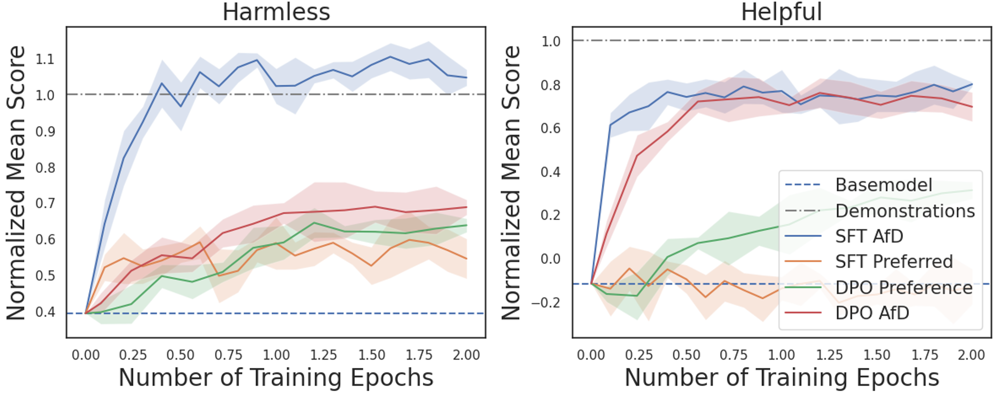

# 逆向对齐：借助演示数据，通过逆向强化学习实现大型语言模型的精准对齐

发布时间：2024年05月24日

`LLM理论

这篇论文主要探讨了大型语言模型（LLMs）的对齐技术，特别是提出了一种新的策略“从演示中对齐”（AfD），并分析了其在序列决策框架中的应用，以及如何通过正向与逆向强化学习来解决奖励信号缺失的问题。这些内容涉及LLM的理论研究和方法论创新，因此归类为LLM理论。` `人工智能`

> Inverse-RLignment: Inverse Reinforcement Learning from Demonstrations for LLM Alignment

# 摘要

> 为了提升大型语言模型（LLMs）的安全性和实用性，对齐技术至关重要。然而，现有方法多依赖于偏好数据集，这带来了标签噪声、高昂的标注成本及隐私顾虑。为此，我们提出了“从演示中对齐”（AfD），一种利用优质演示数据的新策略，以应对上述挑战。我们将AfD置于序列决策框架中，并特别关注其奖励信号缺失的独特难题。结合正向与逆向强化学习的智慧，我们为AfD设定了发散最小化目标。通过深入分析，我们揭示了不同方法在覆盖广度与模式寻求上的行为，阐明了它们在特定情境下的优越性。在实践层面，我们开发了一种高效的计算算法，该算法通过定制的奖励模型进行外推，以支持AfD。通过在“无害”与“有益”任务上的实验，我们验证了这些关键见解，展示了它们在保持方法简洁性的同时，具有显著的实证效果。

> Aligning Large Language Models (LLMs) is crucial for enhancing their safety and utility. However, existing methods, primarily based on preference datasets, face challenges such as noisy labels, high annotation costs, and privacy concerns. In this work, we introduce Alignment from Demonstrations (AfD), a novel approach leveraging high-quality demonstration data to overcome these challenges. We formalize AfD within a sequential decision-making framework, highlighting its unique challenge of missing reward signals. Drawing insights from forward and inverse reinforcement learning, we introduce divergence minimization objectives for AfD. Analytically, we elucidate the mass-covering and mode-seeking behaviors of various approaches, explaining when and why certain methods are superior. Practically, we propose a computationally efficient algorithm that extrapolates over a tailored reward model for AfD. We validate our key insights through experiments on the Harmless and Helpful tasks, demonstrating their strong empirical performance while maintaining simplicity.

[Arxiv](https://arxiv.org/abs/2405.15624)