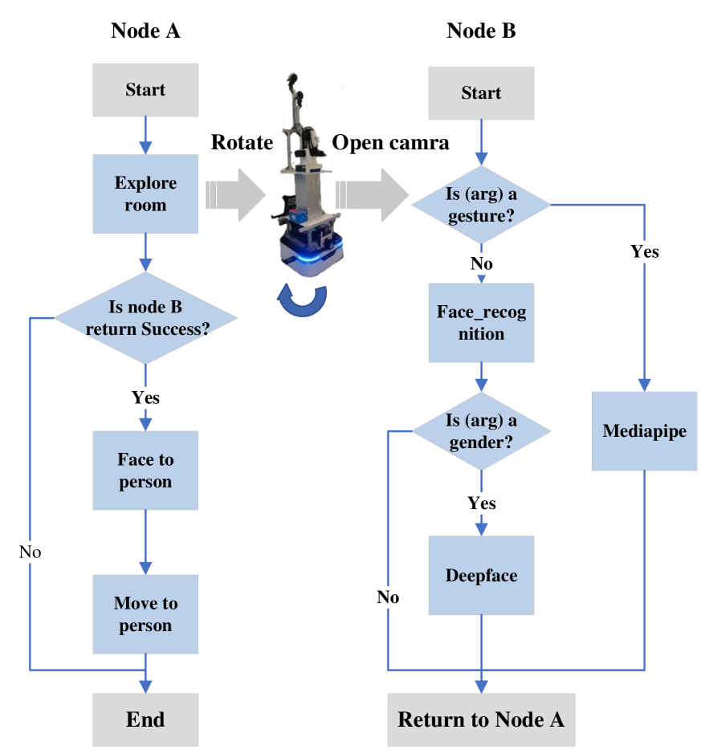

# 大型语言模型驱动的通用服务机器人任务规划与高效异常处理

发布时间：2024年05月24日

`Agent

这篇论文主要讨论了如何利用大型语言模型（LLMs）来生成机器人的动作序列，以适应日常生活的需求。论文提出了一种基于受限LLM提示的任务规划方法，并引入了异常处理模块来确保生成的动作序列在实际环境中是可行的。这种方法使得机器人能够根据自然语言指令明智地执行任务，体现了Agent（代理）的概念，即一个能够感知环境并采取行动以达到目标的系统。因此，这篇论文应归类于Agent。` `机器人技术` `服务机器人`

> LLM-based Robot Task Planning with Exceptional Handling for General Purpose Service Robots

# 摘要

> 为了打造一款适应日常生活的全能服务机器人，它必须能明智地运用多种基础行为。大型语言模型（LLMs）的最新进展使得机器人能直接根据自然语言指令生成动作序列，无需额外领域知识。尽管LLMs的输出语义正确，但生成的任务计划可能与实际可行的动作不符，且可能含有语言歧义。此外，LLM幻觉问题导致任务规划中出现与现实或用户意图不符的内容。为此，本文提出了一种基于受限LLM提示的任务规划方法，能从指令中生成可执行的动作序列，并引入了一个异常处理模块，确保LLM生成的结果在当前环境中有效。通过在RoboCup@Home命令生成器生成的命令上测试，我们发现机器人在理解和执行任务方面表现卓越。

> The development of a general purpose service robot for daily life necessitates the robot's ability to deploy a myriad of fundamental behaviors judiciously. Recent advancements in training Large Language Models (LLMs) can be used to generate action sequences directly, given an instruction in natural language with no additional domain information. However, while the outputs of LLMs are semantically correct, the generated task plans may not accurately map to acceptable actions and might encompass various linguistic ambiguities. LLM hallucinations pose another challenge for robot task planning, which results in content that is inconsistent with real-world facts or user inputs. In this paper, we propose a task planning method based on a constrained LLM prompt scheme, which can generate an executable action sequence from a command. An exceptional handling module is further proposed to deal with LLM hallucinations problem. This module can ensure the LLM-generated results are admissible in the current environment. We evaluate our method on the commands generated by the RoboCup@Home Command Generator, observing that the robot demonstrates exceptional performance in both comprehending instructions and executing tasks.

[Arxiv](https://arxiv.org/abs/2405.15646)