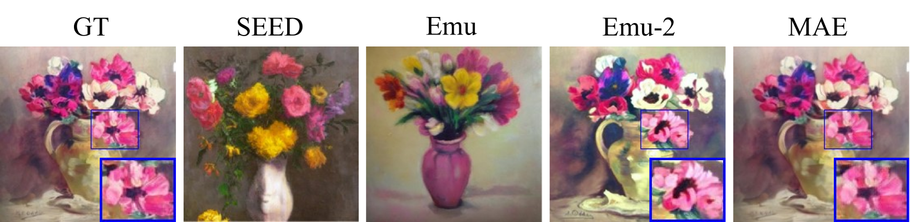
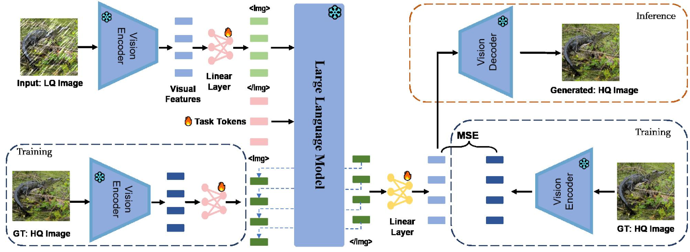
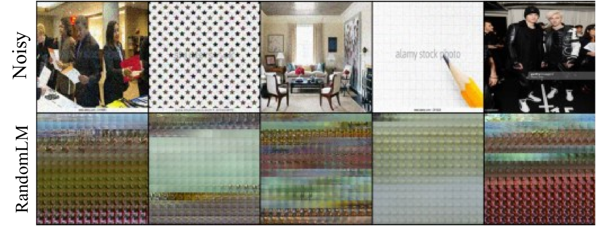
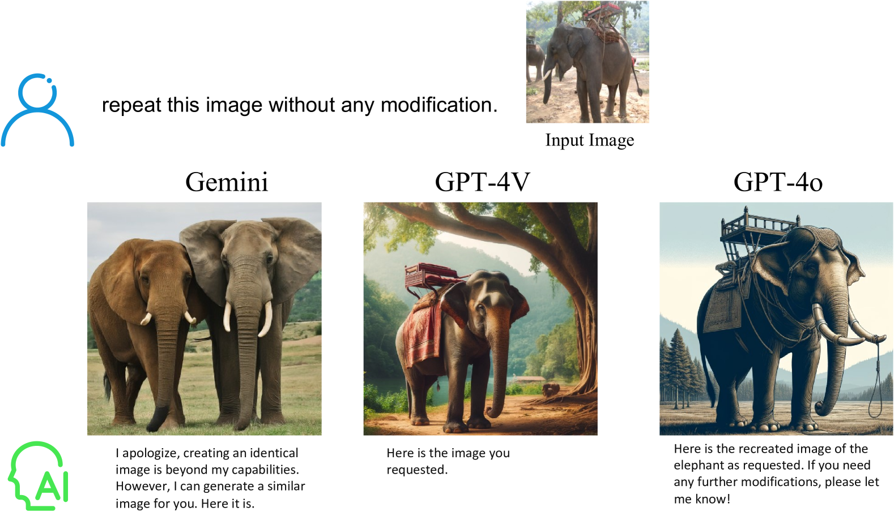
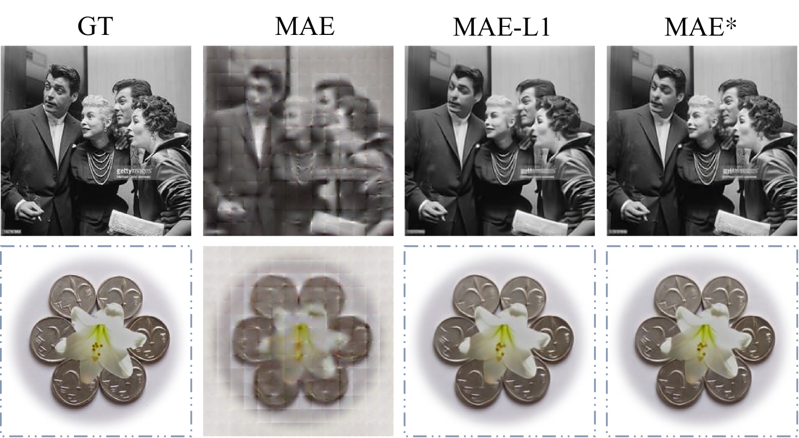
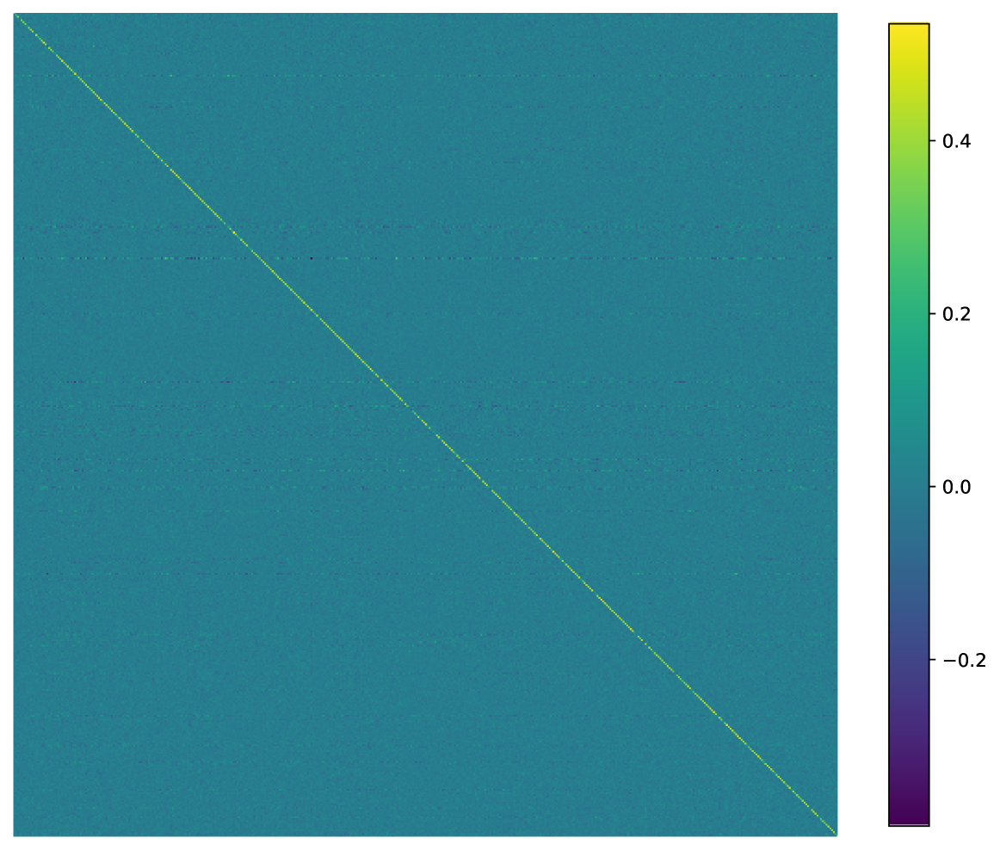
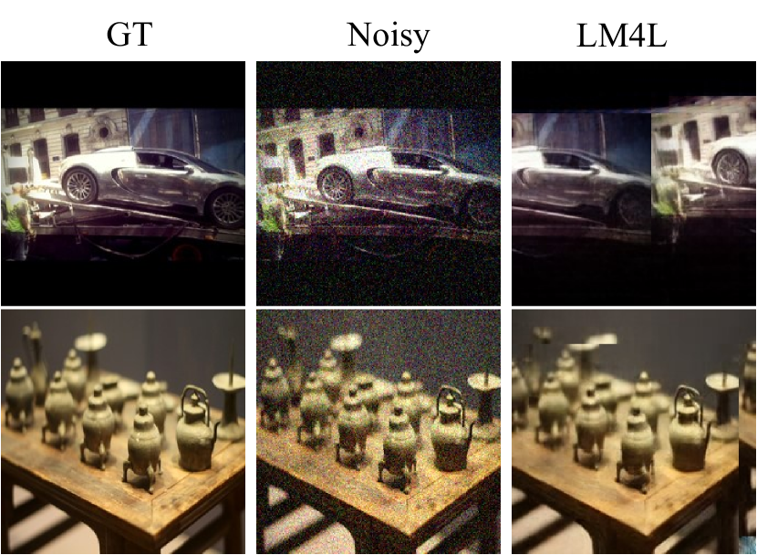

# LM4LV：专为低级视觉任务设计的冻结大型语言模型

发布时间：2024年05月24日

`LLM应用

理由：这篇论文主要探讨了大型语言模型（LLM）在低级视觉任务中的应用，提出了一个名为**LM4LV**的框架，旨在利用已冻结的LLM解决低级视觉任务。这一研究专注于LLM在特定领域的应用，即计算机视觉中的低级视觉任务，而不是理论探讨或Agent的设计与应用。因此，它属于“LLM应用”类别。` `计算机视觉` `人工智能`

> LM4LV: A Frozen Large Language Model for Low-level Vision Tasks

# 摘要

> 大型语言模型的成功引领了多模态大型语言模型（MLLMs）的研究热潮，这一趋势正在重塑计算机视觉的多个领域。虽然MLLMs在高级视觉和视觉-语言任务（如视觉问答和文本生成图像）中表现出色，但它们在低级视觉任务上的应用尚未得到充分探索。我们发现，当前的MLLMs由于其视觉模块的设计，对低级视觉特征不敏感，因此难以应对这些任务。为此，我们提出了**LM4LV**框架，它能让一个已冻结的LLM无需多模态数据或先验知识，即可解决一系列低级视觉任务。这一创新不仅揭示了LLM在低级视觉领域的巨大潜力，也填补了MLLMs与低级视觉任务之间的空白。我们期待这项研究能够激发对LLMs更深层次的思考，并促进对其工作原理的深入理解。

> The success of large language models (LLMs) has fostered a new research trend of multi-modality large language models (MLLMs), which changes the paradigm of various fields in computer vision. Though MLLMs have shown promising results in numerous high-level vision and vision-language tasks such as VQA and text-to-image, no works have demonstrated how low-level vision tasks can benefit from MLLMs. We find that most current MLLMs are blind to low-level features due to their design of vision modules, thus are inherently incapable for solving low-level vision tasks. In this work, we purpose $\textbf{LM4LV}$, a framework that enables a FROZEN LLM to solve a range of low-level vision tasks without any multi-modal data or prior. This showcases the LLM's strong potential in low-level vision and bridges the gap between MLLMs and low-level vision tasks. We hope this work can inspire new perspectives on LLMs and deeper understanding of their mechanisms.

[Arxiv](https://arxiv.org/abs/2405.15734)