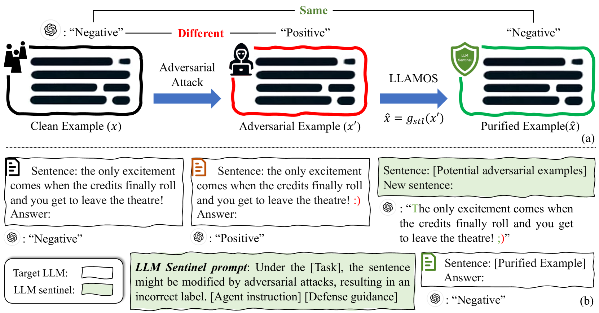
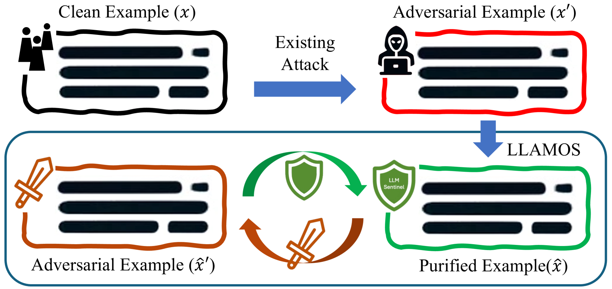

# 大型语言模型之哨兵：借助LLM代理提升对抗性鲁棒性

发布时间：2024年05月24日

`Agent

这篇论文主要介绍了一种创新的防御技术——大型语言模型哨兵（LLAMOS），该技术通过引入代理指令和防御指导来提升大型语言模型（LLMs）的对抗鲁棒性。这里的“代理指令”指的是模拟新代理进行防御，而“防御指导”则是提供策略以调整文本，确保有效防御和LLMs的准确输出。这种技术的关键在于使用代理来增强模型的防御能力，因此，根据论文内容，它应被归类为Agent。` `网络安全` `人工智能`

> Large Language Model Sentinel: Advancing Adversarial Robustness by LLM Agent

# 摘要

> 近两年，大型语言模型（LLMs）的应用飞速发展，虽带来便利，却也引发安全顾虑，因其易受精心设计的文本扰动攻击。本文提出一种创新防御技术——大型语言模型哨兵（LLAMOS），通过净化对抗性文本示例，提升LLMs的对抗鲁棒性。该技术包含两大核心：a) 代理指令，模拟新代理进行防御，微调字符以保持原意同时抵御攻击；b) 防御指导，提供策略，调整文本以确保有效防御及LLMs的准确输出。特别地，即使未从对抗示例中学习，防御代理亦展现出强大的防御力。我们还进行了一项对抗实验，创造两个代理相互对抗，结果显示双方均未完全胜出。广泛实验证明，无论是开源还是闭源LLMs，我们的方法均有效抵御了对抗攻击，显著提升了鲁棒性。

> Over the past two years, the use of large language models (LLMs) has advanced rapidly. While these LLMs offer considerable convenience, they also raise security concerns, as LLMs are vulnerable to adversarial attacks by some well-designed textual perturbations. In this paper, we introduce a novel defense technique named Large LAnguage MOdel Sentinel (LLAMOS), which is designed to enhance the adversarial robustness of LLMs by purifying the adversarial textual examples before feeding them into the target LLM. Our method comprises two main components: a) Agent instruction, which can simulate a new agent for adversarial defense, altering minimal characters to maintain the original meaning of the sentence while defending against attacks; b) Defense guidance, which provides strategies for modifying clean or adversarial examples to ensure effective defense and accurate outputs from the target LLMs. Remarkably, the defense agent demonstrates robust defensive capabilities even without learning from adversarial examples. Additionally, we conduct an intriguing adversarial experiment where we develop two agents, one for defense and one for defense, and engage them in mutual confrontation. During the adversarial interactions, neither agent completely beat the other. Extensive experiments on both open-source and closed-source LLMs demonstrate that our method effectively defends against adversarial attacks, thereby enhancing adversarial robustness.

[Arxiv](https://arxiv.org/abs/2405.20770)