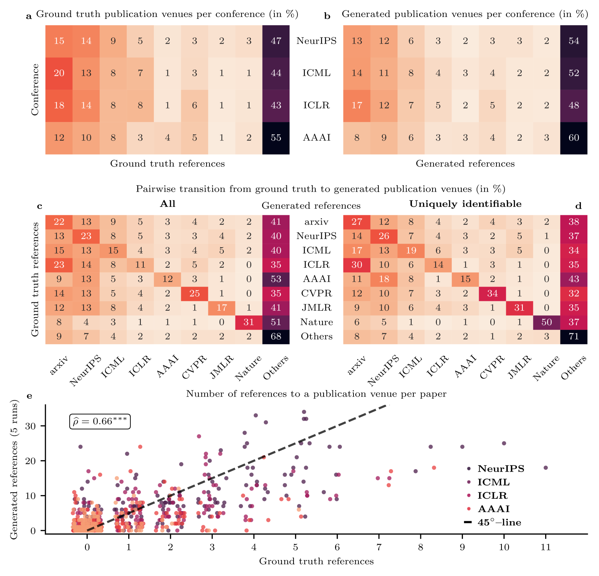

# 大型语言模型不仅映射了人类的引用习惯，还加剧了引用偏差的现象。

发布时间：2024年05月24日

`LLM应用

这篇论文主要探讨了大型语言模型（如GPT-4）在生成科学论文引用时的行为和偏见，以及这些行为如何影响科学知识的传播。研究通过实验分析了GPT-4在特定学术领域的引用生成能力及其潜在的偏见，强调了识别和平衡这些偏见的重要性。这属于对LLM在实际应用中的具体问题进行研究，因此归类为LLM应用。` `学术研究` `科学知识传播`

> Large Language Models Reflect Human Citation Patterns with a Heightened Citation Bias

# 摘要

> 引用实践对科学知识结构的塑造至关重要，但常受当代规范和偏见影响。随着GPT-4等大型语言模型（LLMs）的兴起，这些实践迎来了新变化。特别值得关注的是，LLMs基于其参数知识而非搜索或检索增强生成推荐的参考文献，其特性和潜在偏见尚未被深入研究。为此，我们选取了166篇在GPT-4知识截止日期后发表于AAAI、NeurIPS、ICML和ICLR的论文，共含3,066条参考文献，进行了一项实验。实验中，GPT-4需为这些论文中的匿名文本引用提供学术参考。结果显示，尽管人类与LLM的引用模式相似，但GPT-4的高引用偏见更为显著，即便考虑了发表年份、标题长度、作者数量和会议等因素。此外，GPT-4生成的现有与非现有参考文献特性高度一致，显示了模型对引用模式的内部化。通过引用图分析，我们发现GPT-4推荐的参考文献紧密关联于相关引用上下文，揭示了模型对引用网络的深入概念内部化。尽管LLMs有助于引用生成，但也可能加剧现有偏见并引入新偏见，影响科学知识的传播。因此，识别模型偏见并开发与LLMs交互的平衡方法显得尤为重要。

> Citation practices are crucial in shaping the structure of scientific knowledge, yet they are often influenced by contemporary norms and biases. The emergence of Large Language Models (LLMs) like GPT-4 introduces a new dynamic to these practices. Interestingly, the characteristics and potential biases of references recommended by LLMs that entirely rely on their parametric knowledge, and not on search or retrieval-augmented generation, remain unexplored. Here, we analyze these characteristics in an experiment using a dataset of 166 papers from AAAI, NeurIPS, ICML, and ICLR, published after GPT-4's knowledge cut-off date, encompassing 3,066 references in total. In our experiment, GPT-4 was tasked with suggesting scholarly references for the anonymized in-text citations within these papers. Our findings reveal a remarkable similarity between human and LLM citation patterns, but with a more pronounced high citation bias in GPT-4, which persists even after controlling for publication year, title length, number of authors, and venue. Additionally, we observe a large consistency between the characteristics of GPT-4's existing and non-existent generated references, indicating the model's internalization of citation patterns. By analyzing citation graphs, we show that the references recommended by GPT-4 are embedded in the relevant citation context, suggesting an even deeper conceptual internalization of the citation networks. While LLMs can aid in citation generation, they may also amplify existing biases and introduce new ones, potentially skewing scientific knowledge dissemination. Our results underscore the need for identifying the model's biases and for developing balanced methods to interact with LLMs in general.

[Arxiv](https://arxiv.org/abs/2405.15739)