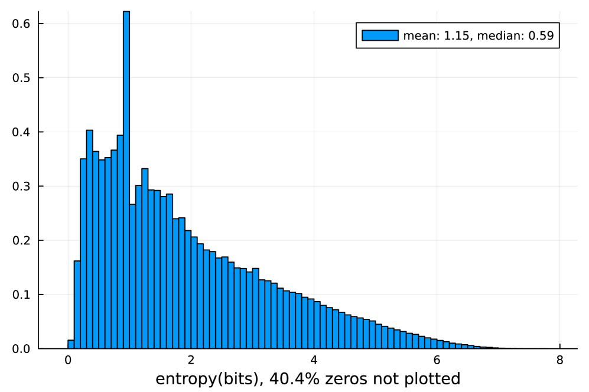

# 大型语言模型：隐蔽通道的系统性分析

发布时间：2024年05月24日

`LLM应用

理由：这篇论文探讨了大型语言模型（LLMs）在特定应用场景下的潜力，即作为隐蔽通信的工具。它通过实验评估了开源LLM模型（如Llama-7B）在安全性和容量方面的表现，以衡量其在隐蔽通道中的效能。这种研究属于LLM的具体应用，而不是理论研究或Agent、RAG的范畴。因此，将其归类为LLM应用是合适的。` `网络安全`

> Large Language Models as Covert Channels... a Systematic Analysis

# 摘要

> 大型语言模型（LLMs）近年来因其卓越的多样化任务处理能力（如翻译、预测、内容生成）而备受瞩目。研究界同时发现，尽管LLMs易受攻击，但它们也能增强系统的安全性。然而，开源LLMs在作为掩护文本分布，比如助力抗审查通信方面表现如何？本文深入探讨了基于开源LLM的隐蔽通道潜力。我们通过实验，评估了Llama-7B模型的安全性和容量，以此衡量其作为隐蔽通道的效能。虽然实验表明这些通道难以达到高比特率，但敌手检测隐蔽通信的概率极低。为简化参考，我们采用了简洁的方案，并仅考虑公开模型。

> Large Language Models (LLMs) have gained significant popularity in the last few years due to their performance in diverse tasks such as translation, prediction, or content generation. At the same time, the research community has shown that LLMs are susceptible to various attacks but can also improve the security of diverse systems. However, besides enabling more secure systems, how well do open source LLMs behave as covertext distributions to, e.g., facilitate censorship resistant communication?
  In this paper, we explore the capabilities of open-source LLM-based covert channels. We approach this problem from the experimental side by empirically measuring the security vs. capacity of the open-source LLM model (Llama-7B) to assess how well it performs as a covert channel. Although our results indicate that such channels are not likely to achieve high practical bitrates, which depend on message length and model entropy, we also show that the chance for an adversary to detect covert communication is low. To ensure that our results can be used with the least effort as a general reference, we employ a conceptually simple and concise scheme and only assume public models.

[Arxiv](https://arxiv.org/abs/2405.15652)