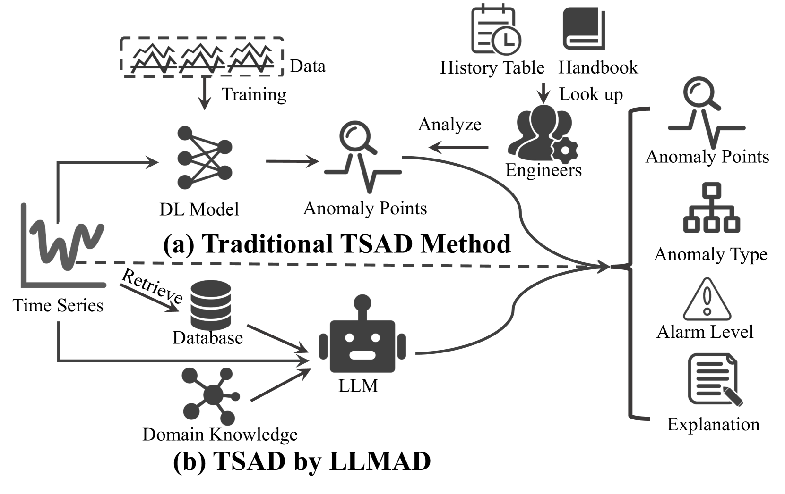

# 大型语言模型在时间序列异常检测方面展现出准确性与可解释性的双重优势。

发布时间：2024年05月24日

`LLM应用

这篇论文摘要描述了一种名为LLMAD的新方法，该方法利用大型语言模型（LLMs）进行时间序列异常检测（TSAD）。这种方法通过检索相似的时间序列片段来提高异常检测的准确性和解释性，并采用AnoCoT方法来模拟专家逻辑，增强决策过程。实验结果表明，LLMAD在性能上表现出色，并能提供多角度的解释，有助于用户决策。这是首次直接将LLMs应用于TSAD的研究，因此属于LLM应用类别。` `时间序列分析` `异常检测`

> Large Language Models can Deliver Accurate and Interpretable Time Series Anomaly Detection

# 摘要

> 时间序列异常检测（TSAD）通过识别异常模式，确保系统稳定并迅速响应，在多行业中至关重要。传统模型依赖深度学习，需大量数据且解释性差。为此，我们创新提出LLMAD，一种利用大型语言模型（LLMs）的新方法，它通过检索相似时间序列片段，显著提升异常检测的准确性和解释性。LLMAD还采用AnoCoT方法，模拟专家逻辑，增强决策过程。实验证明，LLMAD不仅性能卓越，还能提供多角度的解释，助力用户决策。这是首次直接运用LLMs于TSAD的研究，开辟了新领域。

> Time series anomaly detection (TSAD) plays a crucial role in various industries by identifying atypical patterns that deviate from standard trends, thereby maintaining system integrity and enabling prompt response measures. Traditional TSAD models, which often rely on deep learning, require extensive training data and operate as black boxes, lacking interpretability for detected anomalies. To address these challenges, we propose LLMAD, a novel TSAD method that employs Large Language Models (LLMs) to deliver accurate and interpretable TSAD results. LLMAD innovatively applies LLMs for in-context anomaly detection by retrieving both positive and negative similar time series segments, significantly enhancing LLMs' effectiveness. Furthermore, LLMAD employs the Anomaly Detection Chain-of-Thought (AnoCoT) approach to mimic expert logic for its decision-making process. This method further enhances its performance and enables LLMAD to provide explanations for their detections through versatile perspectives, which are particularly important for user decision-making. Experiments on three datasets indicate that our LLMAD achieves detection performance comparable to state-of-the-art deep learning methods while offering remarkable interpretability for detections. To the best of our knowledge, this is the first work that directly employs LLMs for TSAD.

[Arxiv](https://arxiv.org/abs/2405.15370)