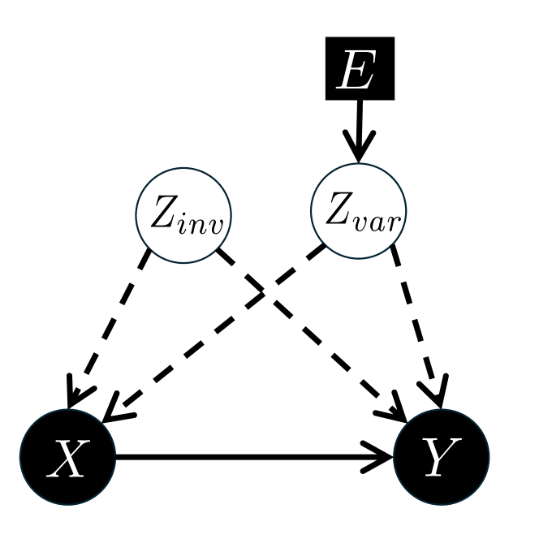
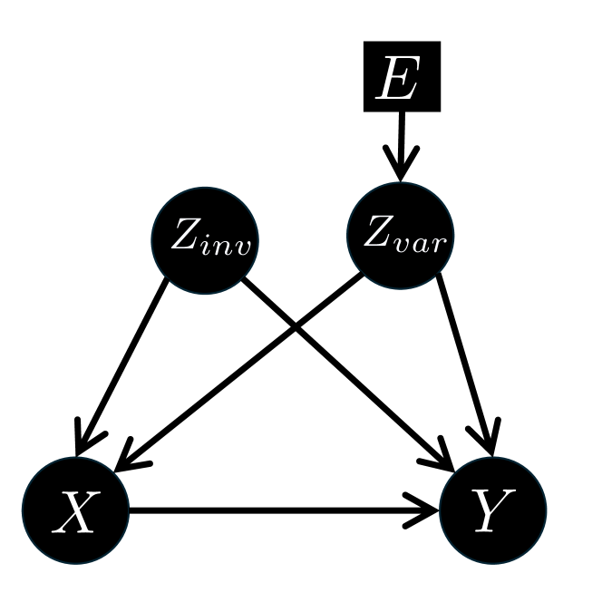
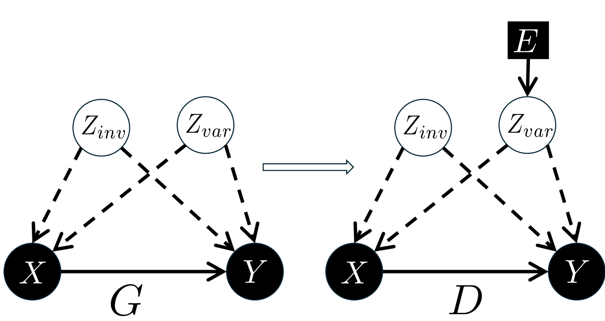
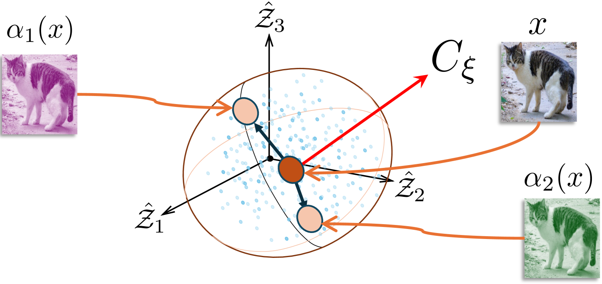
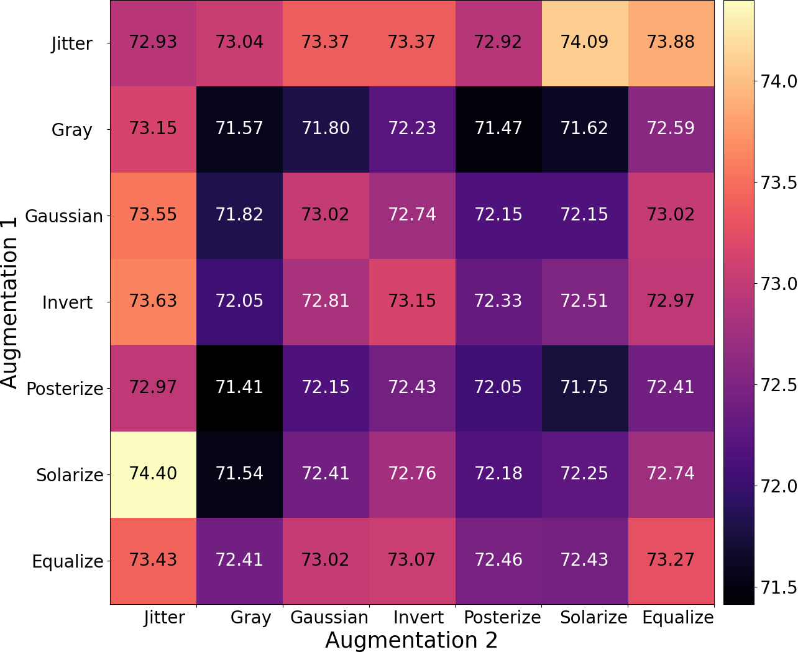
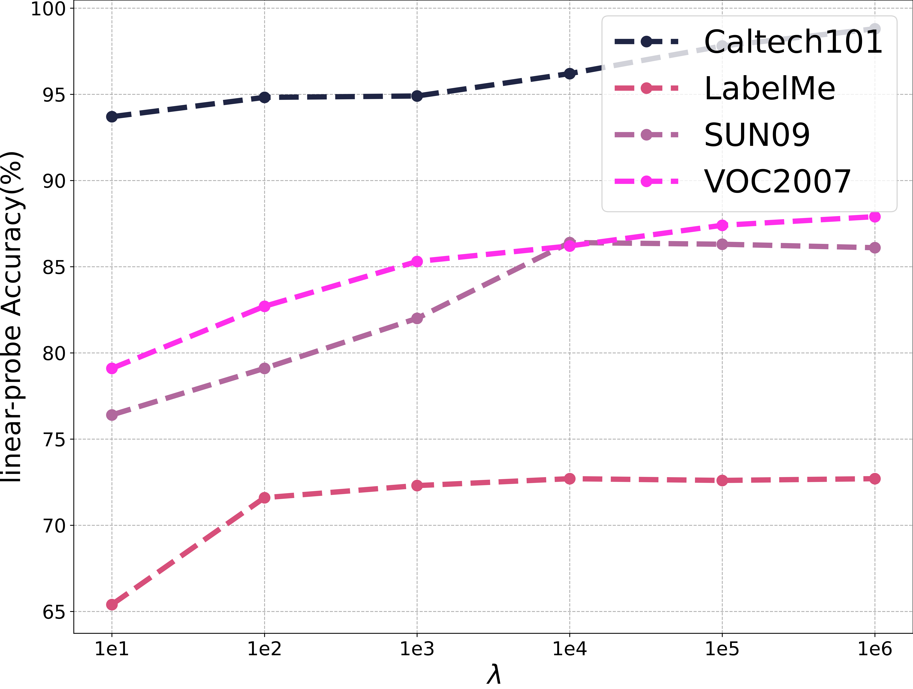

# 探索视觉-语言模型中的不变因果机制学习

发布时间：2024年05月24日

`LLM理论

这篇论文探讨了预训练大规模模型在跨领域应用中的局限性，并提出了一种改进方法——CLIP的不变因果机制（CLIP-ICM）。该研究通过因果推断分析了模型在不同领域的表现，并提出了一种新的算法来识别和利用跨领域的恒定因果机制。这种方法的理论分析和实验结果都表明了其在分布外场景中的泛化能力的提升。因此，这篇论文更偏向于对大型语言模型（LLM）的理论研究，特别是关于模型如何理解和适应不同数据分布的问题。` `机器学习` `计算机视觉`

> Learning Invariant Causal Mechanism from Vision-Language Models

# 摘要

> 预训练的大规模模型虽是研究热点，但在实际应用中因数据分布多样性而效果受限。人类却能在复杂多变的环境中，通过学习可迁移的知识，在各领域做出卓越决策。尽管CLIP这一视觉-语言预训练模型在多个视觉任务中表现出色，但在特定领域我们的实验结果并不理想。通过因果推断深入分析，我们发现CLIP未能捕捉到跨领域的恒定因果机制，原因在于它未能识别出产生数据的潜在因素。为此，我们提出了CLIP的不变因果机制（CLIP-ICM），该算法利用干预数据，旨在识别并证明这些不变的潜在因素，从而在多领域实现精准预测。理论分析显示，我们的方法在分布外场景中泛化能力更强。实验结果证实了CLIP-ICM的优异表现。

> Pre-trained large-scale models have become a major research focus, but their effectiveness is limited in real-world applications due to diverse data distributions. In contrast, humans excel at decision-making across various domains by learning reusable knowledge that remains invariant despite environmental changes in a complex world. Although CLIP, as a successful vision-language pre-trained model, demonstrates remarkable performance in various visual downstream tasks, our experiments reveal unsatisfactory results in specific domains. Our further analysis with causal inference exposes the current CLIP model's inability to capture the invariant causal mechanisms across domains, attributed to its deficiency in identifying latent factors generating the data. To address this, we propose the Invariant Causal Mechanism of CLIP (CLIP-ICM), an algorithm designed to provably identify invariant latent factors with the aid of interventional data, and perform accurate prediction on various domains. Theoretical analysis demonstrates that our method has a lower generalization bound in out-of-distribution (OOD) scenarios. Experimental results showcase the outstanding performance of CLIP-ICM.

[Arxiv](https://arxiv.org/abs/2405.15289)