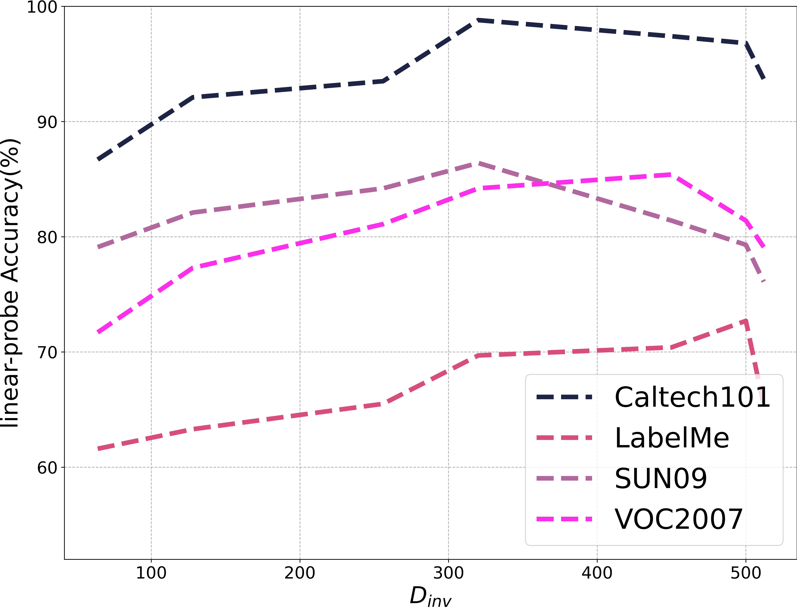

# 探索视觉-语言模型中的不变因果机制学习

发布时间：2024年05月24日

`LLM理论

这篇论文探讨了预训练的大规模模型在实际应用中的局限性，特别是在数据分布多样性方面。它通过因果分析揭示了CLIP模型在跨领域应用中的不足，并提出了CLIP的不变因果机制（CLIP-ICM）来解决这一问题。该研究不仅提出了新的算法，还进行了理论分析和实验验证，强调了在分布外场景中的泛化能力。因此，这篇论文更偏向于对大型语言模型（LLM）的理论研究，特别是关于模型如何理解和处理跨领域数据的不变因果机制。` `人工智能` `机器学习`

> Learning Invariant Causal Mechanism from Vision-Language Models

# 摘要

> 预训练的大规模模型虽是研究热点，但在实际应用中因数据分布多样性而效果受限。人类却能在复杂多变的环境中，凭借可复用的知识在多领域做出精明决策。尽管CLIP这一视觉-语言预训练模型在众多视觉任务中大放异彩，但在特定领域却显露短板。我们的因果分析揭示，CLIP未能捕捉跨领域的不变因果机制，根源在于未能识别数据背后的潜在因素。为此，我们推出了CLIP的不变因果机制（CLIP-ICM），这一算法利用干预数据，旨在精准识别这些不变因素，并在多领域实现精准预测。理论分析证实，我们的方法在分布外场景中泛化能力更强。实验结果更是证明了CLIP-ICM的卓越表现。

> Pre-trained large-scale models have become a major research focus, but their effectiveness is limited in real-world applications due to diverse data distributions. In contrast, humans excel at decision-making across various domains by learning reusable knowledge that remains invariant despite environmental changes in a complex world. Although CLIP, as a successful vision-language pre-trained model, demonstrates remarkable performance in various visual downstream tasks, our experiments reveal unsatisfactory results in specific domains. Our further analysis with causal inference exposes the current CLIP model's inability to capture the invariant causal mechanisms across domains, attributed to its deficiency in identifying latent factors generating the data. To address this, we propose the Invariant Causal Mechanism of CLIP (CLIP-ICM), an algorithm designed to provably identify invariant latent factors with the aid of interventional data, and perform accurate prediction on various domains. Theoretical analysis demonstrates that our method has a lower generalization bound in out-of-distribution (OOD) scenarios. Experimental results showcase the outstanding performance of CLIP-ICM.

[Arxiv](https://arxiv.org/abs/2405.15289)