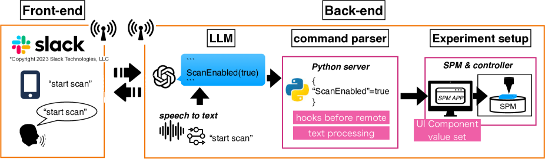
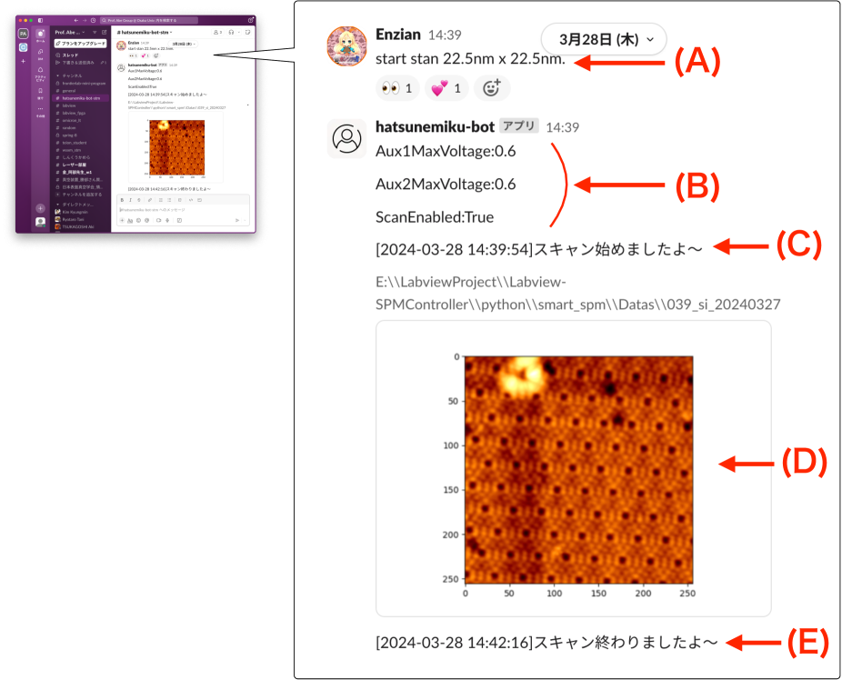
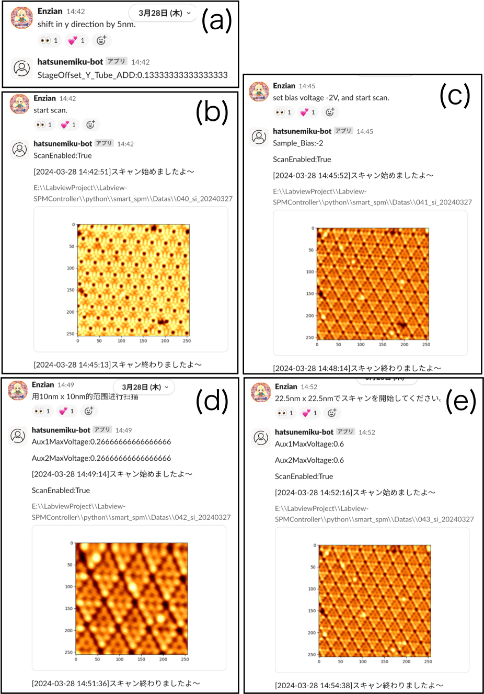
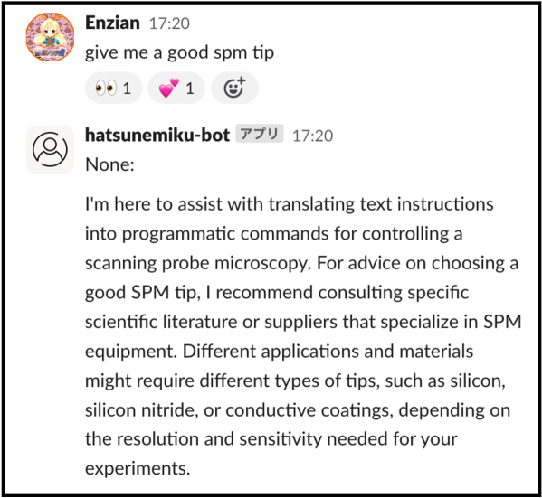

# 借助大型语言模型与社交媒体之力，推动扫描探针显微镜自动化进程

发布时间：2024年05月24日

`Agent

理由：这篇论文描述了一个自动化系统，该系统利用大型语言模型（LLM）来控制扫描探针显微镜（SPM）。这种系统通过社交媒体服务（SNS）接收指令，实现了实时、语言无关的控制。这种集成LLM的系统可以被视为一个智能代理（Agent），因为它能够接收外部指令并自主执行任务，类似于一个智能体在执行其功能。因此，这篇论文更适合归类为Agent。` `显微镜技术` `自动化实验室`

> Leveraging Large Language Models and Social Media for Automation in Scanning Probe Microscopy

# 摘要

> 我们开发了一种利用先进大型语言模型（LLM）的自动化扫描探针显微镜（SPM）系统，该系统能通过社交媒体服务（SNS）接收指令。SNS与LLM的融合实现了SPM操作的实时、语言无关控制，极大提升了系统的便捷性和效率。这种将LLM与专业AI系统结合的方式，正逐步推动自动驾驶实验室成为现实。

> We present the development of an automated scanning probe microscopy (SPM) measurement system using an advanced large-scale language model (LLM). This SPM system can receive instructions via social networking services (SNS), and the integration of SNS and LLMs enables real-time, language-agnostic control of SPM operations, thereby improving accessibility and efficiency. The integration of LLMs with AI systems with specialized functions brings the realization of self-driving labs closer.

[Arxiv](https://arxiv.org/abs/2405.15490)