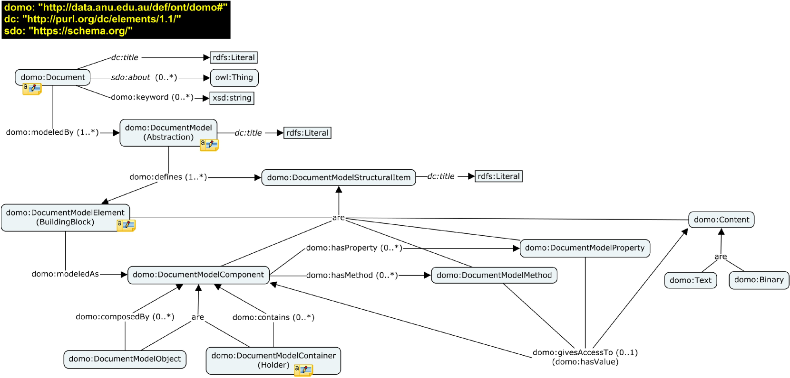
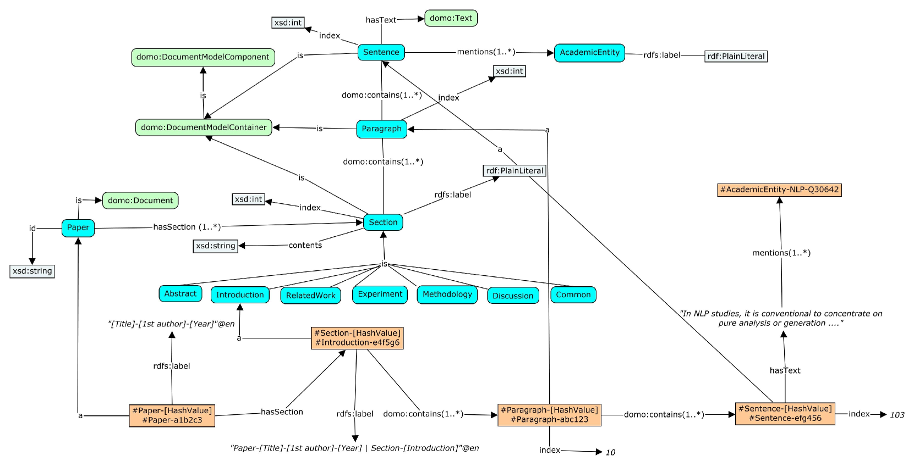
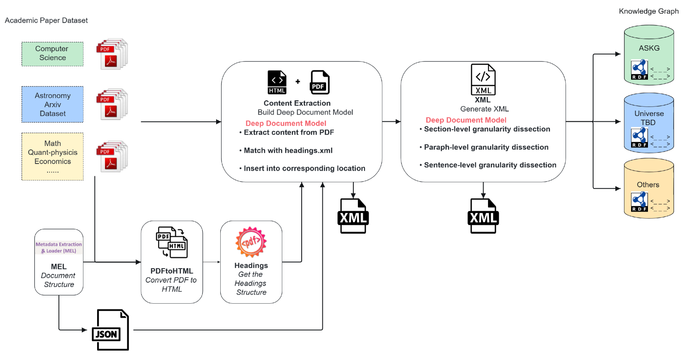
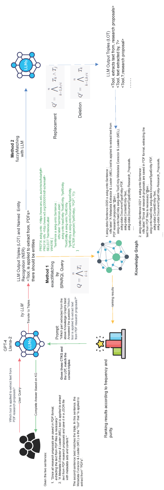

# 借助大型语言模型优化学术知识图谱的语义查询处理

发布时间：2024年05月24日

`RAG

理由：这篇论文介绍了一种创新的语义查询处理系统，该系统结合了大型语言模型（LLMs）与学术知识图谱（ASKG），并通过深度文档模型（DDM）和KG增强的查询处理（KGQP）来提高查询的准确性和效率。这种系统的设计和实现涉及到知识图谱的增强查询处理，这与RAG（Retrieval-Augmented Generation）模型的概念相吻合，即通过检索增强生成过程。此外，论文中提到的自动LLM-SPARQL融合技术也体现了对知识图谱信息的高效检索，这是RAG模型中的一个关键特性。因此，这篇论文更适合归类于RAG。` `学术研究` `知识管理`

> Leveraging Large Language Models for Semantic Query Processing in a Scholarly Knowledge Graph

# 摘要

> 本研究旨在开发一种创新的语义查询处理系统，该系统结合了大型语言模型（LLMs）与澳大利亚国立大学（ANU）的学术知识图谱（ASKG），旨在为用户提供关于ANU计算机科学研究成果的全面信息。我们提出的框架通过深度文档模型（DDM）和KG增强的查询处理（KGQP），解决了传统学术知识图谱在捕捉细节方面的不足，提高了查询的准确性和效率。通过自动LLM-SPARQL融合技术，我们的系统能够从ASKG中高效检索信息，实验结果显示其性能优于传统方法。该系统不仅提升了知识利用和自然语言理解能力，还为学术研究提供了新的知识管理和发现工具，使研究人员能够更有效地从文档中获取和利用知识，为与LLMs的精确交互奠定了基础。

> The proposed research aims to develop an innovative semantic query processing system that enables users to obtain comprehensive information about research works produced by Computer Science (CS) researchers at the Australian National University (ANU). The system integrates Large Language Models (LLMs) with the ANU Scholarly Knowledge Graph (ASKG), a structured repository of all research-related artifacts produced at ANU in the CS field. Each artifact and its parts are represented as textual nodes stored in a Knowledge Graph (KG).
  To address the limitations of traditional scholarly KG construction and utilization methods, which often fail to capture fine-grained details, we propose a novel framework that integrates the Deep Document Model (DDM) for comprehensive document representation and the KG-enhanced Query Processing (KGQP) for optimized complex query handling. DDM enables a fine-grained representation of the hierarchical structure and semantic relationships within academic papers, while KGQP leverages the KG structure to improve query accuracy and efficiency with LLMs.
  By combining the ASKG with LLMs, our approach enhances knowledge utilization and natural language understanding capabilities. The proposed system employs an automatic LLM-SPARQL fusion to retrieve relevant facts and textual nodes from the ASKG. Initial experiments demonstrate that our framework is superior to baseline methods in terms of accuracy retrieval and query efficiency.
  We showcase the practical application of our framework in academic research scenarios, highlighting its potential to revolutionize scholarly knowledge management and discovery. This work empowers researchers to acquire and utilize knowledge from documents more effectively and provides a foundation for developing precise and reliable interactions with LLMs.

[Arxiv](https://arxiv.org/abs/2405.15374)