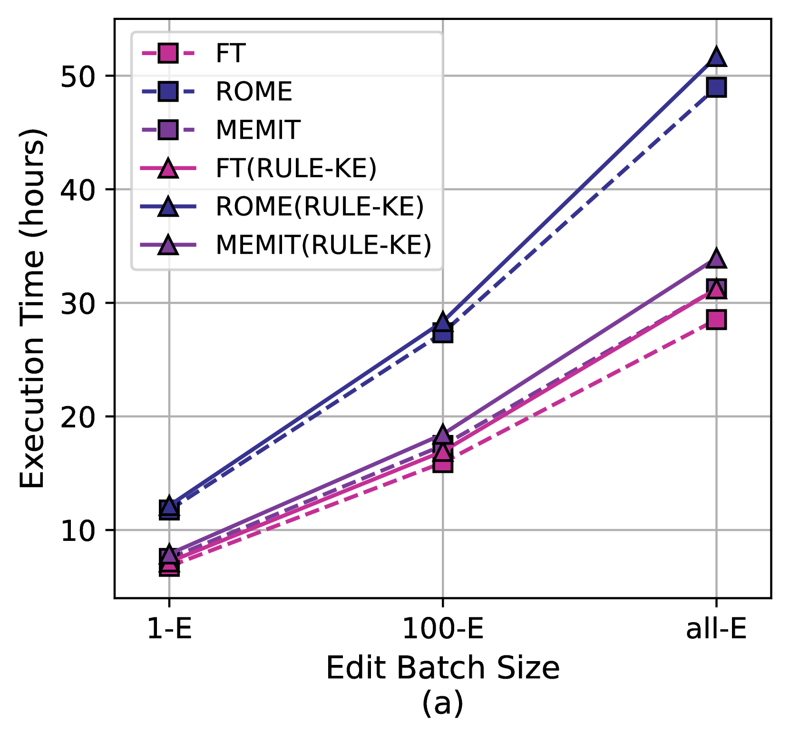

# 在知识编辑中运用逻辑规则，犹如锦上添花，为知识的精炼与优化增添了更多可能。

发布时间：2024年05月24日

`RAG

理由：这篇论文主要关注的是知识编辑下的多跳问题回答（Multi-hop Question Answering, MQA），并提出了一个名为RULE-KE的框架来优化知识更新过程。这个框架通过发现逻辑规则来提升MQA方法的性能，这与RAG（Retrieval-Augmented Generation）模型的目标相似，即通过增强检索机制来改善生成模型的性能。因此，这篇论文更适合归类到RAG分类中。` `问答系统` `知识图谱`

> Leveraging Logical Rules in Knowledge Editing: A Cherry on the Top

# 摘要

> 知识编辑下的多跳问题回答是LLMs的一大挑战。现有最佳方案虽能分解问题并生成答案，但面对复杂问题和知识更新间的关联性时显得力不从心，影响了知识更新的整体一致性。为此，我们提出了RULE-KE框架，通过发现逻辑规则来优化知识更新，显著提升了现有MQA方法的性能。实验显示，RULE-KE让基于参数和内存的解决方案性能分别提升了92%和112.9%。

> Multi-hop Question Answering (MQA) under knowledge editing (KE) is a key challenge in Large Language Models (LLMs). While best-performing solutions in this domain use a plan and solve paradigm to split a question into sub-questions followed by response generation, we claim that this approach is sub-optimal as it fails for hard to decompose questions, and it does not explicitly cater to correlated knowledge updates resulting as a consequence of knowledge edits. This has a detrimental impact on the overall consistency of the updated knowledge. To address these issues, in this paper, we propose a novel framework named RULE-KE, i.e., RULE based Knowledge Editing, which is a cherry on the top for augmenting the performance of all existing MQA methods under KE. Specifically, RULE-KE leverages rule discovery to discover a set of logical rules. Then, it uses these discovered rules to update knowledge about facts highly correlated with the edit. Experimental evaluation using existing and newly curated datasets (i.e., RKE-EVAL) shows that RULE-KE helps augment both performances of parameter-based and memory-based solutions up to 92% and 112.9%, respectively.

[Arxiv](https://arxiv.org/abs/2405.15452)