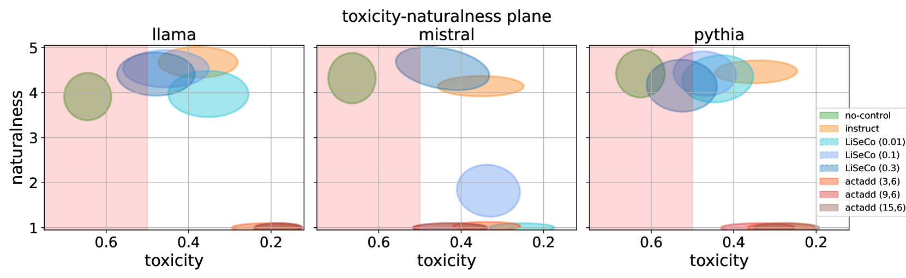
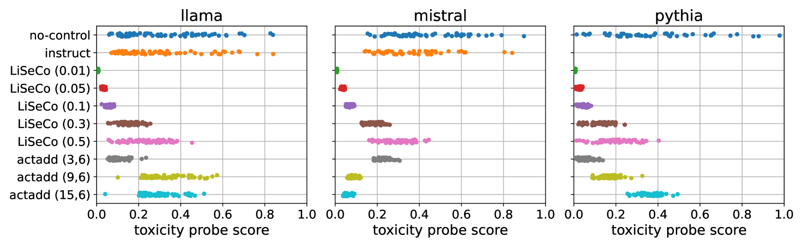
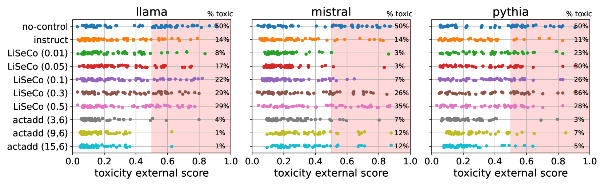
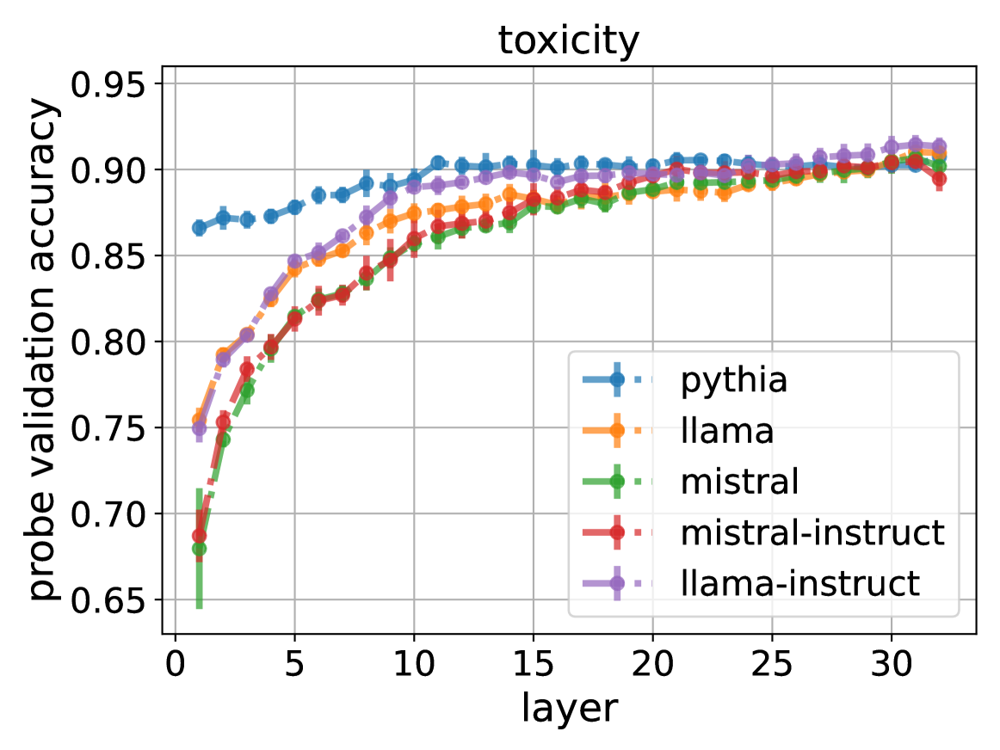
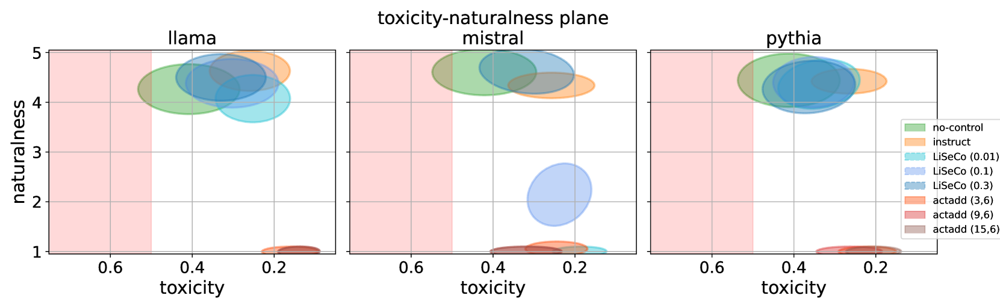
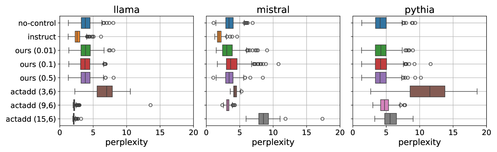

# 线性调控下的语言生成，确保性能稳定

发布时间：2024年05月24日

`LLM应用

理由：这篇论文探讨了如何利用大型语言模型（LLM）的潜在空间来动态调整语言生成过程，以避免生成有害内容，同时保持文本质量。这种方法涉及在模型的连续语义空间中调整生成轨迹，是一种应用于实际语言生成任务的技术。因此，它属于LLM应用类别，因为它关注的是如何有效地使用LLM来改进语言生成的质量和安全性，而不是探讨LLM的理论基础或Agent的行为。` `语言模型` `内容安全`

> Linearly Controlled Language Generation with Performative Guarantees

# 摘要

> 随着大型语言模型在关键应用中的广泛使用，我们需要既高效又可靠的语言生成策略。为此，我们利用了语言模型潜在空间中线性表示的概念语义模型。我们视自然语言生成为在连续语义空间中的轨迹，由模型的隐藏激活实现。基于此，我们提出了一种轻量级、无需梯度的干预方法，能在潜在空间中动态调整生成轨迹，避免不希望的语义区域。我们证明了这种干预方法能确保输出进入允许的区域。实证表明，这种方法在避免生成有害内容的同时，保持了文本质量。

> The increasing prevalence of Large Language Models (LMs) in critical applications highlights the need for controlled language generation strategies that are not only computationally efficient but that also enjoy performance guarantees. To achieve this, we use a common model of concept semantics as linearly represented in an LM's latent space. In particular, we take the view that natural language generation traces a trajectory in this continuous semantic space, realized by the language model's hidden activations. This view permits a control-theoretic treatment of text generation in latent space, in which we propose a lightweight, gradient-free intervention that dynamically steers trajectories away from regions corresponding to undesired meanings. Crucially, we show that this intervention, which we compute in closed form, is guaranteed (in probability) to steer the output into the allowed region. Finally, we demonstrate on a toxicity avoidance objective that the intervention steers language away from undesired content while maintaining text quality.

[Arxiv](https://arxiv.org/abs/2405.15454)