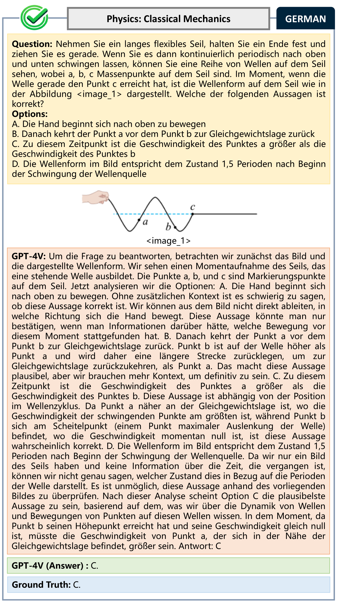
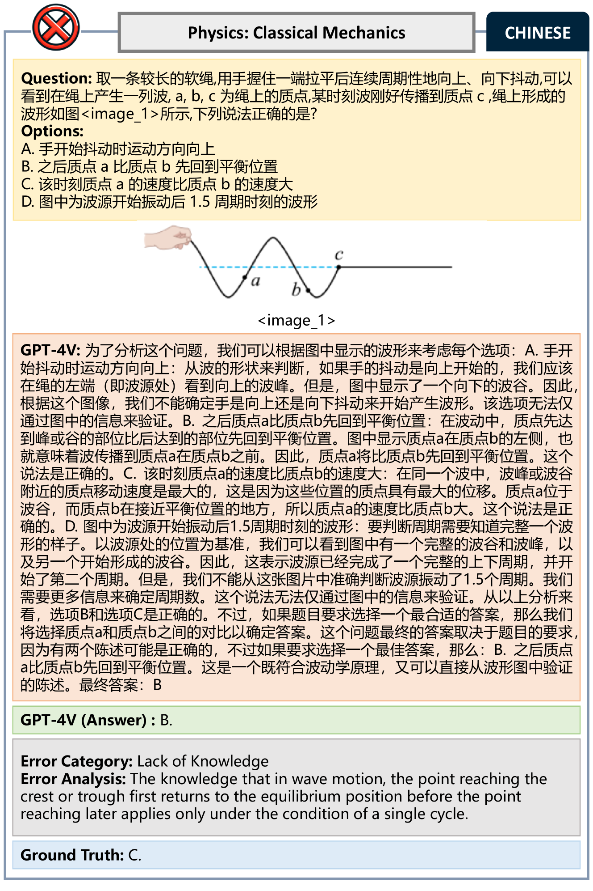

# M4U：探究大型多模态模型在多语言理解和推理上的能力评估

发布时间：2024年05月24日

`RAG

理由：这篇论文介绍了M4U基准，这是一个用于评估多语言多模态推理能力的工具。它专注于评估大型多模态模型（LMMs）和大型语言模型（LLMs）在多语言和多模态环境下的表现。这与RAG（Retrieval-Augmented Generation）的概念相关，因为RAG是一种结合了检索和生成的方法，用于改进语言模型的性能，尤其是在多模态和多语言环境中。因此，这篇论文属于RAG分类，因为它提供了一个评估框架，用于衡量和改进这些模型在复杂多语言多模态任务中的表现。` `人工智能` `教育评估`

> M4U: Evaluating Multilingual Understanding and Reasoning for Large Multimodal Models

# 摘要

> 多语言多模态推理是通往人类级智能的关键一步。尽管如此，当前的多语言多模态推理基准难以区分不同水平的模型，甚至缺乏视觉能力的语言模型也能轻松取得高分。这导致了对顶尖多语言多模态模型的全面评估仍处于空白。为此，我们推出了M4U，一个新颖且极具挑战性的基准，旨在深度评估多学科多语言多模态理解和推理的能力。M4U涵盖了8,931个样本，跨越科学、工程和医疗保健领域的16个子领域的64个学科，支持中文、英文和德文。通过M4U，我们对21个顶尖的大型多模态模型（LMMs）和大型语言模型（LLMs）进行了全面评估，并借助外部工具。评估结果揭示，即便是最先进的模型GPT-4o，在M4U上的平均准确率也仅为47.6%。我们还发现，这些顶尖的LMMs在语言上表现出明显的偏好。深入分析显示，当面对跨语言多模态问题，例如图像中的关键信息为中文而问题为德文时，包括GPT-4o在内的顶尖LMMs的性能会显著下降。我们坚信，M4U将成为评估和监测LMMs多语言多模态推理能力发展的关键工具。相关主页、代码和数据已对外开放。

> Multilingual multimodal reasoning is a core component in achieving human-level intelligence. However, most existing benchmarks for multilingual multimodal reasoning struggle to differentiate between models of varying performance; even language models without visual capabilities can easily achieve high scores. This leaves a comprehensive evaluation of leading multilingual multimodal models largely unexplored. In this work, we introduce M4U, a novel and challenging benchmark for assessing the capability of multi-discipline multilingual multimodal understanding and reasoning. M4U contains 8,931 samples covering 64 disciplines across 16 subfields in Science, Engineering, and Healthcare in Chinese, English, and German. Using M4U, we conduct extensive evaluations of 21 leading Large Multimodal Models (LMMs) and Large Language Models (LLMs) with external tools. The evaluation results show that the state-of-the-art model, GPT-4o, achieves only 47.6% average accuracy on M4U. Additionally, we observe that the leading LMMs exhibit significant language preferences. Our in-depth analysis indicates that leading LMMs, including GPT-4o, suffer performance degradation when prompted with cross-lingual multimodal questions, such as images with key textual information in Chinese while the question is in German. We believe that M4U can serve as a crucial tool for systematically evaluating LMMs based on their multilingual multimodal reasoning capabilities and monitoring their development. The homepage, codes and data are public available.

[Arxiv](https://arxiv.org/abs/2405.15638)