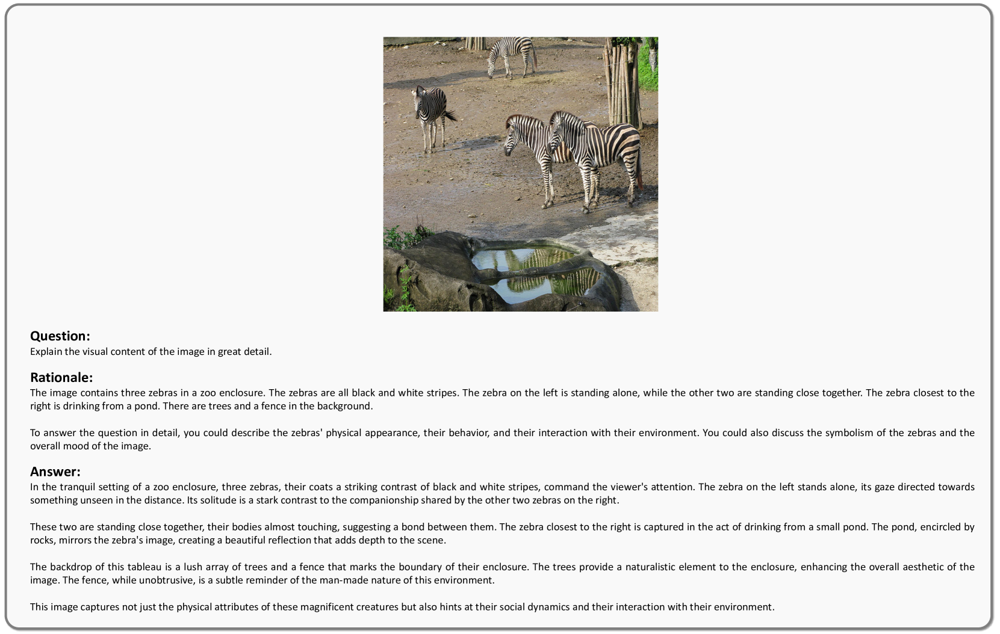

# Meteor：探索大规模语言与视觉模型中基于Mamba的推理路径

发布时间：2024年05月24日

`LLM应用

这篇论文摘要描述了一种新型的大型语言与视觉模型（LLVM）——Meteor，它通过特定的架构和处理方式，在多个评估基准上提升了视觉语言性能。这种模型的发展和应用直接关联到LLM的实际应用领域，特别是在视觉指令调谐技术方面的进步，以及如何通过整合高质量数据集和视觉编码器来提升模型性能。因此，这篇论文属于LLM应用分类。` `计算机视觉` `人工智能`

> Meteor: Mamba-based Traversal of Rationale for Large Language and Vision Models

# 摘要

> 随着视觉指令调谐技术的进步，大型语言与视觉模型（LLVMs）正迅速发展。开源LLVMs通过整合高质量视觉指令数据集，并结合额外的视觉编码器或多种计算机视觉模型，正逐步缩小与闭源LLVMs的性能差距。这些进步将归功于对多方面信息的需求，涵盖了从基础图像理解到现实世界知识（如常识、非物体概念、图表、符号等），再到解决复杂问题的详细步骤。基于此，我们开发了新型高效LLVM——Meteor，它通过Mamba架构处理序列数据，实现线性时间复杂度，并引入推理遍历概念，有效嵌入丰富信息的长推理。Meteor在无需扩大模型或增加额外视觉工具的情况下，在多个评估基准上显著提升了视觉语言性能，展现了其在多样能力需求下的优越性。

> The rapid development of large language and vision models (LLVMs) has been driven by advances in visual instruction tuning. Recently, open-source LLVMs have curated high-quality visual instruction tuning datasets and utilized additional vision encoders or multiple computer vision models in order to narrow the performance gap with powerful closed-source LLVMs. These advancements are attributed to multifaceted information required for diverse capabilities, including fundamental image understanding, real-world knowledge about common-sense and non-object concepts (e.g., charts, diagrams, symbols, signs, and math problems), and step-by-step procedures for solving complex questions. Drawing from the multifaceted information, we present a new efficient LLVM, Mamba-based traversal of rationales (Meteor), which leverages multifaceted rationale to enhance understanding and answering capabilities. To embed lengthy rationales containing abundant information, we employ the Mamba architecture, capable of processing sequential data with linear time complexity. We introduce a new concept of traversal of rationale that facilitates efficient embedding of rationale. Subsequently, the backbone multimodal language model (MLM) is trained to generate answers with the aid of rationale. Through these steps, Meteor achieves significant improvements in vision language performances across multiple evaluation benchmarks requiring diverse capabilities, without scaling up the model size or employing additional vision encoders and computer vision models.

[Arxiv](https://arxiv.org/abs/2405.15574)