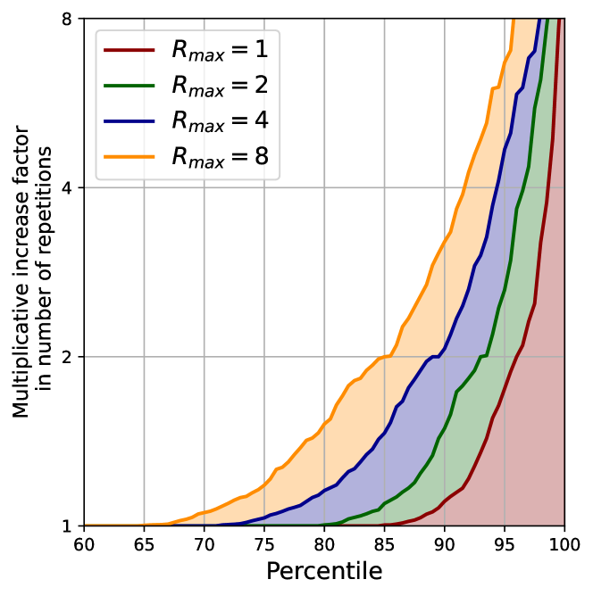

# 马赛克记忆：大型语言模型版权陷阱中的模糊复制现象

发布时间：2024年05月24日

`LLM理论

理由：这篇论文主要探讨了大型语言模型（LLMs）中版权内容的处理问题，并提出了一种新的策略——模糊版权陷阱，以增强内容在模型中的可检测性。这涉及到对LLMs的内部工作机制和数据处理的深入理解，以及对现有隐私保护措施（如数据去重技术）的挑战。因此，这篇论文更偏向于LLM的理论研究，特别是关于模型记忆和隐私保护的方面。` `版权保护` `隐私保护`

> Mosaic Memory: Fuzzy Duplication in Copyright Traps for Large Language Models

# 摘要

> 大型语言模型（LLMs）的开发数据集常含版权内容，且未经创作者许可。为此，我们提出了一种模糊版权陷阱策略，通过轻微修改文本序列来增强内容在新LLMs中的可检测性，从而避免了传统精确复制陷阱易受数据去重技术影响的弱点。实验表明，在1.3B LLM的微调数据中注入模糊陷阱序列，其记忆效果与精确副本相当，且在替换4个令牌后，成员推理攻击的ROC AUC仅略有下降。此外，通过优化替换位置，模糊副本的记忆效果得以保持，同时极大降低了被去重技术移除的风险。这一发现对依赖自然副本的LLM记忆研究提出了挑战，并揭示了The Pile数据集中存在的模糊副本问题，这为LLM记忆的后验研究引入了新的复杂因素，同时也对数据去重作为隐私保护措施的有效性提出了质疑。

> The immense datasets used to develop Large Language Models (LLMs) often include copyright-protected content, typically without the content creator's consent. Copyright traps have been proposed to be injected into the original content, improving content detectability in newly released LLMs. Traps, however, rely on the exact duplication of a unique text sequence, leaving them vulnerable to commonly deployed data deduplication techniques. We here propose the generation of fuzzy copyright traps, featuring slight modifications across duplication. When injected in the fine-tuning data of a 1.3B LLM, we show fuzzy trap sequences to be memorized nearly as well as exact duplicates. Specifically, the Membership Inference Attack (MIA) ROC AUC only drops from 0.90 to 0.87 when 4 tokens are replaced across the fuzzy duplicates. We also find that selecting replacement positions to minimize the exact overlap between fuzzy duplicates leads to similar memorization, while making fuzzy duplicates highly unlikely to be removed by any deduplication process. Lastly, we argue that the fact that LLMs memorize across fuzzy duplicates challenges the study of LLM memorization relying on naturally occurring duplicates. Indeed, we find that the commonly used training dataset, The Pile, contains significant amounts of fuzzy duplicates. This introduces a previously unexplored confounding factor in post-hoc studies of LLM memorization, and questions the effectiveness of (exact) data deduplication as a privacy protection technique.

[Arxiv](https://arxiv.org/abs/2405.15523)