# 精调大型语言模型，助力OpenAPI代码自动补全

发布时间：2024年05月24日

`LLM应用

这篇论文主要探讨了大型语言模型（LLMs）在代码生成领域的应用，特别是在OpenAPI补全任务上的表现。研究通过评估GitHub Copilot和优化Code Llama模型，展示了LLMs在特定软件开发任务中的应用和改进。这属于LLM应用的范畴，因为它关注的是LLMs在实际软件开发工具中的应用和性能优化。` `软件开发` `人工智能`

> Optimizing Large Language Models for OpenAPI Code Completion

# 摘要

> 大型语言模型（LLMs）的最新进展及其在代码生成中的应用，已深刻重塑了软件开发领域。尽管主流编程语言的代码补全工具表现出色，但在处理OpenAPI等非主流格式时，性能却有所不足。本研究对GitHub Copilot在OpenAPI补全任务上的表现进行了评估，并借助Meta的开源模型Code Llama提出了一系列针对性优化。通过本研究提出的语义感知OpenAPI补全基准，我们进行了一系列实验，深入分析了提示工程和微调技术对Code Llama性能的影响。结果显示，尽管参数数量仅为商业解决方案的1/25，微调后的Code Llama模型在正确性上超越了GitHub Copilot，提升了55.2%。此外，本研究还针对代码填充训练技术提出了一项改进，有效解决了模型在提示上下文小于训练时所用大小时的性能问题。

> Recent advancements in Large Language Models (LLMs) and their utilization in code generation tasks have significantly reshaped the field of software development. Despite the remarkable efficacy of code completion solutions in mainstream programming languages, their performance lags when applied to less ubiquitous formats such as OpenAPI definitions. This study evaluates the OpenAPI completion performance of GitHub Copilot, a prevalent commercial code completion tool, and proposes a set of task-specific optimizations leveraging Meta's open-source model Code Llama. A semantics-aware OpenAPI completion benchmark proposed in this research is used to perform a series of experiments through which the impact of various prompt-engineering and fine-tuning techniques on the Code Llama model's performance is analyzed. The fine-tuned Code Llama model reaches a peak correctness improvement of 55.2% over GitHub Copilot despite utilizing 25 times fewer parameters than the commercial solution's underlying Codex model. Additionally, this research proposes an enhancement to a widely used code infilling training technique, addressing the issue of underperformance when the model is prompted with context sizes smaller than those used during training.

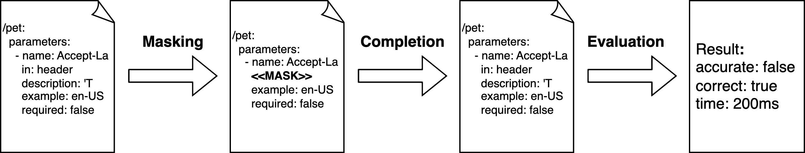

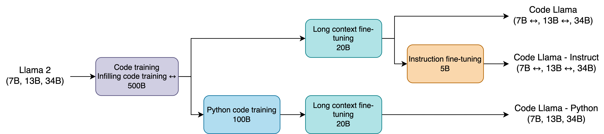

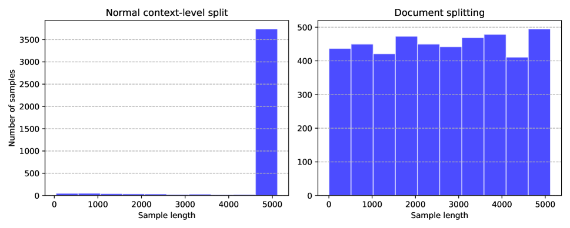

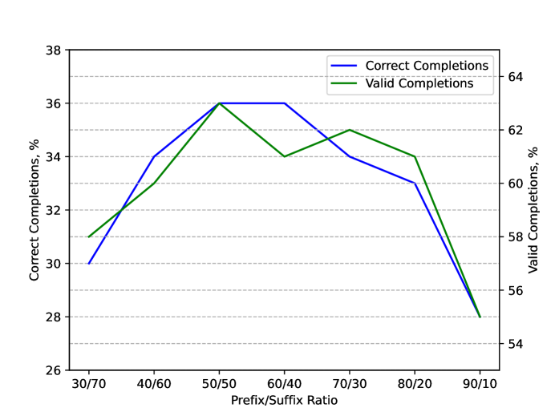

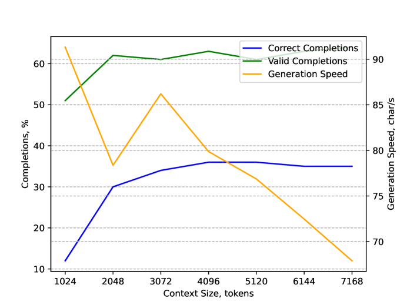

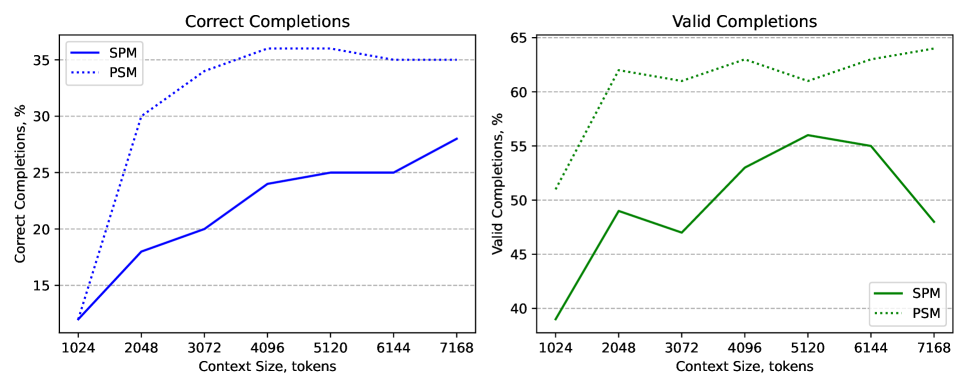

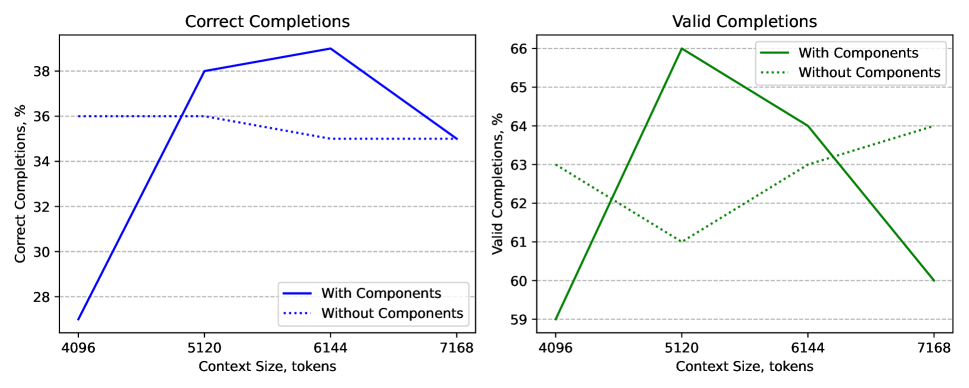

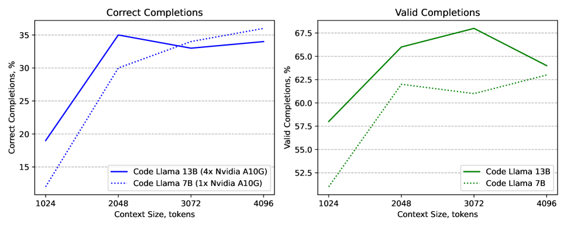

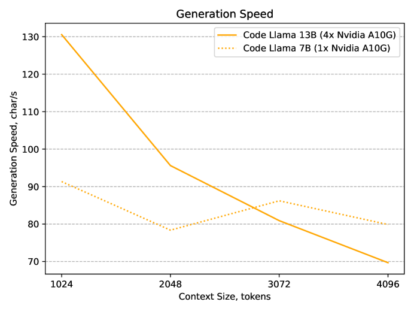

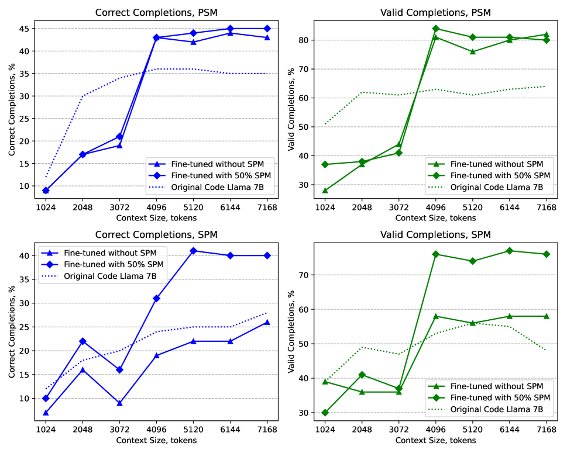

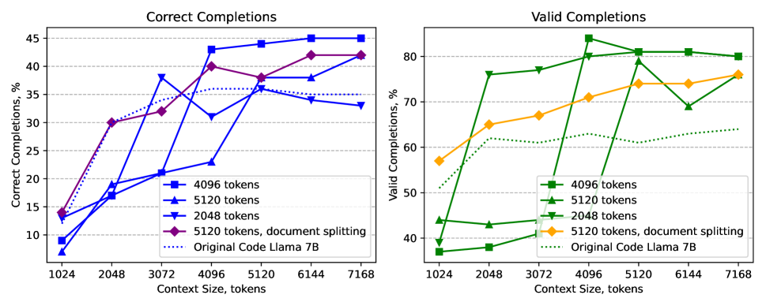

[Arxiv](https://arxiv.org/abs/2405.15729)