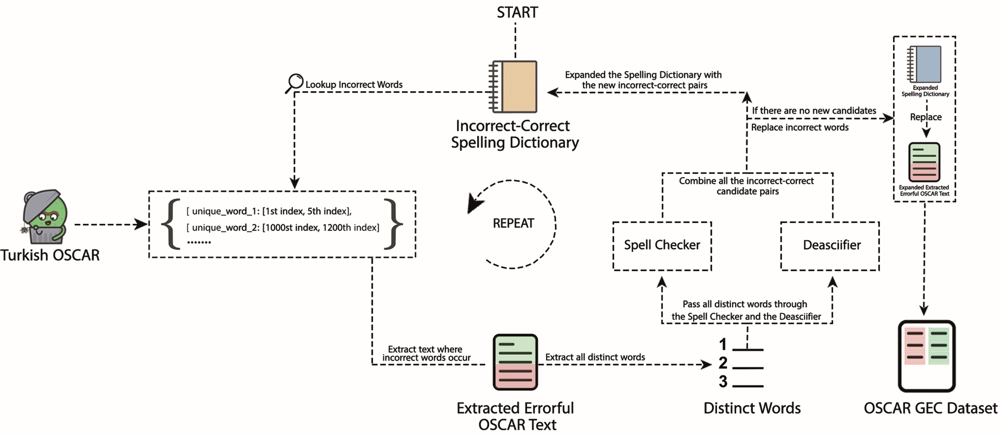
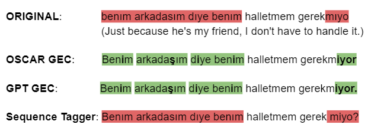

# 采用有机数据驱动策略，本研究致力于土耳其语法错误修正，并探索大型语言模型在此领域的应用。

发布时间：2024年05月24日

`LLM应用

这篇论文主要探讨了如何通过一种新的方法——清洁插入法，来构建土耳其语法错误修正的平行数据集，并优化大型语言模型的训练数据。这种方法特别关注于土耳其语，并在实际测试中取得了优异的成绩。因此，这篇论文的内容更偏向于大型语言模型的应用层面，即如何利用特定的技术和方法来改进语言模型的性能和应用效果。` `语言处理`

> Organic Data-Driven Approach for Turkish Grammatical Error Correction and LLMs

# 摘要

> 深度学习的进步，让语法错误修正技术焕发新生。然而，这些技术依赖于庞大的数据量，合成数据集应运而生，填补了这一需求。遗憾的是，这些合成数据集在某些情况下显得不够自然，甚至需要依赖于已清理的数据。此外，现有研究多聚焦于英语。本研究独辟蹊径，提出了一种基于有机数据的新方法——清洁插入法，旨在从任意有机数据源构建土耳其语法错误修正的平行数据集，并优化大型语言模型的训练数据。我们的方法在公开的三个土耳其语法错误修正测试集中的两个上取得了顶尖成绩，并在语言模型训练损失上展现了其卓越效果。

> Grammatical Error Correction has seen significant progress with the recent advancements in deep learning. As those methods require huge amounts of data, synthetic datasets are being built to fill this gap. Unfortunately, synthetic datasets are not organic enough in some cases and even require clean data to start with. Furthermore, most of the work that has been done is focused mostly on English. In this work, we introduce a new organic data-driven approach, clean insertions, to build parallel Turkish Grammatical Error Correction datasets from any organic data, and to clean the data used for training Large Language Models. We achieve state-of-the-art results on two Turkish Grammatical Error Correction test sets out of the three publicly available ones. We also show the effectiveness of our method on the training losses of training language models.

[Arxiv](https://arxiv.org/abs/2405.15320)