# 可控内存下的管道并行性

发布时间：2024年05月24日

`LLM应用

这篇论文主要讨论了在大型语言模型（LLM）应用中，通过改进流水线并行调度来提高内存效率和吞吐量。论文提出了一种新的框架，通过优化构建块的设计来控制激活内存，从而降低峰值内存使用并提高吞吐量。这种方法在实际应用中通过混合并行性超参数的网格搜索，进一步提高了大语言模型的吞吐量。因此，这篇论文的内容更偏向于LLM的实际应用，特别是在优化模型运行效率方面。` `计算机科学` `高性能计算`

> Pipeline Parallelism with Controllable Memory

# 摘要

> 流水线并行虽广受研究，但多数调度缺乏系统方法。本文提出框架，将流水线调度视为重复构建块，揭示构建块寿命决定峰值激活内存。我们发现，几乎所有现有调度均内存效率低下。为此，我们设计了一组高效内存构建块，可控激活内存，峰值降至1F1B的一半，效率不减，甚至可达三分之一，吞吐量相当。同时，我们几乎消除了流水线气泡，激活内存与1F1B持平。评估显示，在纯流水线并行下，我们的方法吞吐量提升7%至55%。在实际应用中，通过混合并行性超参数的网格搜索，我们提出的方法在大语言模型上比1F1B基线提高了16%的吞吐量。

> Pipeline parallelism has been widely explored, but most existing schedules lack a systematic methodology. In this paper, we propose a framework to decompose pipeline schedules as repeating a building block and we show that the lifespan of the building block decides the peak activation memory of the pipeline schedule. Guided by the observations, we find that almost all existing pipeline schedules, to the best of our knowledge, are memory inefficient. To address this, we introduce a family of memory efficient building blocks with controllable activation memory, which can reduce the peak activation memory to 1/2 of 1F1B without sacrificing efficiency, and even to 1/3 with comparable throughput. We can also achieve almost zero pipeline bubbles while maintaining the same activation memory as 1F1B. Our evaluations demonstrate that in pure pipeline parallelism settings, our methods outperform 1F1B by from 7% to 55% in terms of throughput. When employing a grid search over hybrid parallelism hyperparameters in practical scenarios, our proposed methods demonstrate a 16% throughput improvement over the 1F1B baseline for large language models.

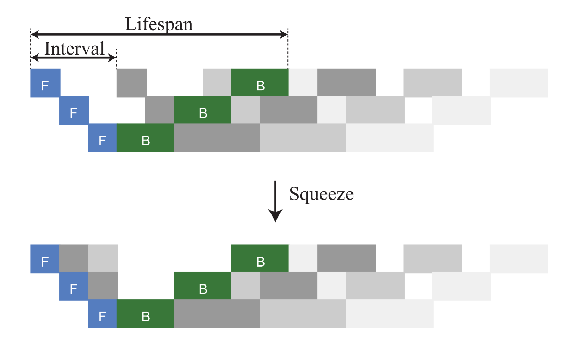

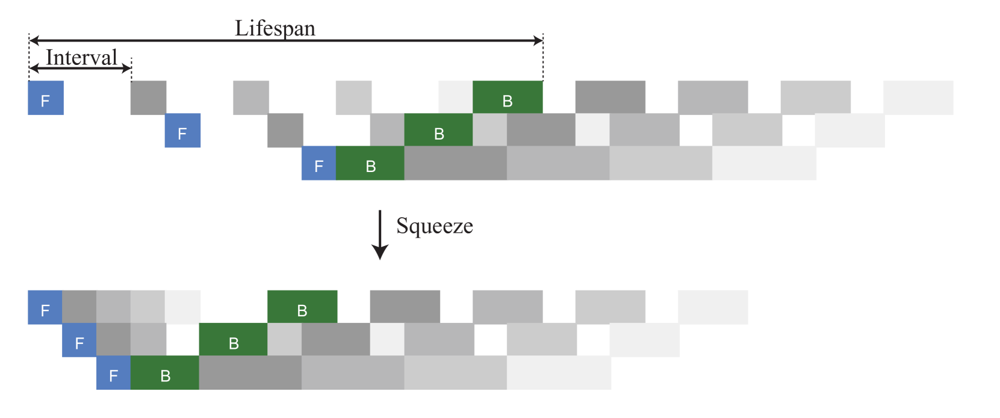

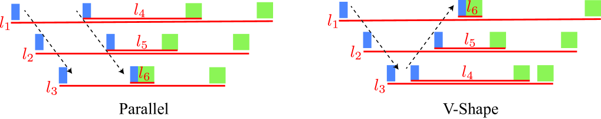

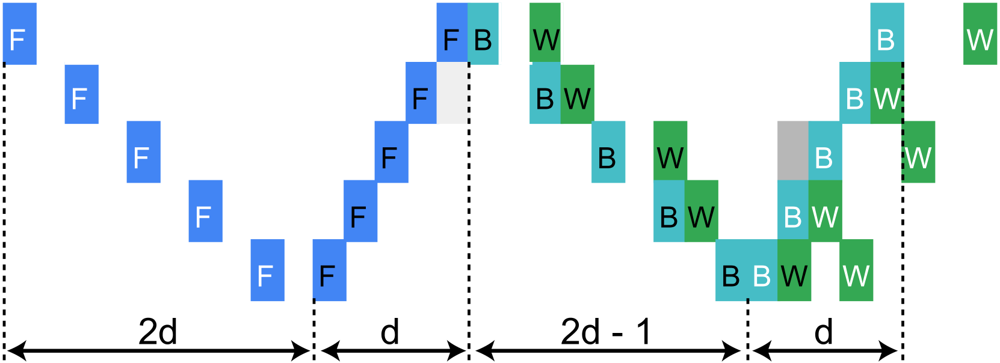

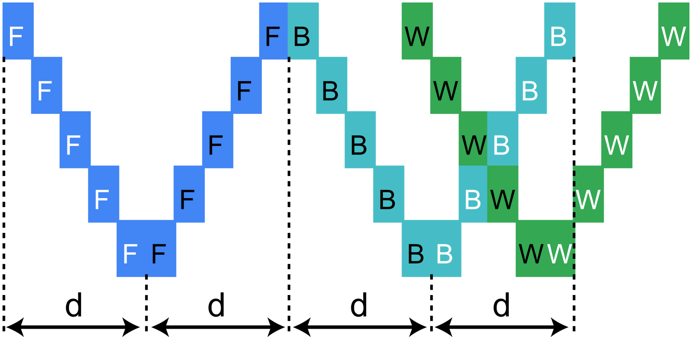

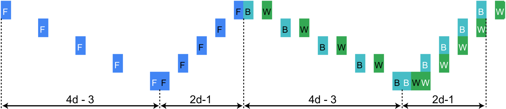

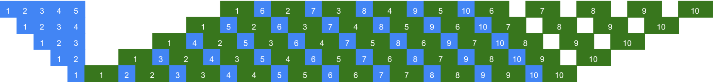

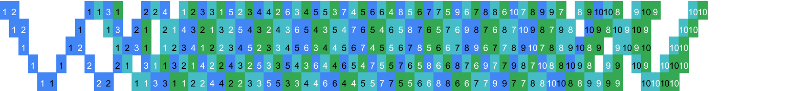

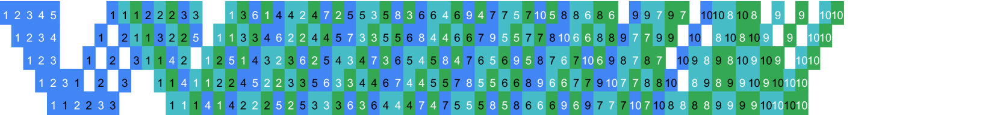

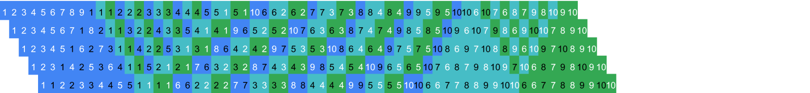

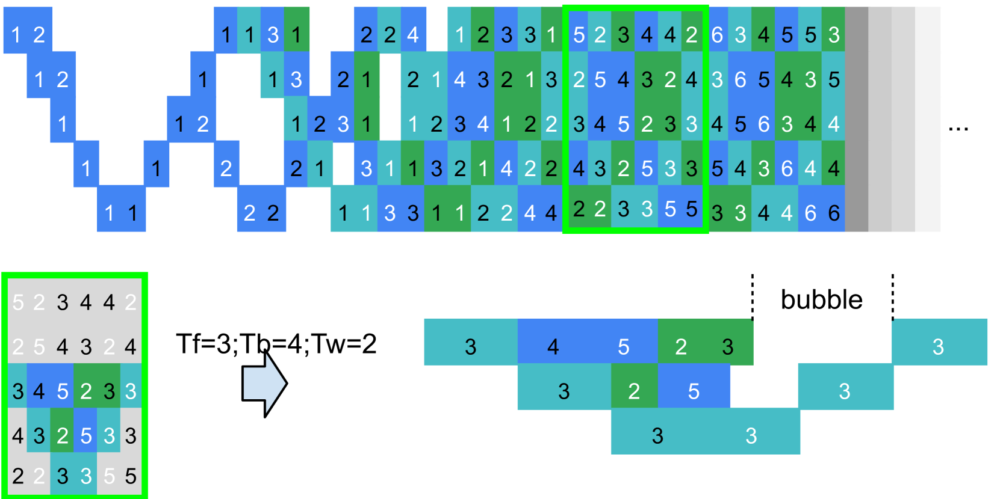

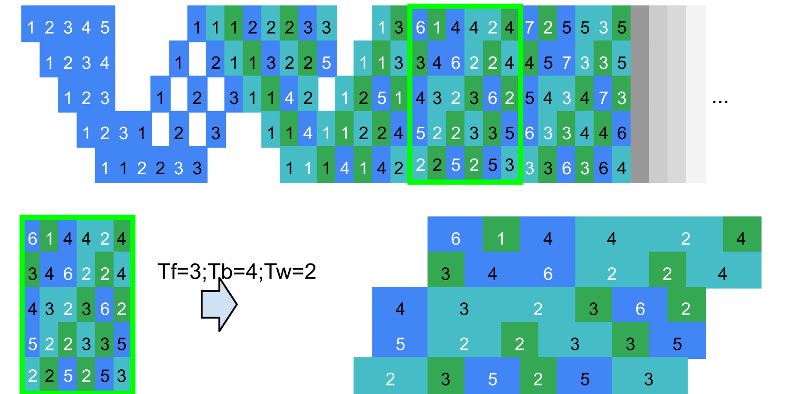

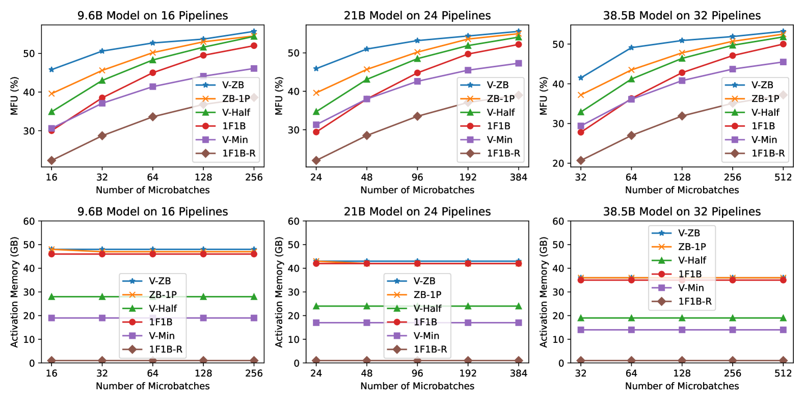

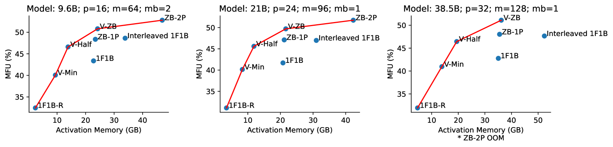

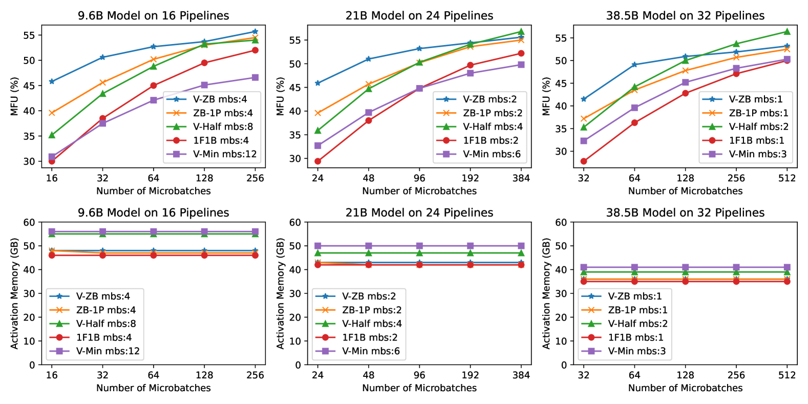

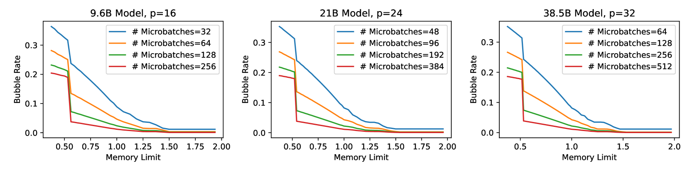

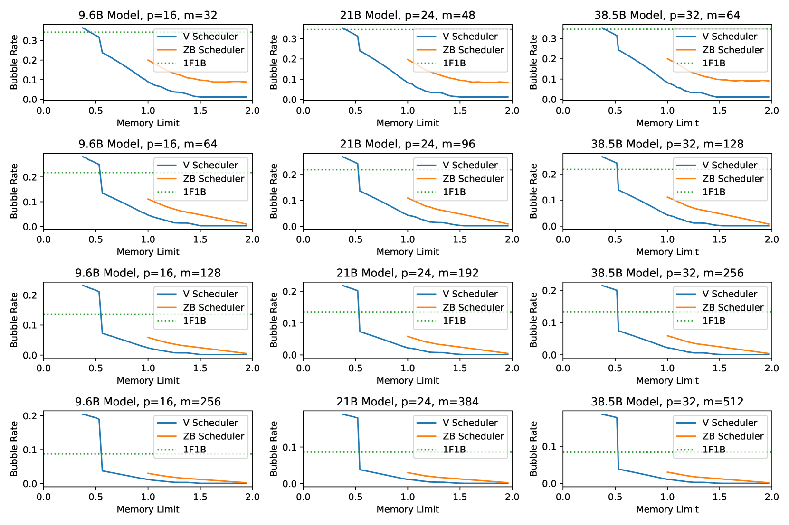

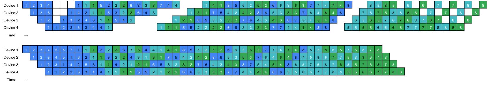

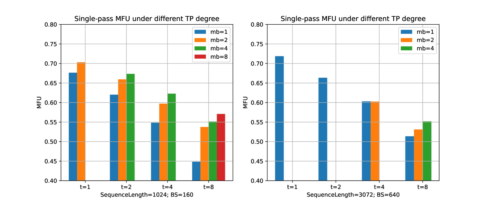

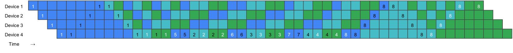

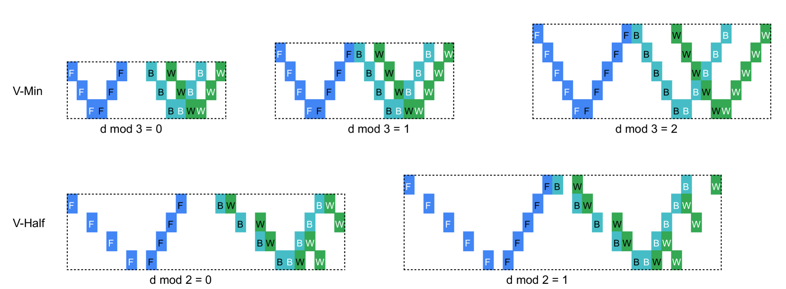

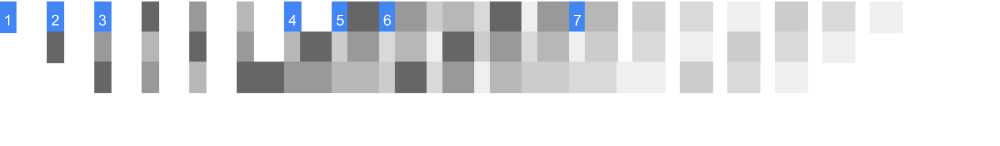

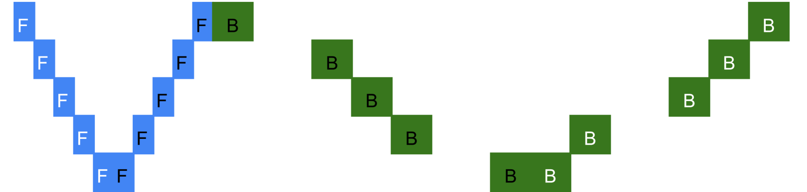

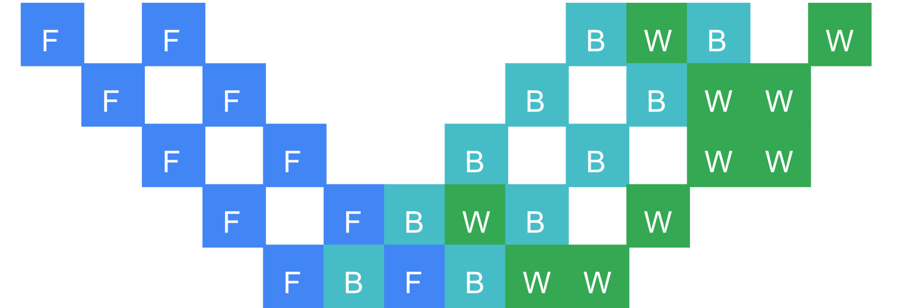

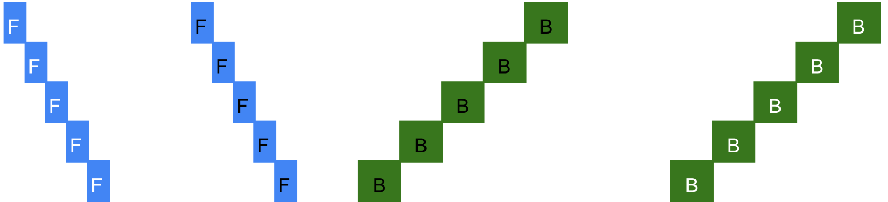

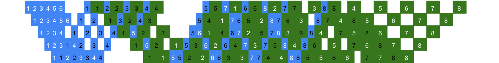

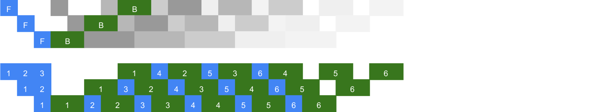

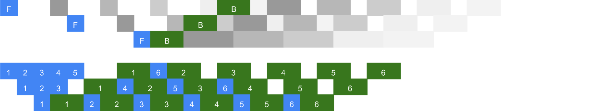

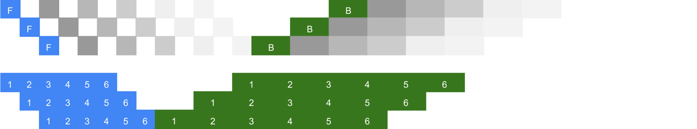

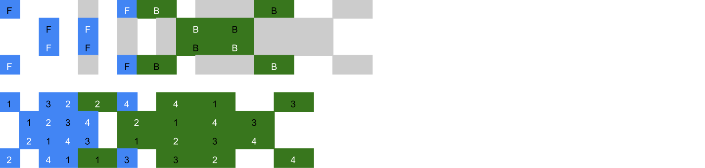

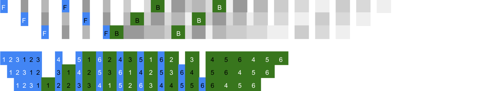

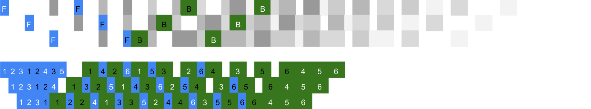

[Arxiv](https://arxiv.org/abs/2405.15362)