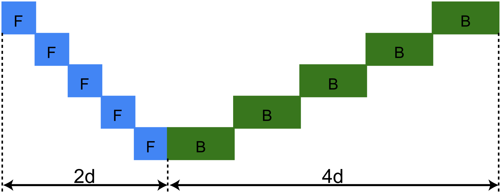

# 可控内存下的管道并行技术

发布时间：2024年05月24日

`LLM应用

这篇论文主要讨论了在大型语言模型（LLM）应用中，如何通过改进流水线并行调度框架来优化内存使用和提高吞吐量。论文提出了一种新的调度框架，该框架通过重复使用基础模块并优化其生命周期，显著降低了峰值内存使用，同时提高了吞吐量。这种方法在实际应用中，特别是在处理大型语言模型时，显示出了显著的性能提升。因此，这篇论文的内容更偏向于LLM的实际应用，而不是Agent、RAG或LLM理论。` `计算机科学` `并行计算`

> Pipeline Parallelism with Controllable Memory

# 摘要

> 流水线并行虽广受关注，但多数调度方案缺乏系统性。本文提出一种新框架，将流水线调度视为重复使用基础模块，并揭示了这些模块的生命周期直接关联到调度的峰值内存使用。我们发现，几乎所有现有调度方案在内存使用上均不尽人意。为此，我们开发了一系列高效内存的基础模块，其激活内存可调，能在不损效率的前提下，将峰值内存降至1F1B的一半，甚至三分之一，同时保持相当的吞吐量。此外，我们还能在维持相同激活内存的同时，几乎消除流水线中的气泡。评估显示，在纯流水线并行环境下，我们的方法在吞吐量上比1F1B高出7%至55%。在实际应用中，通过混合并行性超参数的网格搜索，我们的方法在大语言模型上相比1F1B基线提升了16%的吞吐量。

> Pipeline parallelism has been widely explored, but most existing schedules lack a systematic methodology. In this paper, we propose a framework to decompose pipeline schedules as repeating a building block and we show that the lifespan of the building block decides the peak activation memory of the pipeline schedule. Guided by the observations, we find that almost all existing pipeline schedules, to the best of our knowledge, are memory inefficient. To address this, we introduce a family of memory efficient building blocks with controllable activation memory, which can reduce the peak activation memory to 1/2 of 1F1B without sacrificing efficiency, and even to 1/3 with comparable throughput. We can also achieve almost zero pipeline bubbles while maintaining the same activation memory as 1F1B. Our evaluations demonstrate that in pure pipeline parallelism settings, our methods outperform 1F1B by from 7% to 55% in terms of throughput. When employing a grid search over hybrid parallelism hyperparameters in practical scenarios, our proposed methods demonstrate a 16% throughput improvement over the 1F1B baseline for large language models.

[Arxiv](https://arxiv.org/abs/2405.15362)