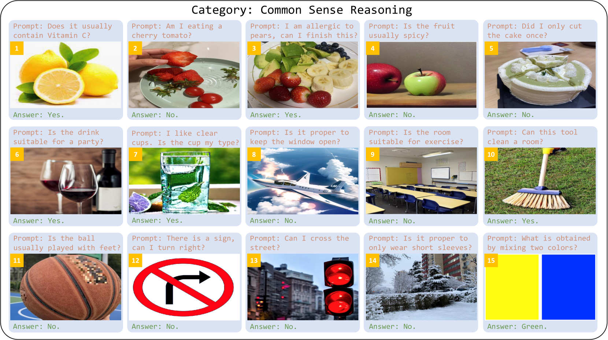

# 提示感知适配器：探索为多模态大型语言模型学习适应性视觉标记的新途径

发布时间：2024年05月24日

`RAG

理由：这篇论文主要讨论了多模态大型语言模型（MLLMs）中的视觉信息转换问题，并提出了一种新的适配器——提示感知适配器，以改善LLMs对视觉内容的理解。这种适配器的设计和优化属于模型架构的改进，特别是在多模态信息处理方面，这与RAG（Retrieval-Augmented Generation）模型的概念相似，即通过改进信息检索和整合机制来增强模型的性能。因此，这篇论文更适合归类于RAG。` `视觉问答` `多模态学习`

> Prompt-Aware Adapter: Towards Learning Adaptive Visual Tokens for Multimodal Large Language Models

# 摘要

> 为了连接视觉与语言，多模态大型语言模型（MLLMs）通常采用适配器将视觉信息转换为大型语言模型（LLMs）能理解的令牌。但多数适配器生成的视觉令牌缺乏针对性，不考虑提示中提及的具体对象。这些适配器对图像细节一视同仁，关注全局场景，可能导致LLMs在复杂场景处理中的认知负担加重。为此，我们提出了提示感知适配器，它能根据提示的焦点动态调整视觉输入的嵌入。通过结合全局与局部文本特征，提示感知适配器能在不同粒度上捕捉到提示中最关键的视觉线索，大幅提升了LLMs对视觉内容的理解力。在多种视觉问答任务，如计数和位置推理中的实验，均显示了提示感知适配器的显著效果。

> To bridge the gap between vision and language modalities, Multimodal Large Language Models (MLLMs) usually learn an adapter that converts visual inputs to understandable tokens for Large Language Models (LLMs). However, most adapters generate consistent visual tokens, regardless of the specific objects of interest mentioned in the prompt. Since these adapters distribute equal attention to every detail in the image and focus on the entire scene, they may increase the cognitive load for LLMs, particularly when processing complex scenes. To alleviate this problem, we propose prompt-aware adapters. These adapters are designed with the capability to dynamically embed visual inputs based on the specific focus of the prompt. Specifically, prompt-aware adapters utilize both global and local textual features to capture the most relevant visual clues from the prompt at both coarse and fine granularity levels. This approach significantly enhances the ability of LLMs to understand and interpret visual content. Experiments on various visual question answering tasks, such as counting and position reasoning, demonstrate the effectiveness of prompt-aware adapters.

[Arxiv](https://arxiv.org/abs/2405.15684)