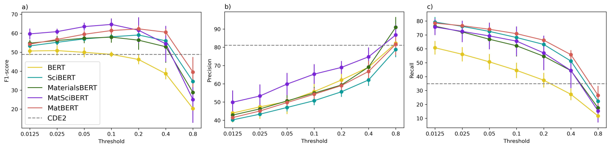

# 钙钛矿材料科学文献信息提取的问答模型

发布时间：2024年05月24日

`Agent

这篇论文主要关注的是如何利用问答（QA）技术从科学文本中提取材料与属性的关联，特别是在材料科学领域。虽然涉及到了大型语言模型（LLM）的应用，但重点在于通过QA技术构建的Agent，即一个能够理解和回答关于材料属性问题的系统。这个Agent通过优化的大型语言模型来提高其性能，特别是在钙钛矿带隙信息的提取上。因此，这篇论文更符合Agent分类，因为它主要讨论的是一个特定领域的智能Agent的构建和应用。` `材料科学` `问答系统`

> Question Answering models for information extraction from perovskite materials science literature

# 摘要

> 科学文本在材料科学中被视为宝贵的数据源，研究者们正探索如何利用文本数据推动材料发现。本研究中，我们采用问答（QA）技术，创新性地从科学文献中提取材料与属性的关联。通过人类查询，我们评估了钙钛矿带隙信息的提取效果，并发现五种针对QA任务优化的大型语言模型表现各异。其中，QA MatBERT表现最佳，其F1分数超越了现有技术水平。此研究不仅展示了QA流程，也为未来应用奠定了基础。QA方法的简便性、广泛适用性和高准确性，预示着它在材料研究中通过文本驱动发现方面的巨大潜力。

> Scientific text is a promising source of data in materials science, with ongoing research into utilising textual data for materials discovery. In this study, we developed and tested a novel approach to extract material-property relationships from scientific publications using the Question Answering (QA) method. QA performance was evaluated for information extraction of perovskite bandgaps based on a human query. We observed considerable variation in results with five different large language models fine-tuned for the QA task. Best extraction accuracy was achieved with the QA MatBERT and F1-scores improved on the current state-of-the-art. This work demonstrates the QA workflow and paves the way towards further applications. The simplicity, versatility and accuracy of the QA approach all point to its considerable potential for text-driven discoveries in materials research.

[Arxiv](https://arxiv.org/abs/2405.15290)