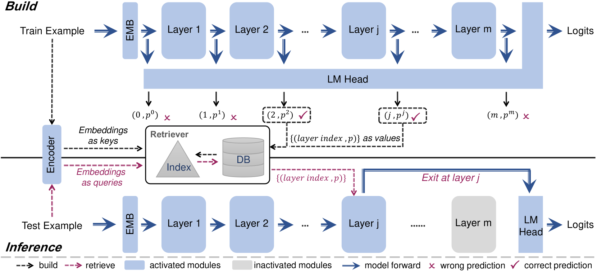
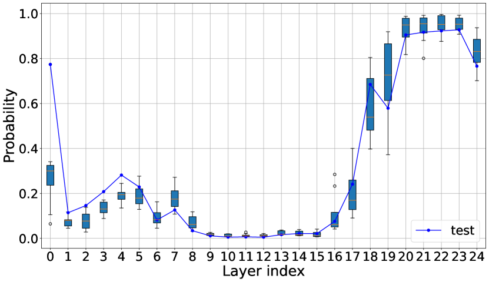
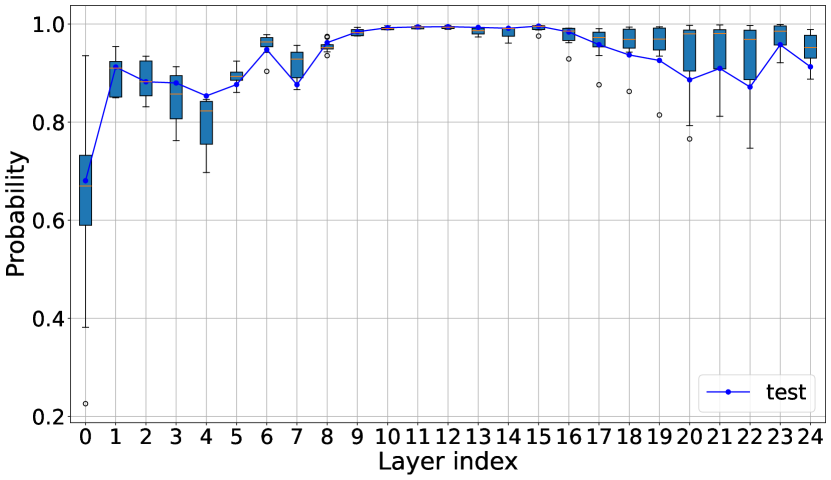

# RAEE：一种无需额外训练的检索增强框架，通过早期退出策略优化推理效率

发布时间：2024年05月24日

`RAG

理由：这篇论文介绍了一种名为RAEE的新型检索增强型早期退出框架，该框架旨在提高大型语言模型的推理效率。它通过将早期退出问题转化为分布预测问题，并利用检索到的信息来引导模型在预测的层级提前退出。这种方法与RAG（Retrieval-Augmented Generation）的概念相符，即通过检索增强来改善模型的性能和效率。因此，这篇论文应归类于RAG。` `人工智能` `推理加速`

> RAEE: A Training-Free Retrieval-Augmented Early Exiting Framework for Efficient Inference

# 摘要

> 大型语言模型的推理部署因其高计算成本而充满挑战。早期退出策略通过动态减少推理层数来加速这一过程。然而，现有的早期退出方法依赖于内部分类器的训练，这不仅设计复杂，而且训练成本高昂。为此，本文提出了RAEE，一种无需额外训练的检索增强型早期退出框架，旨在提升推理效率。首先，我们将早期退出问题转化为一个分布预测问题，利用类似数据的已有信息来近似这一分布。接着，详细阐述了如何收集这些信息以构建检索数据库。最后，RAEE利用这些检索到的信息，引导模型在预测的层级提前退出，从而加速推理过程。实验证明，RAEE不仅大幅提升了推理速度，还在8个分类任务上达到了顶尖的零-shot性能。

> Deploying large language model inference remains challenging due to their high computational overhead. Early exiting accelerates model inference by adaptively reducing the number of inference layers. Existing methods require training internal classifiers to determine whether to exit at each intermediate layer. However, such classifier-based early exiting frameworks require significant effort to design and train the classifiers. To address these limitations, this paper proposes RAEE, a training-free Retrieval-Augmented Early Exiting framework for efficient inference. First, this paper demonstrates that the early exiting problem can be modeled as a distribution prediction problem, where the distribution is approximated using similar data's existing information. Next, the paper details the process of collecting existing information to build the retrieval database. Finally, based on the pre-built retrieval database, RAEE leverages the retrieved similar data's exiting information to guide the backbone model to exit at the layer, which is predicted by the approximated distribution. Experimental results demonstrate that the proposed RAEE can significantly accelerate inference. RAEE also achieves state-of-the-art zero-shot performance on 8 classification tasks.

[Arxiv](https://arxiv.org/abs/2405.15198)