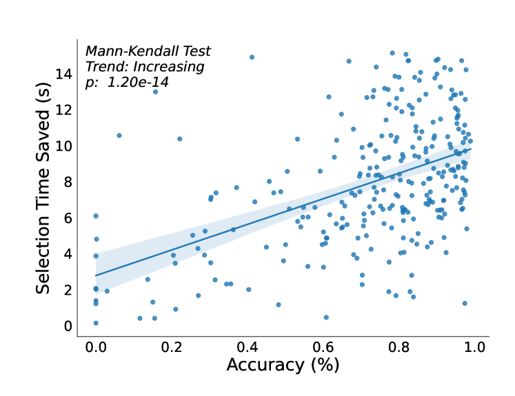

# 大型语言模型中判别分类的扩展规律

发布时间：2024年05月24日

`LLM应用

这篇论文摘要描述了一个系统，该系统利用大型语言模型（LLMs）的能力来增强客户支持人员的响应。它通过将LLM的能力转化为判别分类任务，为支持人员提供前K个最佳响应模板。这种方法旨在解决LLMs在客户支持中可能产生的幻觉问题，并提升性能。因此，这项工作属于LLM应用类别，因为它专注于将LLM技术应用于实际的客户支持场景中，以改善服务质量和效率。` `客户支持` `机器学习`

> Scaling Laws for Discriminative Classification in Large Language Models

# 摘要

> 现代大型语言模型（LLMs）标志着机器学习能力的一次飞跃，它们能对多样化的查询提供合理回答，预示着在客户支持领域的巨大潜力。然而，这些模型易产生幻觉，限制了其在客户支持中的即时应用。为此，我们开发了一个系统，将LLM的能力转化为判别分类任务，以增强客户支持人员的响应。该系统为支持人员提供前K个最佳响应模板。实验结果显示，无论是在离线还是在线环境中，我们的系统都显著提升了性能。我们还分析了模型参数对验证损失和前K准确性的影响，并探讨了模型规模、延迟与准确性之间的平衡。最后，我们展望了未来可能的应用方向。

> Modern large language models (LLMs) represent a paradigm shift in what can plausibly be expected of machine learning models. The fact that LLMs can effectively generate sensible answers to a diverse range of queries suggests that they would be useful in customer support applications. While powerful, LLMs have been observed to be prone to hallucination which unfortunately makes their near term use in customer support applications challenging. To address this issue we present a system that allows us to use an LLM to augment our customer support advocates by re-framing the language modeling task as a discriminative classification task. In this framing, we seek to present the top-K best template responses for a customer support advocate to use when responding to a customer. We present the result of both offline and online experiments where we observed offline gains and statistically significant online lifts for our experimental system. Along the way, we present observed scaling curves for validation loss and top-K accuracy, resulted from model parameter ablation studies. We close by discussing the space of trade-offs with respect to model size, latency, and accuracy as well as and suggesting future applications to explore.

[Arxiv](https://arxiv.org/abs/2405.15765)