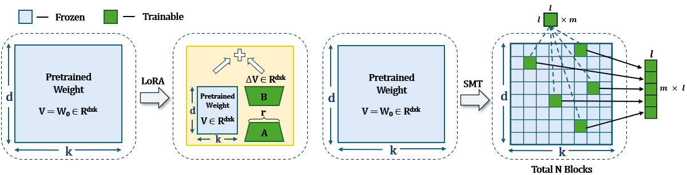
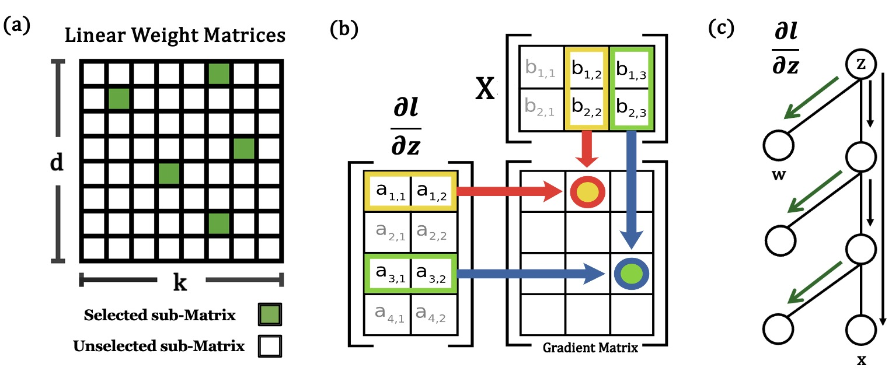
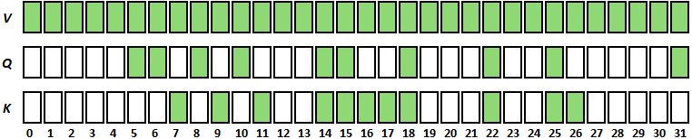
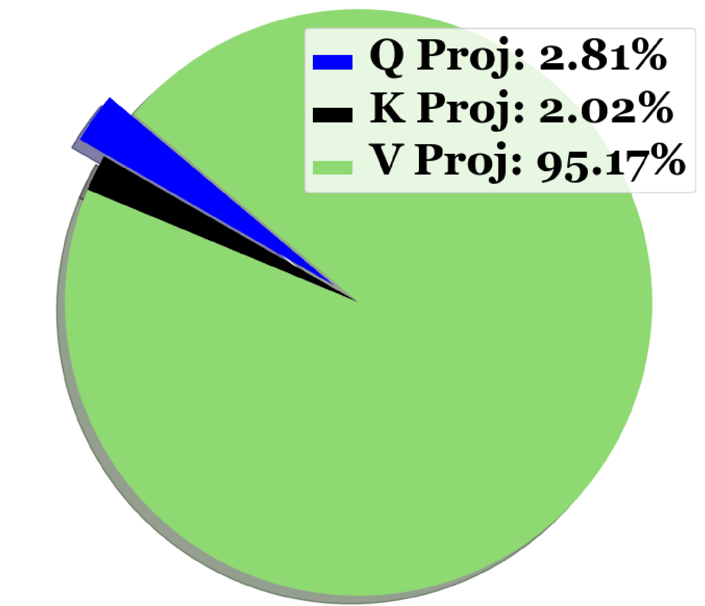
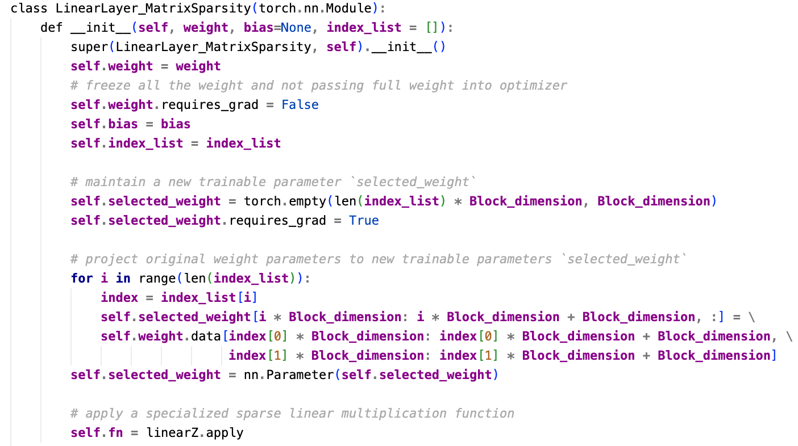
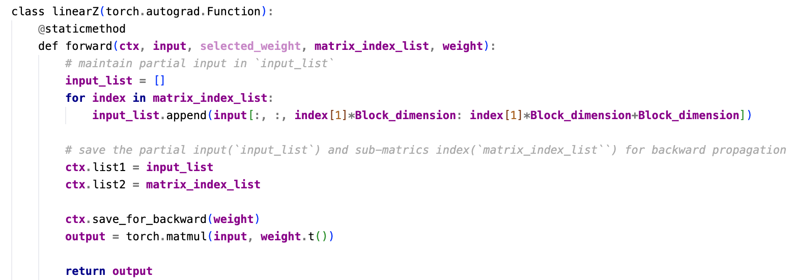
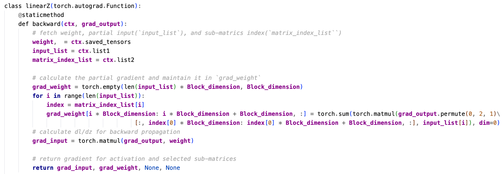

# 大型语言模型微调中的稀疏矩阵探索

发布时间：2024年05月24日

`LLM理论

理由：这篇论文主要探讨了参数高效微调（PEFT）方法，特别是LoRA及其变种，在微调大型语言模型（如LLaMA）时的性能和效率问题。论文提出了一种新的方法——稀疏矩阵调优（SMT），旨在优化微调过程中的计算和内存开销，并提高模型的准确性。这一研究深入分析了微调技术的理论基础和性能优化，属于对大型语言模型理论层面的探讨和改进，因此归类为LLM理论。` `机器学习`

> Sparse Matrix in Large Language Model Fine-tuning

# 摘要

> LoRA及其变种因其避免高昂计算成本的能力而成为流行的参数高效微调（PEFT）方法。然而，PEFT与完全微调（FT）之间的准确性差距尚未得到系统研究。我们提出了一种选择稀疏子矩阵的方法，旨在缩小这一性能差距，并降低微调的计算和内存开销。我们的稀疏矩阵调优（SMT）方法首先识别并更新梯度更新中最关键的子矩阵。实验表明，SMT在微调如LLaMA等大型语言模型时，不仅在多个任务上优于LoRA和DoRA等基线，还减少了67%的GPU内存使用。此外，我们发现LoRA和DoRA的性能随着可训练参数的增加而趋于饱和和下降，而SMT则无此问题。

> LoRA and its variants have become popular parameter-efficient fine-tuning (PEFT) methods due to their ability to avoid excessive computational costs. However, an accuracy gap often exists between PEFT methods and full fine-tuning (FT), and this gap has yet to be systematically studied. In this work, we introduce a method for selecting sparse sub-matrices that aim to minimize the performance gap between PEFT vs. full fine-tuning (FT) while also reducing both fine-tuning computational cost and memory cost. Our Sparse Matrix Tuning (SMT) method begins by identifying the most significant sub-matrices in the gradient update, updating only these blocks during the fine-tuning process. In our experiments, we demonstrate that SMT consistently surpasses other PEFT baseline (e.g. LoRA and DoRA) in fine-tuning popular large language models such as LLaMA across a broad spectrum of tasks, while reducing the GPU memory footprint by 67% compared to FT. We also examine how the performance of LoRA and DoRA tends to plateau and decline as the number of trainable parameters increases, in contrast, our SMT method does not suffer from such issue.

[Arxiv](https://arxiv.org/abs/2405.15525)