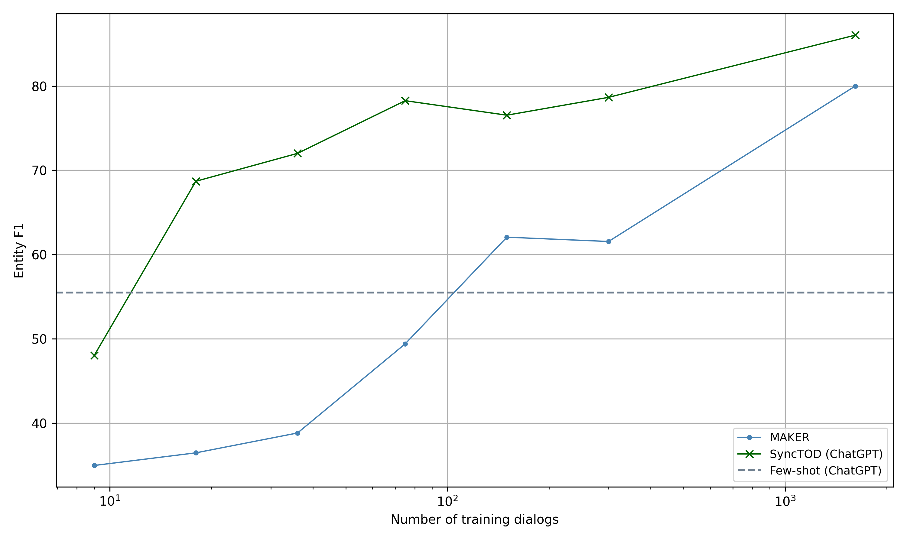

# 融合提示的上下文学习，提升端到端任务导向型对话系统的协同效应

发布时间：2024年05月24日

`Agent

理由：这篇论文主要讨论了基于大型语言模型（LLM）的端到端任务导向对话系统，特别是在训练数据稀缺时的性能优化。论文中提到的SyncTOD系统通过结合LLM与任务相关的提示来优化对话系统的性能，这涉及到模型的自主学习和适应能力，符合Agent类别的定义，即模型能够根据环境和任务需求自主地做出决策和行动。此外，论文中提到的情境学习和示例选择也体现了模型在特定任务环境下的自适应和优化能力，这些都是Agent系统的关键特征。` `对话系统` `人工智能`

> Synergizing In-context Learning with Hints for End-to-end Task-oriented Dialog Systems

# 摘要

> 当训练数据稀缺时，基于LLM的端到端任务导向对话系统通过情境学习展现出优于传统监督模型的性能。这得益于LLM通过少量示例学习任何任务的内在能力。然而，随着训练对话量的增加，监督模型因其能更好地模仿训练数据中的系统响应风格而超越了LLM。为此，我们推出了SyncTOD，它巧妙地结合了LLM与任务相关的提示，以优化对齐效果。具体而言，SyncTOD通过训练辅助模型来提供这些提示，并为情境学习选择合适的示例。借助ChatGPT，SyncTOD在数据稀缺环境下超越了其他基于LLM的系统和最新模型，同时在数据充足时也保持了竞争力。

> Large language models (LLM) based end-to-end task-oriented dialog (TOD) systems built using few-shot (in-context) learning perform better than supervised models only when the train data is limited. This is due to the inherent ability of LLMs to learn any task with just a few demonstrations. As the number of train dialogs increases, supervised SoTA models surpass in-context learning LLMs as they learn to better align with the style of the system responses in the training data, which LLMs struggle to mimic. In response, we propose SyncTOD, which synergizes LLMs with useful hints about the task for improved alignment. At a high level, SyncTOD trains auxiliary models to provide these hints and select exemplars for the in-context prompts. With ChatGPT, SyncTOD achieves superior performance compared to LLM-based baselines and SoTA models in low-data settings, while retaining competitive performance in full-data settings

[Arxiv](https://arxiv.org/abs/2405.15585)