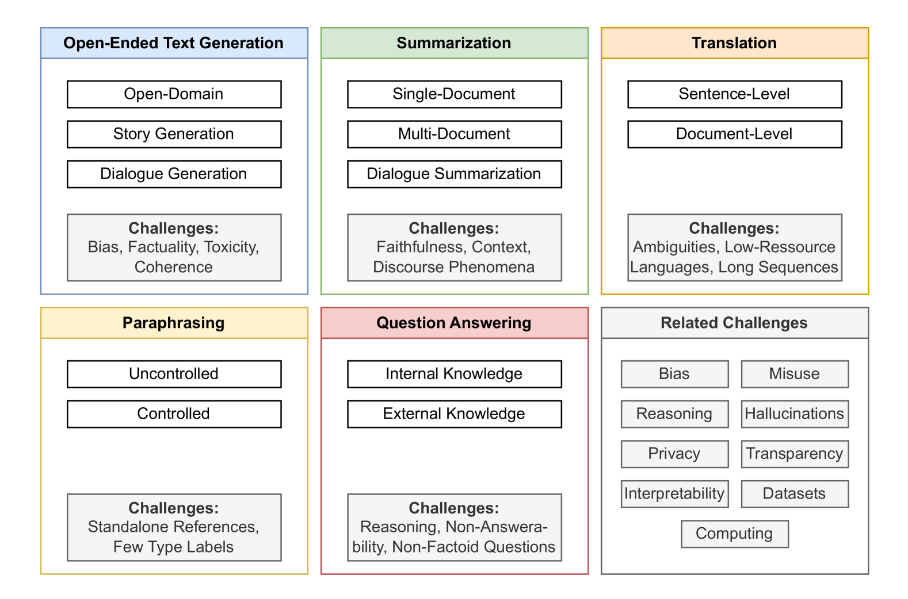
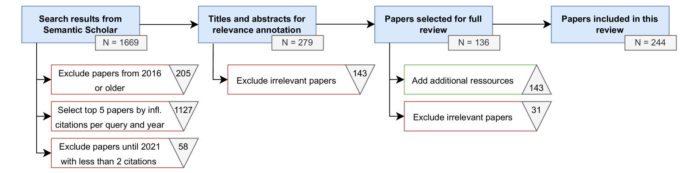

# 文本生成综述：系统探讨任务、评估及面临的挑战

发布时间：2024年05月24日

`LLM应用

这篇论文摘要主要讨论了基于大型语言模型的文本生成研究，包括其核心任务、特定挑战以及评估方法。它回顾了相关领域的研究进展，并指出了存在的挑战和可能的解决方案。这些内容主要关注LLM在实际应用中的问题和进展，因此适合归类为LLM应用。` `文本生成`

> Text Generation: A Systematic Literature Review of Tasks, Evaluation, and Challenges

# 摘要

> 文本生成如今触手可及，尤其是基于大型语言模型的系统，引发了广泛的研究兴趣和相关出版物的激增。我们系统地回顾了2017至2024年间精选的244篇论文，将文本生成研究归纳为五大核心任务：开放式文本生成、摘要、翻译、改写及问答。针对每一任务，我们探讨了其特性、子任务及特定挑战，如多文档摘要的数据集匮乏、故事生成的连贯性问题、问答中的复杂推理等。同时，我们审视了当前文本生成系统的评估方法，并指出了现有评价指标的不足。调查揭示了近期文本生成研究中普遍存在的九大挑战：偏见、推理、幻觉、误用、隐私、可解释性、透明度、数据集和计算能力。我们深入分析了这些挑战，探讨了可能的解决方案，并指出了需要社区进一步关注的领域。本综述旨在为自然语言处理领域的初入行研究者提供领域概览及研究方向，同时也为资深研究者提供任务细节、评估方法、开放挑战及近期应对策略的深入洞察。

> Text generation has become more accessible than ever, and the increasing interest in these systems, especially those using large language models, has spurred an increasing number of related publications. We provide a systematic literature review comprising 244 selected papers between 2017 and 2024. This review categorizes works in text generation into five main tasks: open-ended text generation, summarization, translation, paraphrasing, and question answering. For each task, we review their relevant characteristics, sub-tasks, and specific challenges (e.g., missing datasets for multi-document summarization, coherence in story generation, and complex reasoning for question answering). Additionally, we assess current approaches for evaluating text generation systems and ascertain problems with current metrics. Our investigation shows nine prominent challenges common to all tasks and sub-tasks in recent text generation publications: bias, reasoning, hallucinations, misuse, privacy, interpretability, transparency, datasets, and computing. We provide a detailed analysis of these challenges, their potential solutions, and which gaps still require further engagement from the community. This systematic literature review targets two main audiences: early career researchers in natural language processing looking for an overview of the field and promising research directions, as well as experienced researchers seeking a detailed view of tasks, evaluation methodologies, open challenges, and recent mitigation strategies.

[Arxiv](https://arxiv.org/abs/2405.15604)