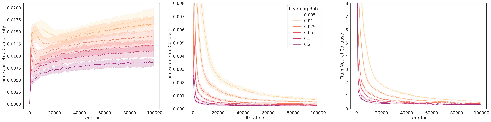

# 迁移学习中几何复杂性对神经崩溃的影响探究

发布时间：2024年05月24日

`LLM理论

这篇论文主要探讨了大型语言模型（LLM）预训练过程中的理论问题，特别是模型学习表示的几何复杂性与神经崩溃之间的关系。它通过理论分析和实验研究，揭示了影响预训练网络几何复杂性的因素如何影响神经崩溃，并进一步影响少样本情境下的下游任务表现。这与LLM的理论研究紧密相关，因此归类为LLM理论。` `计算机视觉` `机器学习`

> The Impact of Geometric Complexity on Neural Collapse in Transfer Learning

# 摘要

> 计算机视觉和语言模型的近期突破，多得益于大型基础模型预训练带来的迁移学习成功。尽管如此，解释这一成功的理论框架仍未完善，是当前研究的前沿。损失面的平坦性与神经崩溃作为新兴预训练指标，揭示了预训练背后的隐含偏见。本文深入探讨了模型学习表示的几何复杂性，视其为连接这两大概念的关键机制。实验与理论分析表明，影响预训练网络几何复杂性的因素同样左右着神经崩溃。更有甚者，这种影响还能扩展至新类别的神经崩溃，从而在少样本情境下，显著提升下游任务的表现。

> Many of the recent remarkable advances in computer vision and language models can be attributed to the success of transfer learning via the pre-training of large foundation models. However, a theoretical framework which explains this empirical success is incomplete and remains an active area of research. Flatness of the loss surface and neural collapse have recently emerged as useful pre-training metrics which shed light on the implicit biases underlying pre-training. In this paper, we explore the geometric complexity of a model's learned representations as a fundamental mechanism that relates these two concepts. We show through experiments and theory that mechanisms which affect the geometric complexity of the pre-trained network also influence the neural collapse. Furthermore, we show how this effect of the geometric complexity generalizes to the neural collapse of new classes as well, thus encouraging better performance on downstream tasks, particularly in the few-shot setting.

[Arxiv](https://arxiv.org/abs/2405.15706)