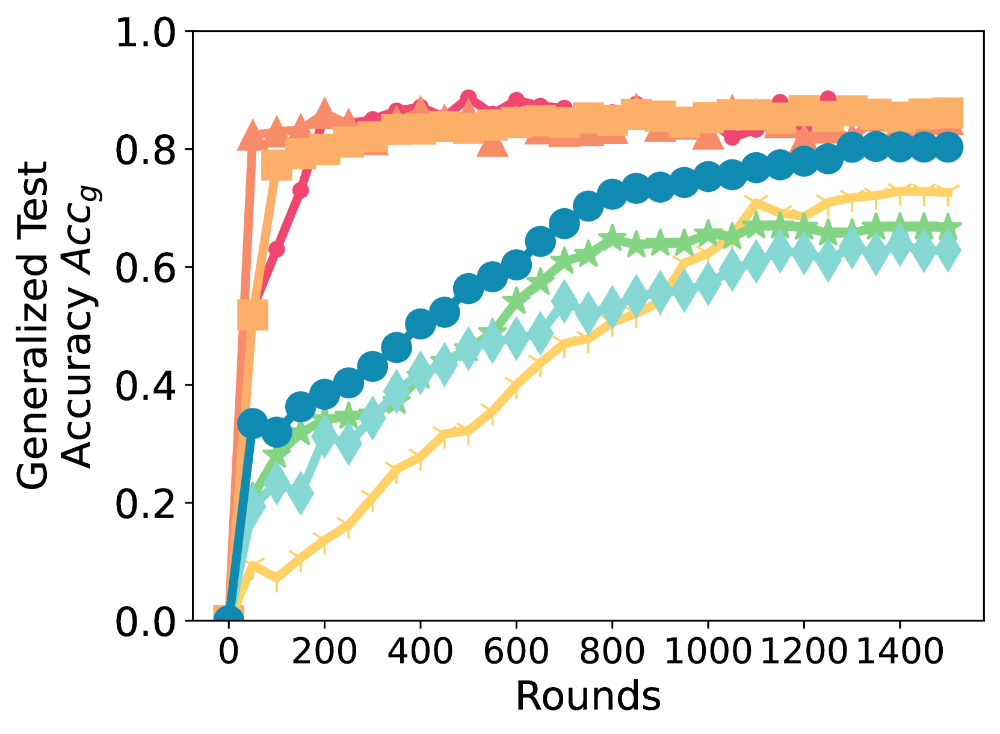
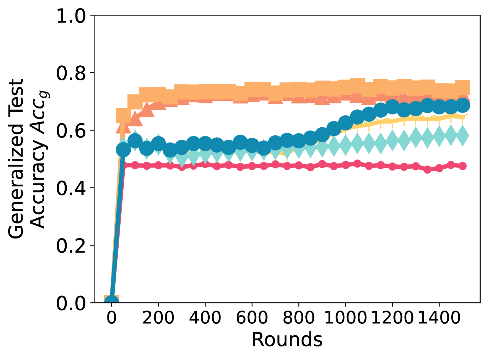

# 展望未来：优化内存的联邦微调语言模型策略

发布时间：2024年05月24日

`LLM应用

理由：这篇论文主要讨论了在联邦学习环境中如何高效地微调大型语言模型（LLM），特别是在资源受限的设备上。它提出了一种名为Spry的算法，该算法通过前向模式自动微分来减少内存需求，同时保持模型的收敛速度和准确性。这种方法直接应用于LLM的微调，并且通过实证研究展示了其在减少内存占用和提高性能方面的有效性。因此，这篇论文属于LLM应用类别，因为它专注于实际应用中的技术和方法，以优化大型语言模型的性能和部署。` `联邦学习` `边缘计算`

> Thinking Forward: Memory-Efficient Federated Finetuning of Language Models

# 摘要

> 在联邦学习环境中微调大型语言模型已成为关键，使资源受限设备能用私有数据优化模型。但反向传播微调LLM需大量内存，对资源有限设备构成挑战。前向模式自动微分虽能减小内存需求，但直接用于LLM微调会导致收敛慢、准确性低。为此，我们提出Spry算法，将LLM权重分散至各客户端，利用前向模式AD计算更精确的梯度。Spry不仅内存效率高，还实现了快速收敛和高准确性。理论分析表明，Spry对同质数据分布提供无偏全局梯度估计，异质性则增加估计偏差。实证显示，Spry在多种语言任务和FL设置中，内存占用减少1.4至7.1倍，同时保持准确性。与现有技术相比，Spry加速收敛1.2至20.3倍，提升准确性5.2至13.5%。例如，使用LoRA微调Llama2-7B时，Spry峰值内存仅6.2GB，远低于反向传播的33.9GB。Spry让在移动和边缘设备上部署联邦学习成为现实，源码见https://github.com/Astuary/Spry。

> Finetuning large language models (LLMs) in federated learning (FL) settings has become important as it allows resource-constrained devices to finetune a model using private data. However, finetuning LLMs using backpropagation requires excessive memory (especially from intermediate activations) for resource-constrained devices. While Forward-mode Auto-Differentiation (AD) can reduce memory footprint from activations, we observe that directly applying it to LLM finetuning results in slow convergence and poor accuracy. This work introduces Spry, an FL algorithm that splits trainable weights of an LLM among participating clients, such that each client computes gradients using Forward-mode AD that are closer estimates of the true gradients. Spry achieves a low memory footprint, high accuracy, and fast convergence. We theoretically show that the global gradients in Spry are unbiased estimates of true global gradients for homogeneous data distributions across clients, while heterogeneity increases bias of the estimates. We also derive Spry's convergence rate, showing that the gradients decrease inversely proportional to the number of FL rounds, indicating the convergence up to the limits of heterogeneity. Empirically, Spry reduces the memory footprint during training by 1.4-7.1$\times$ in contrast to backpropagation, while reaching comparable accuracy, across a wide range of language tasks, models, and FL settings. Spry reduces the convergence time by 1.2-20.3$\times$ and achieves 5.2-13.5\% higher accuracy against state-of-the-art zero-order methods. When finetuning Llama2-7B with LoRA, compared to the peak memory usage of 33.9GB of backpropagation, Spry only consumes 6.2GB of peak memory. For OPT13B, the reduction is from 76.5GB to 10.8GB. Spry makes feasible previously impossible FL deployments on commodity mobile and edge devices. Source code is available at https://github.com/Astuary/Spry.

[Arxiv](https://arxiv.org/abs/2405.15551)