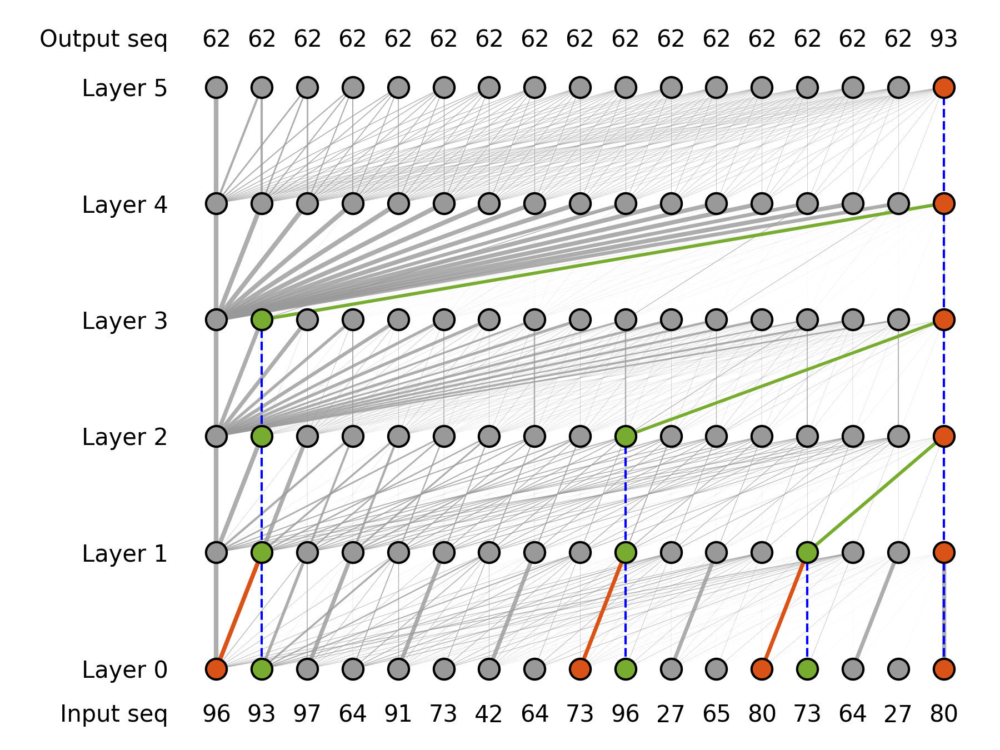
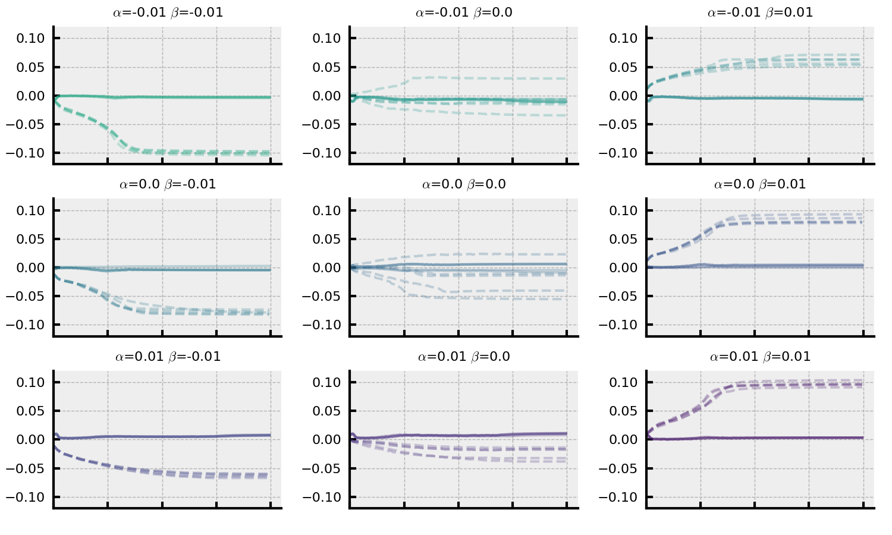

# 探索Transformer如何运用匹配操作实现多步骤推理的奥秘

发布时间：2024年05月24日

`LLM理论

这篇论文主要探讨了大型语言模型（LLM）在复杂推理任务中的表现，并通过对模型内部推理机制的深入分析，提出优化模型架构和训练策略的方法。研究内容涉及模型的初始化、层归一化处理以及利用正交噪声提升推理能力等技术细节，这些都是对LLM理论层面的深入研究。因此，这篇论文应归类于LLM理论。` `人工智能`

> Towards Understanding How Transformer Perform Multi-step Reasoning with Matching Operation

# 摘要

> 大型语言模型在解决复杂推理任务，如数学问题时，一直面临挑战。通过探究这些模型的内部推理机制，我们能够优化模型架构和训练策略，从而提升其推理能力。本研究聚焦于Transformer在特定数据集上进行多步推理的匹配机制，并分析了影响这一机制的因素。我们发现，通过精细的初始化和层归一化处理，可以增强模型的推理能力。此外，我们还提出了一种利用正交噪声来进一步提升推理能力的方法。最后，我们对Transformer的并行推理机制进行了探讨，并基于此提出了关于模型推理能力上限的假设。这些发现不仅加深了我们对大型语言模型推理过程的理解，也为未来设计更高效的推理系统和训练方法提供了指导。

> Large language models have consistently struggled with complex reasoning tasks, such as mathematical problem-solving. Investigating the internal reasoning mechanisms of these models can help us design better model architectures and training strategies, ultimately enhancing their reasoning capabilities. In this study, we examine the matching mechanism employed by Transformer for multi-step reasoning on a constructed dataset. We investigate factors that influence the model's matching mechanism and discover that small initialization and post-LayerNorm can facilitate the formation of the matching mechanism, thereby enhancing the model's reasoning ability. Moreover, we propose a method to improve the model's reasoning capability by adding orthogonal noise. Finally, we investigate the parallel reasoning mechanism of Transformers and propose a conjecture on the upper bound of the model's reasoning ability based on this phenomenon. These insights contribute to a deeper understanding of the reasoning processes in large language models and guide designing more effective reasoning architectures and training strategies.

[Arxiv](https://arxiv.org/abs/2405.15302)