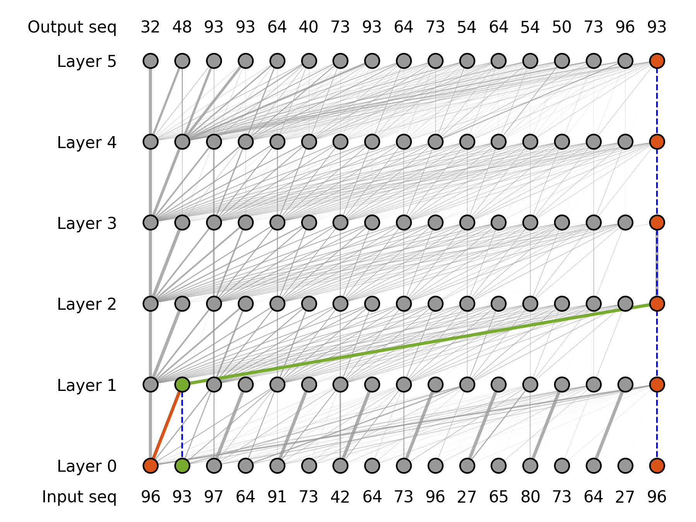
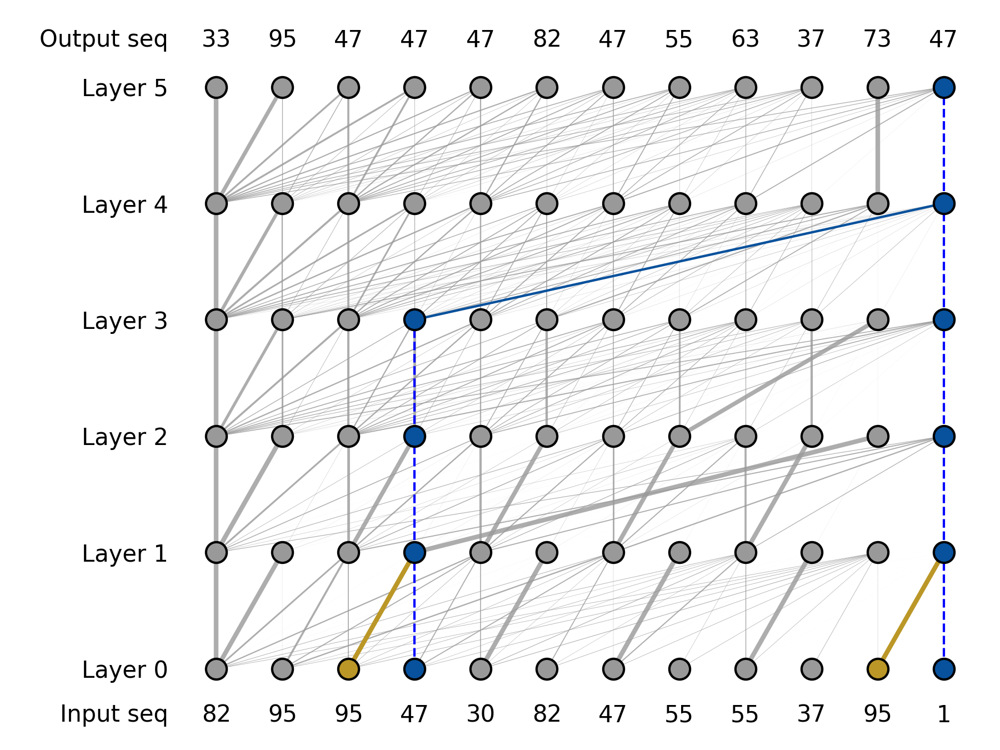

# 探索Transformer如何运用匹配操作实现多步骤推理的奥秘

发布时间：2024年05月24日

`LLM理论

理由：这篇论文主要探讨了大型语言模型（LLM）在复杂推理任务中的机制优化和推理能力的提升方法，包括对Transformer模型的分析和改进。这些内容涉及对LLM内部工作原理的深入理解和理论上的探讨，因此属于LLM理论分类。` `人工智能`

> Towards Understanding How Transformer Perform Multi-step Reasoning with Matching Operation

# 摘要

> 大型语言模型在解决复杂推理任务，如数学问题时一直面临挑战。本研究深入分析了Transformer模型在多步推理中的匹配机制，并发现通过小初始化和后层归一化可以优化这一机制，提升推理能力。我们还提出了一种利用正交噪声增强推理能力的新方法。此外，我们对Transformer的并行推理机制进行了探讨，并基于此提出了关于模型推理能力上限的假设。这些发现不仅加深了我们对大型语言模型推理过程的理解，也为未来设计更高效的推理架构和训练策略提供了指导。

> Large language models have consistently struggled with complex reasoning tasks, such as mathematical problem-solving. Investigating the internal reasoning mechanisms of these models can help us design better model architectures and training strategies, ultimately enhancing their reasoning capabilities. In this study, we examine the matching mechanism employed by Transformer for multi-step reasoning on a constructed dataset. We investigate factors that influence the model's matching mechanism and discover that small initialization and post-LayerNorm can facilitate the formation of the matching mechanism, thereby enhancing the model's reasoning ability. Moreover, we propose a method to improve the model's reasoning capability by adding orthogonal noise. Finally, we investigate the parallel reasoning mechanism of Transformers and propose a conjecture on the upper bound of the model's reasoning ability based on this phenomenon. These insights contribute to a deeper understanding of the reasoning processes in large language models and guide designing more effective reasoning architectures and training strategies.

[Arxiv](https://arxiv.org/abs/2405.15302)