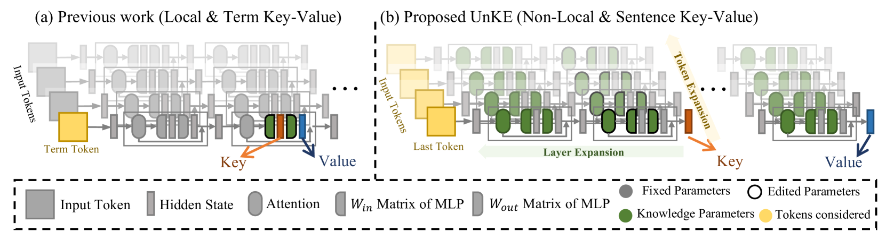
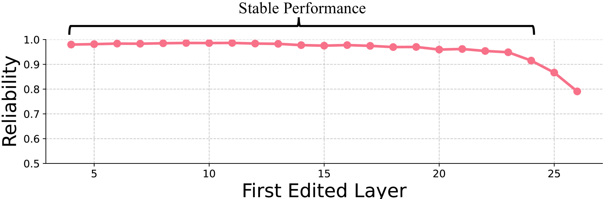
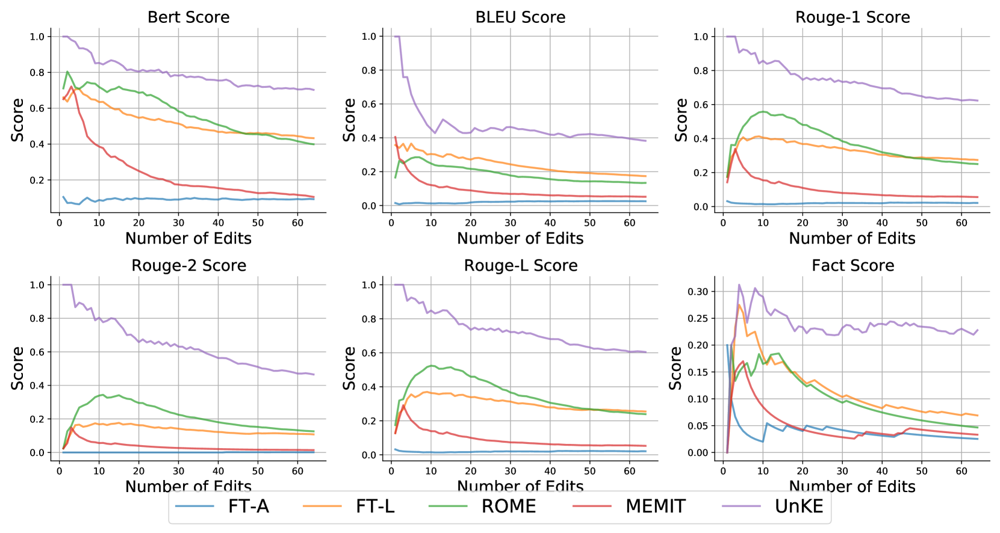
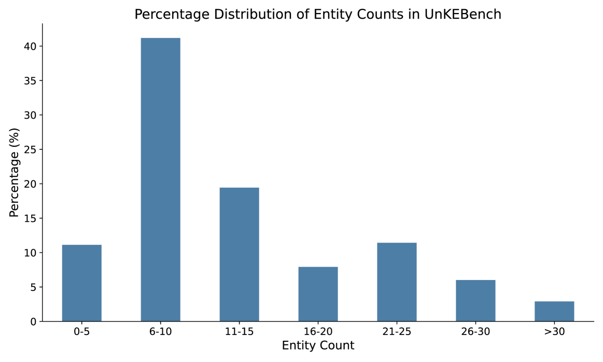

# UnKE：大型语言模型中的非结构化知识精修

发布时间：2024年05月24日

`LLM应用

这篇论文主要探讨了如何编辑大型语言模型中的非结构化知识，提出了一种新的方法UnKE，该方法在层和令牌两个维度上进行了扩展和优化。这种方法旨在更有效地处理和编辑非结构化知识，这在实际应用中非常重要，尤其是在处理包含长篇内容、噪声及复杂特性的知识时。因此，这篇论文的内容更偏向于LLM的应用层面，即如何改进和应用LLM来处理特定的知识编辑任务。` `人工智能` `知识编辑`

> UnKE: Unstructured Knowledge Editing in Large Language Models

# 摘要

> 近期，知识编辑方法主要关注于修改大型语言模型中的结构化知识，基于结构化知识以键值对形式存储在特定层或神经元的假设。但这一做法忽视了现实世界中大量知识以非结构化形式存在，这些知识包含长篇内容、噪声及复杂全面的特性。以往方法如MEMIT所采用的“知识定位”和“术语驱动优化”并不适用于非结构化知识。为此，我们提出了一种名为UnKE的新型非结构化知识编辑方法，它在层和令牌两个维度上扩展了原有假设。首先，在层维度上，我们摒弃了“知识定位”步骤，将前几层视为关键，通过层间扩展知识存储，打破了“知识本地存储”的假设。接着，在令牌维度上，我们用“原因驱动优化”替代了“术语驱动优化”，直接优化关键生成器的最后一层以进行编辑，生成所需的关键向量。通过在层级使用键值对，UnKE有效地表示和编辑了复杂全面的非结构化知识，充分发挥了MLP和注意力层的潜力。在新的非结构化知识编辑数据集UnKEBench及传统结构化数据集上的测试结果显示，UnKE表现出色，超越了现有强基线。

> Recent knowledge editing methods have primarily focused on modifying structured knowledge in large language models, heavily relying on the assumption that structured knowledge is stored as key-value pairs locally in MLP layers or specific neurons. However, this task setting overlooks the fact that a significant portion of real-world knowledge is stored in an unstructured format, characterized by long-form content, noise, and a complex yet comprehensive nature. The "knowledge locating" and "term-driven optimization" techniques conducted from the assumption used in previous methods (e.g., MEMIT) are ill-suited for unstructured knowledge. To address these challenges, we propose a novel unstructured knowledge editing method, namely UnKE, which extends previous assumptions in the layer dimension and token dimension. Firstly, in the layer dimension, we discard the "knowledge locating" step and treat first few layers as the key, which expand knowledge storage through layers to break the "knowledge stored locally" assumption. Next, we replace "term-driven optimization" with "cause-driven optimization" across all inputted tokens in the token dimension, directly optimizing the last layer of the key generator to perform editing to generate the required key vectors. By utilizing key-value pairs at the layer level, UnKE effectively represents and edits complex and comprehensive unstructured knowledge, leveraging the potential of both the MLP and attention layers. Results on newly proposed unstructure knowledge editing dataset (UnKEBench) and traditional structured datasets demonstrate that UnKE achieves remarkable performance, surpassing strong baselines.

[Arxiv](https://arxiv.org/abs/2405.15349)