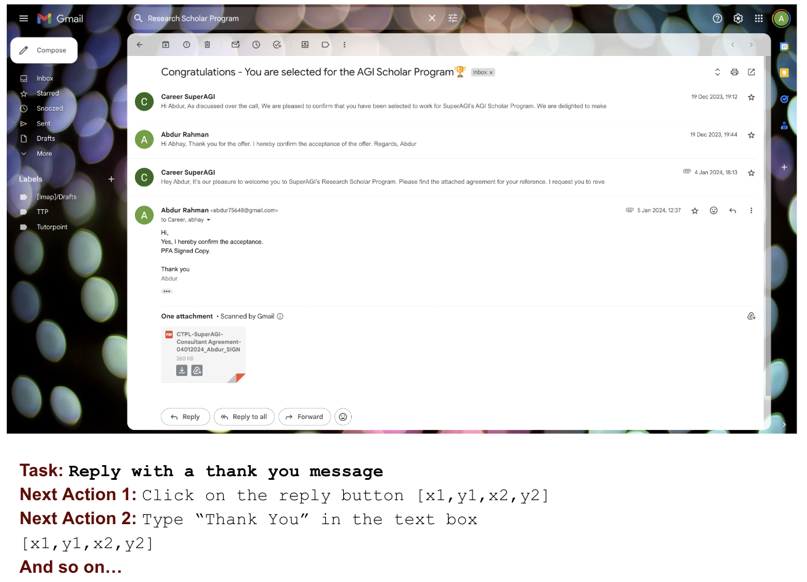
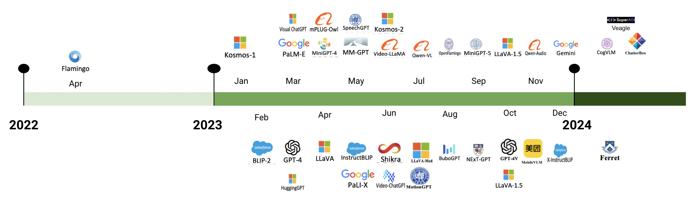
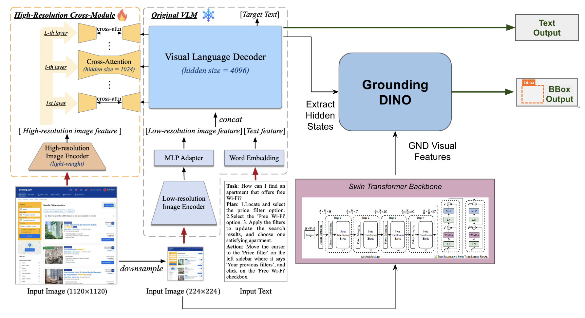
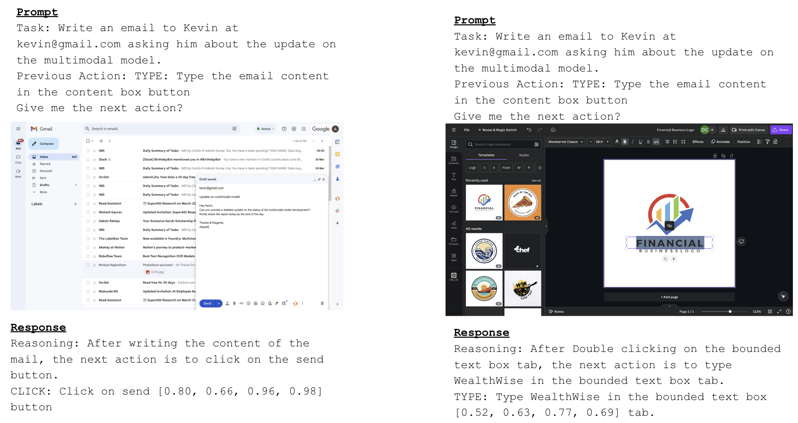
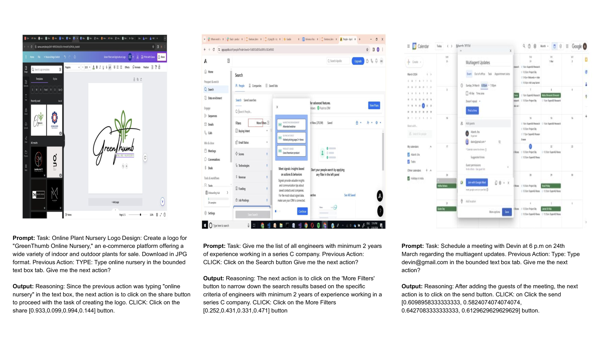

# V-Zen：创新多模态LLM，精准解析图形用户界面，实现高效定位。

发布时间：2024年05月24日

`LLM应用

这篇论文介绍了V-Zen，一款多模态大型语言模型（MLLMs），专门设计来理解和处理图形用户界面（GUIs）的复杂交互。论文强调了V-Zen在GUI理解方面的创新，包括其双分辨率图像编码器和GUIDE数据集的使用，这些都是为了提高模型的自动化水平和理解能力。因此，这篇论文属于LLM应用类别，因为它专注于开发和应用大型语言模型来解决实际的技术问题，即GUI的自动化和理解。` `人工智能` `图形用户界面`

> V-Zen: Efficient GUI Understanding and Precise Grounding With A Novel Multimodal LLM

# 摘要

> 在AI领域日新月异的今天，多模态大型语言模型（MLLMs）崭露头角，成为一股革新力量，它们能够理解和融合来自文本、图像乃至图形用户界面（GUIs）的多样化信息。尽管取得了显著进展，但GUI的复杂交互和深度理解仍是一大难题，制约了现有模型在提升自动化水平上的潜力。为此，本文推出了V-Zen，一款精心打造的多模态大型语言模型，旨在彻底革新GUI的理解与基础。V-Zen凭借其双分辨率图像编码器，在基础定位和下一步行动预测上树立了新标杆，为自主计算机系统的实现奠定了基石。与之相辅相成的是GUIDE数据集，一个包含丰富真实GUI元素和任务序列的宝库，为专业微调提供了强大动力。V-Zen与GUIDE的完美结合，预示着多模态AI研究的新时代，引领我们迈向智能、自主的计算体验。我们诚邀研究界同仁共同踏上这段激动人心的旅程，共塑GUI自动化的未来。秉承开放科学的精神，我们将公开代码、数据及模型，为复杂而精准的多模态对话场景开辟道路。

> In the rapidly evolving landscape of AI research and application, Multimodal Large Language Models (MLLMs) have emerged as a transformative force, adept at interpreting and integrating information from diverse modalities such as text, images, and Graphical User Interfaces (GUIs). Despite these advancements, the nuanced interaction and understanding of GUIs pose a significant challenge, limiting the potential of existing models to enhance automation levels. To bridge this gap, this paper presents V-Zen, an innovative Multimodal Large Language Model (MLLM) meticulously crafted to revolutionise the domain of GUI understanding and grounding. Equipped with dual-resolution image encoders, V-Zen establishes new benchmarks in efficient grounding and next-action prediction, thereby laying the groundwork for self-operating computer systems. Complementing V-Zen is the GUIDE dataset, an extensive collection of real-world GUI elements and task-based sequences, serving as a catalyst for specialised fine-tuning. The successful integration of V-Zen and GUIDE marks the dawn of a new era in multimodal AI research, opening the door to intelligent, autonomous computing experiences. This paper extends an invitation to the research community to join this exciting journey, shaping the future of GUI automation. In the spirit of open science, our code, data, and model will be made publicly available, paving the way for multimodal dialogue scenarios with intricate and precise interactions.

[Arxiv](https://arxiv.org/abs/2405.15341)