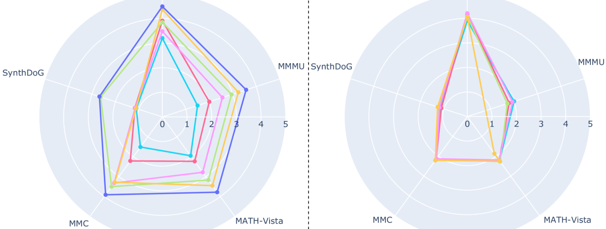
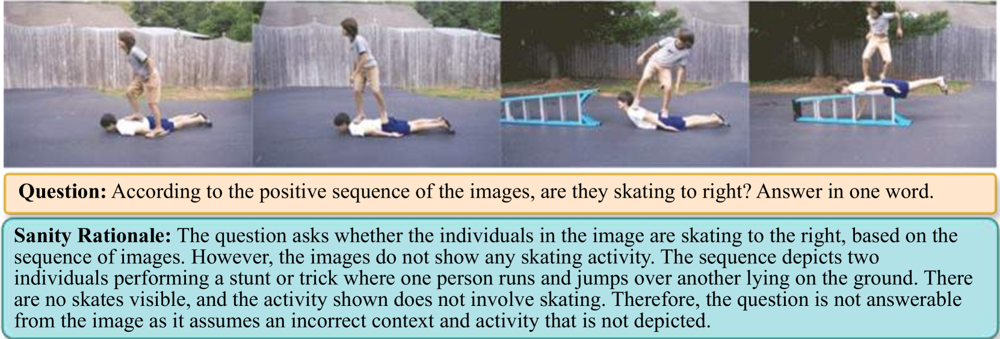
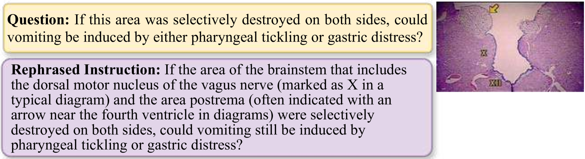

# VDGD：弥合视觉感知差距，减轻大型视觉语言模型中的认知提示幻觉

发布时间：2024年05月24日

`LLM应用

这篇论文主要探讨了大型视觉-语言模型（LVLMs）在实际应用中的幻觉问题，并提出了一种新的方法（视觉描述基础解码，VDGD）来减少这种幻觉。此外，论文还推出了一个新的基准测试（VaLLu基准）来评估LVLMs的认知能力。这些内容主要关注于LLM的实际应用问题和解决方案，因此适合归类为LLM应用。` `人工智能` `计算机视觉`

> VDGD: Mitigating LVLM Hallucinations in Cognitive Prompts by Bridging the Visual Perception Gap

# 摘要

> 大型视觉-语言模型（LVLMs）在实际应用中备受关注，但其幻觉问题——生成的文本与事实信息不一致——成为一大挑战。本文深入探讨了LVLMs产生幻觉的原因，并揭示了几个关键发现：首先，社区主要致力于减少与视觉识别相关的幻觉，却忽略了需要复杂认知技能的提示所引发的幻觉；其次，LVLMs虽能“看”到图像，却未必能真正“理解”或“感知”图像内容。针对这一问题，我们提出了视觉描述基础解码（VDGD），一种无需额外训练的简单而有效的方法，通过在解码过程中优先选择与图像描述KL散度较低的候选文本来减少幻觉。实验证明，VDGD在多个LVLMs和基准测试中显著提升了性能。此外，我们还推出了VaLLu基准，旨在全面评估LVLMs的认知能力。

> Recent interest in Large Vision-Language Models (LVLMs) for practical applications is moderated by the significant challenge of hallucination or the inconsistency between the factual information and the generated text. In this paper, we first perform an in-depth analysis of hallucinations and discover several novel insights about how and when LVLMs hallucinate. From our analysis, we show that: (1) The community's efforts have been primarily targeted towards reducing hallucinations related to visual recognition (VR) prompts (e.g., prompts that only require describing the image), thereby ignoring hallucinations for cognitive prompts (e.g., prompts that require additional skills like reasoning on contents of the image). (2) LVLMs lack visual perception, i.e., they can see but not necessarily understand or perceive the input image. We analyze responses to cognitive prompts and show that LVLMs hallucinate due to a perception gap: although LVLMs accurately recognize visual elements in the input image and possess sufficient cognitive skills, they struggle to respond accurately and hallucinate. To overcome this shortcoming, we propose Visual Description Grounded Decoding (VDGD), a simple, robust, and training-free method for alleviating hallucinations. Specifically, we first describe the image and add it as a prefix to the instruction. Next, during auto-regressive decoding, we sample from the plausible candidates according to their KL-Divergence (KLD) to the description, where lower KLD is given higher preference. Experimental results on several benchmarks and LVLMs show that VDGD improves significantly over other baselines in reducing hallucinations. We also propose VaLLu, a benchmark for the comprehensive evaluation of the cognitive capabilities of LVLMs.

[Arxiv](https://arxiv.org/abs/2405.15683)