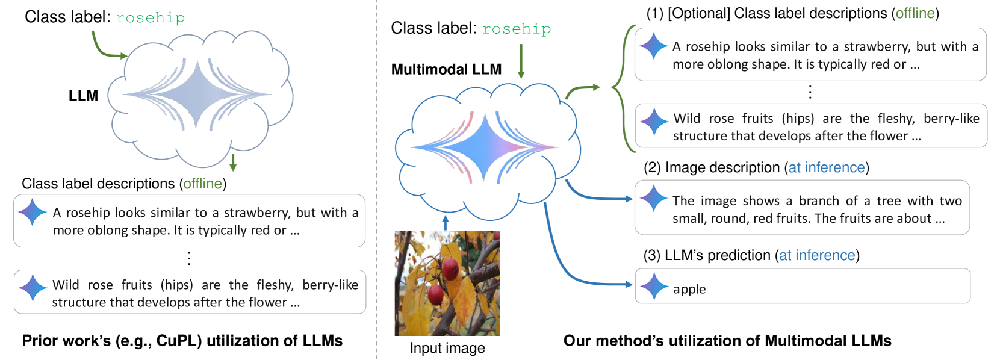
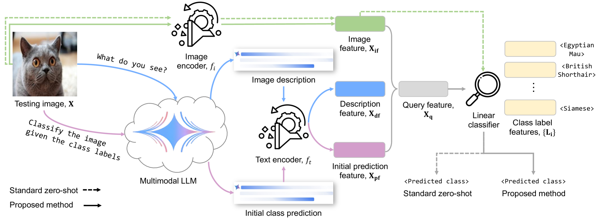
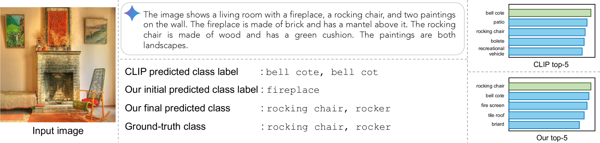
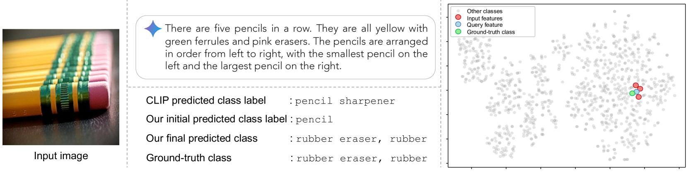
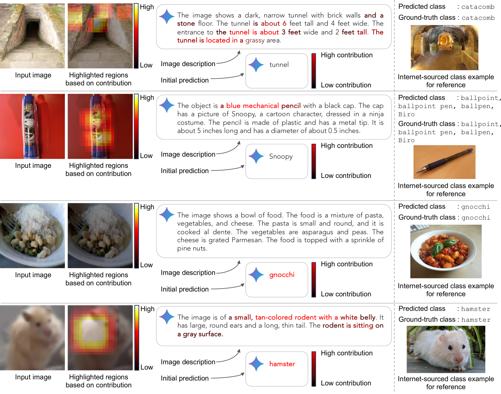
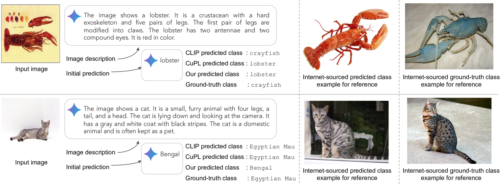
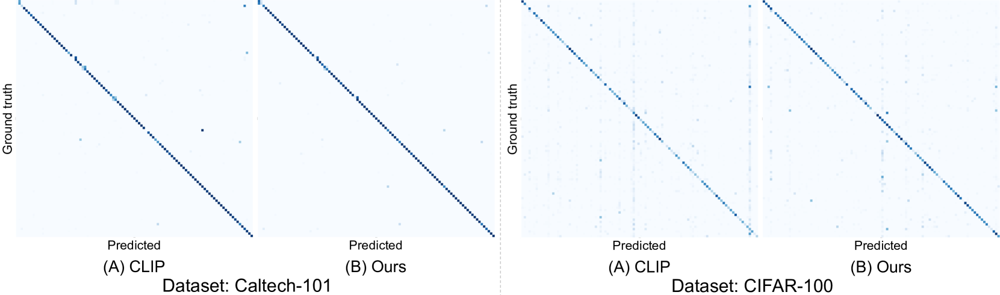

# 你所见为何？借助多模态大型语言模型，提升零-shot图像分类能力

发布时间：2024年05月24日

`LLM应用

这篇论文介绍了一种利用大型语言模型（LLMs）进行零样本图像分类的新策略，通过多模态LLMs从图像中提取文本描述并转化为跨模态嵌入空间中的特征，进而实现图像分类。这种方法展示了LLMs在计算机视觉任务中的应用潜力，特别是在零样本学习场景下，其性能超越了传统方法。因此，这篇论文属于LLM应用类别。` `计算机视觉` `图像分类`

> What Do You See? Enhancing Zero-Shot Image Classification with Multimodal Large Language Models

# 摘要

> 大型语言模型（LLMs）在图像分类等计算机视觉任务中展现出强大效能。本文介绍了一种新颖的零样本图像分类策略，借助多模态LLMs的力量。我们通过这些模型从图像中提取详尽的文本描述，进而转化为跨模态嵌入空间中的固定维度特征。这些特征经过融合，通过线性分类器实现零样本分类，无需为各数据集定制提示，一套通用提示即可横扫所有数据集。在多个数据集上的测试表明，我们的方法不仅超越了基准准确度，平均提升了4.1个百分点，在ImageNet上更是提升了6.8个百分点。这一成果凸显了多模态LLMs在零样本图像分类等任务中的巨大潜力，为传统方法带来了显著的进步。

> Large language models (LLMs) has been effectively used for many computer vision tasks, including image classification. In this paper, we present a simple yet effective approach for zero-shot image classification using multimodal LLMs. By employing multimodal LLMs, we generate comprehensive textual representations from input images. These textual representations are then utilized to generate fixed-dimensional features in a cross-modal embedding space. Subsequently, these features are fused together to perform zero-shot classification using a linear classifier. Our method does not require prompt engineering for each dataset; instead, we use a single, straightforward, set of prompts across all datasets. We evaluated our method on several datasets, and our results demonstrate its remarkable effectiveness, surpassing benchmark accuracy on multiple datasets. On average over ten benchmarks, our method achieved an accuracy gain of 4.1 percentage points, with an increase of 6.8 percentage points on the ImageNet dataset, compared to prior methods. Our findings highlight the potential of multimodal LLMs to enhance computer vision tasks such as zero-shot image classification, offering a significant improvement over traditional methods.

[Arxiv](https://arxiv.org/abs/2405.15668)