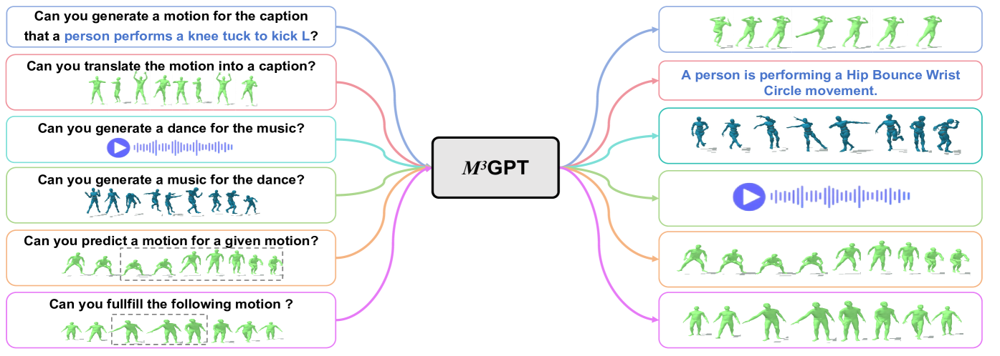
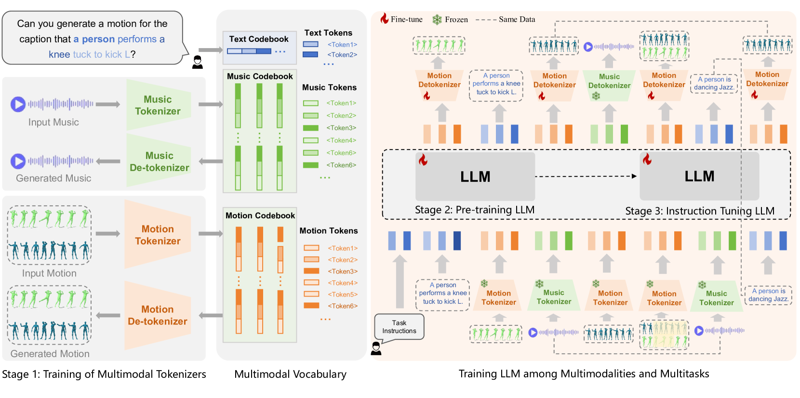
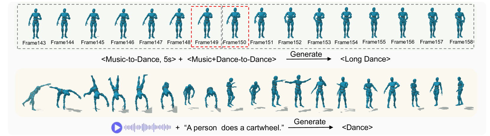
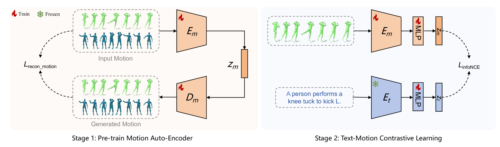
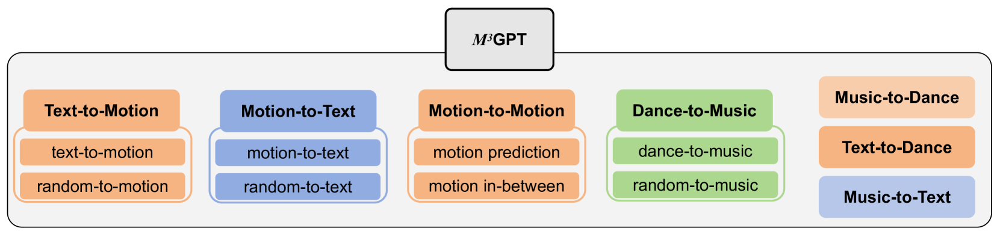
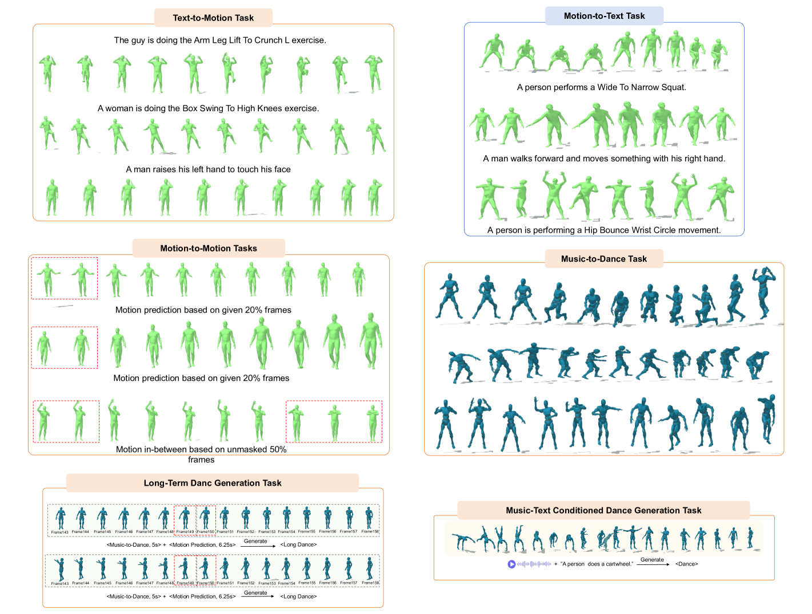

# $M^3$GPT：引领前沿的运动理解与生成多模态多任务框架

发布时间：2024年05月25日

`Agent

理由：论文摘要中提到的$M^3$GPT模型是一个多元模态、多任务框架，专门设计用于运动理解和生成。它构建了一个统一的表示空间，涵盖文本、音乐、运动等多种模态，并利用文本作为桥梁连接不同运动任务。这种设计使得模型能够理解和生成运动，表现出强大的零-shot泛化能力。这些特性表明$M3$GPT模型更像是一个能够执行多种任务的智能Agent，而不是仅仅关注语言模型理论或应用，也不是专注于检索增强生成（RAG）技术。因此，将其归类为Agent更为合适。` `运动科学` `人工智能`

> $M^3$GPT: An Advanced Multimodal, Multitask Framework for Motion Comprehension and Generation

# 摘要

> 本文推出的$M^3$GPT，是一个创新的多元模态、多任务框架，专为运动理解和生成设计。其核心原则有三：一是构建一个涵盖文本、音乐、运动等多种模态的统一表示空间，通过离散向量量化实现无缝集成于大型语言模型；二是直接在原始运动空间进行模型生成，避免信息损失，提升生成质量；三是利用文本作为桥梁，连接并强化不同运动任务间的协同效应。$M^3$GPT不仅是首个能基于多信号理解并生成运动的模型，其广泛的实验结果也证明了它在各类运动任务中的卓越表现和强大的零-shot泛化能力。

> This paper presents $M^3$GPT, an advanced \textbf{M}ultimodal, \textbf{M}ultitask framework for \textbf{M}otion comprehension and generation. $M^3$GPT operates on three fundamental principles. The first focuses on creating a unified representation space for various motion-relevant modalities. We employ discrete vector quantization for multimodal control and generation signals, such as text, music and motion/dance, enabling seamless integration into a large language model (LLM) with a single vocabulary. The second involves modeling model generation directly in the raw motion space. This strategy circumvents the information loss associated with discrete tokenizer, resulting in more detailed and comprehensive model generation. Third, $M^3$GPT learns to model the connections and synergies among various motion-relevant tasks. Text, the most familiar and well-understood modality for LLMs, is utilized as a bridge to establish connections between different motion tasks, facilitating mutual reinforcement. To our knowledge, $M^3$GPT is the first model capable of comprehending and generating motions based on multiple signals. Extensive experiments highlight $M^3$GPT's superior performance across various motion-relevant tasks and its powerful zero-shot generalization capabilities for extremely challenging tasks.

[Arxiv](https://arxiv.org/abs/2405.16273)