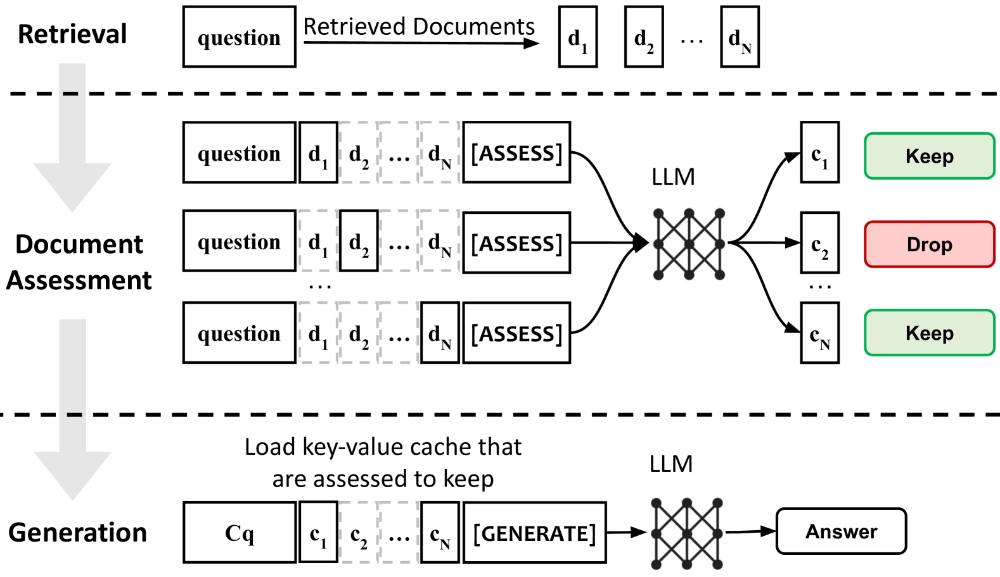
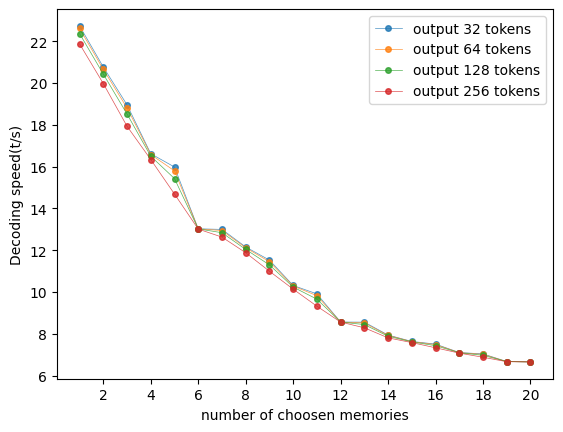
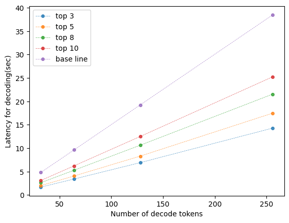

# 利用稀疏上下文选择技术，加速检索增强生成模型的推理过程

发布时间：2024年05月25日

`RAG

理由：这篇论文主要讨论了Sparse RAG这一创新模式，它是一种检索增强生成（Retrieval-Augmented Generation, RAG）系统，专注于通过稀疏性降低计算负担，提高大型语言模型（LLMs）的性能和效率。论文中提到的技术细节和实验结果都是围绕RAG系统的优化和改进，因此最合适的分类是RAG。` `信息检索`

> Accelerating Inference of Retrieval-Augmented Generation via Sparse Context Selection

# 摘要

> 通过整合外部上下文，大型语言模型（LLMs）的检索增强功能展现出卓越的性能和广泛的适应性。但随着检索文档数量的增加，输入长度的线性增长导致延迟急剧上升。为此，我们提出了Sparse RAG这一创新模式，旨在通过稀疏性降低计算负担。Sparse RAG并行处理检索文档的编码，有效避免了长距离注意力带来的延迟问题。LLMs随后通过特殊控制标记引导，自动回归地选择性地关注高度相关的缓存以解码输出。Sparse RAG巧妙地将文档评估与响应生成融为一体。RAG系统中的稀疏机制设计，不仅减少了推理过程中加载的文档数量，加快了系统响应，还通过过滤无关内容，提升了模型对关键上下文的关注，从而提高了生成质量。对两个数据集的评估表明，Sparse RAG在生成质量与计算效率间取得了理想平衡，展现了其在各类生成任务中的广泛适用性。

> Large language models (LLMs) augmented with retrieval exhibit robust performance and extensive versatility by incorporating external contexts. However, the input length grows linearly in the number of retrieved documents, causing a dramatic increase in latency. In this paper, we propose a novel paradigm named Sparse RAG, which seeks to cut computation costs through sparsity. Specifically, Sparse RAG encodes retrieved documents in parallel, which eliminates latency introduced by long-range attention of retrieved documents. Then, LLMs selectively decode the output by only attending to highly relevant caches auto-regressively, which are chosen via prompting LLMs with special control tokens. It is notable that Sparse RAG combines the assessment of each individual document and the generation of the response into a single process. The designed sparse mechanism in a RAG system can facilitate the reduction of the number of documents loaded during decoding for accelerating the inference of the RAG system. Additionally, filtering out undesirable contexts enhances the model's focus on relevant context, inherently improving its generation quality. Evaluation results of two datasets show that Sparse RAG can strike an optimal balance between generation quality and computational efficiency, demonstrating its generalizability across both short- and long-form generation tasks.

[Arxiv](https://arxiv.org/abs/2405.16178)