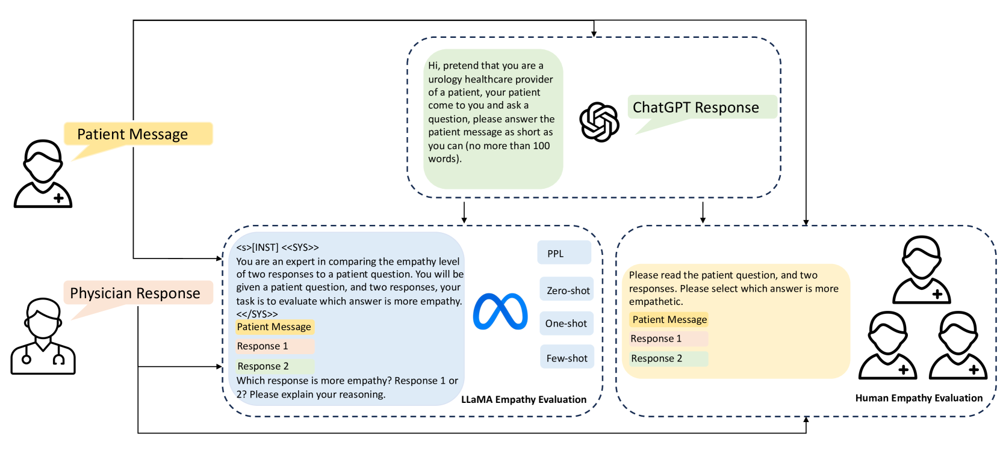
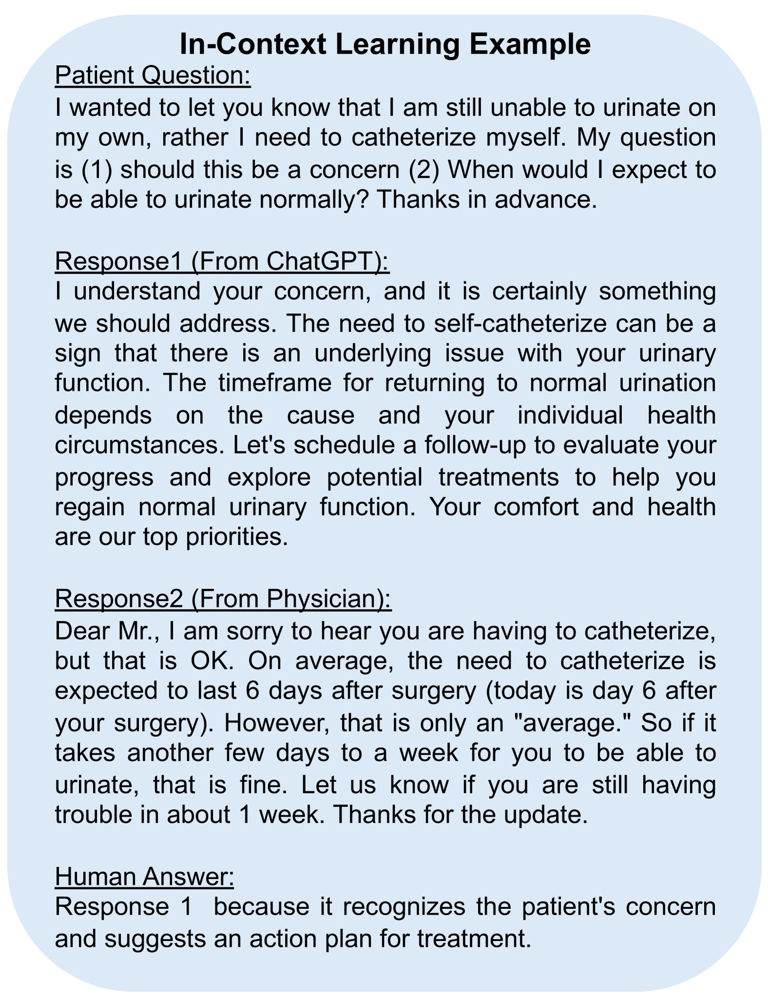
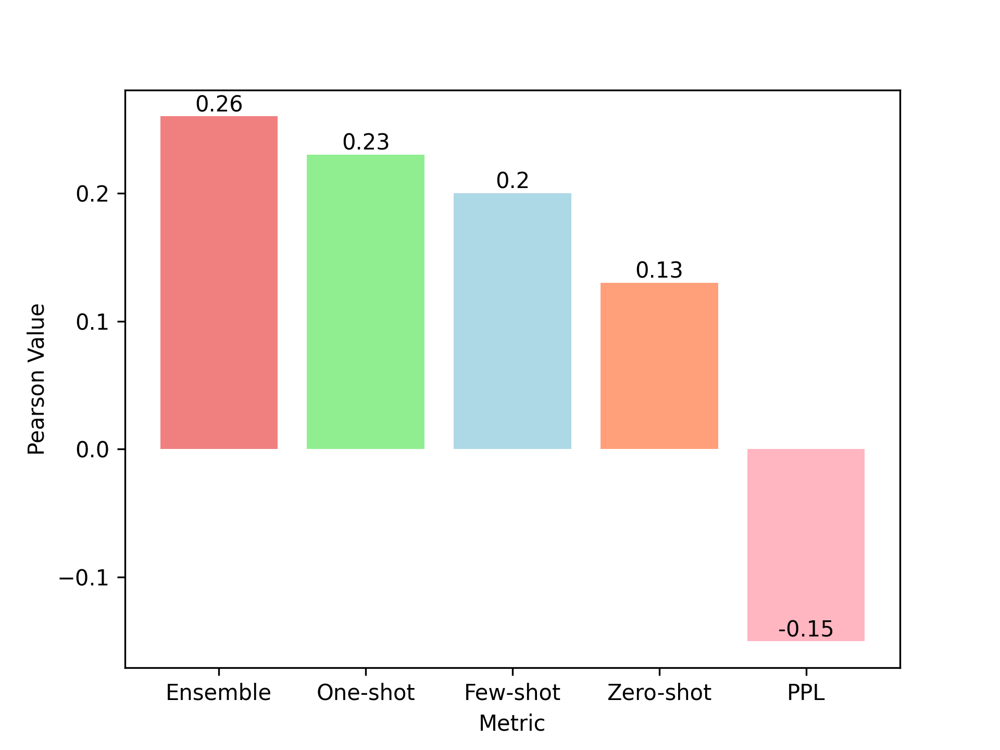
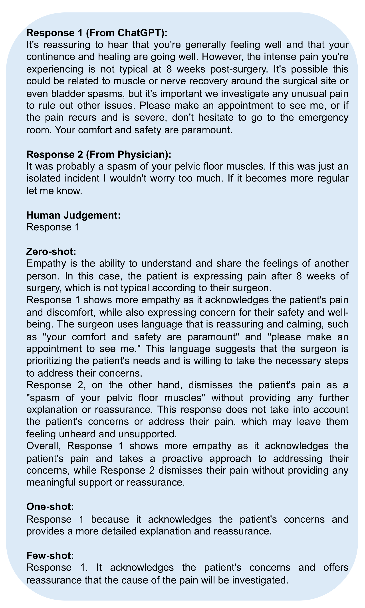
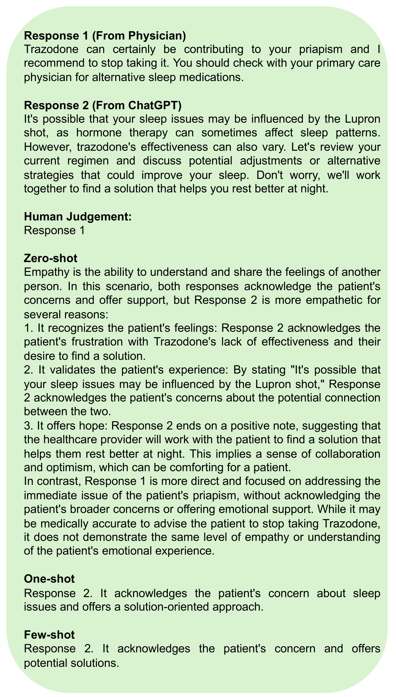
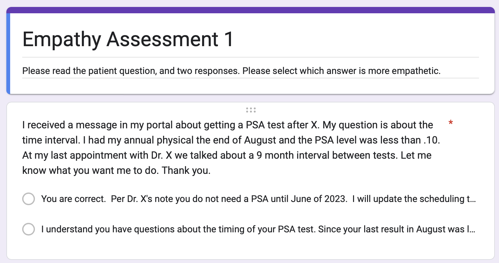

# 借助真实医生与患者互动，探究大型语言模型中的同理心表现

发布时间：2024年05月25日

`LLM应用

这篇论文探讨了大型语言模型（LLMs）在医疗领域的应用，特别是通过开发具有同理心的患者互动聊天机器人来提升患者护理质量。研究通过比较ChatGPT生成的回复与医生的常规回复在同理心表达上的差异，并使用一种新的同理心评分机制（EMRank）进行评估。这表明LLMs在特定应用场景（如医疗沟通）中可能超越人类的表现，为提升医疗服务质量提供了新的可能性。因此，这篇论文属于LLM应用分类。` `聊天机器人`

> Assessing Empathy in Large Language Models with Real-World Physician-Patient Interactions

# 摘要

> 将大型语言模型（LLMs）融入医疗领域，有望通过开发富有同理心的患者互动聊天机器人，大幅提升患者护理质量。本研究深入探讨：ChatGPT是否能在同理心表达上超越医生的常规回复？为此，我们收集了梅奥诊所的去标识化患者信息及医生反馈，并利用ChatGPT生成替代性回复。通过结合自动评估与人工判断的新颖同理心评分机制（EMRank），我们评估了回复的同理心水平。研究结果显示，LLM驱动的聊天机器人在同理心沟通上可能超越人类医生，为提升患者护理和缓解职业压力开辟了新路径。此研究不仅凸显了同理心在医患交流中的关键作用，还提出了一套高效的自动同理心评估指标，为LLMs在医疗领域的广泛应用奠定了基础。

> The integration of Large Language Models (LLMs) into the healthcare domain has the potential to significantly enhance patient care and support through the development of empathetic, patient-facing chatbots. This study investigates an intriguing question Can ChatGPT respond with a greater degree of empathy than those typically offered by physicians? To answer this question, we collect a de-identified dataset of patient messages and physician responses from Mayo Clinic and generate alternative replies using ChatGPT. Our analyses incorporate novel empathy ranking evaluation (EMRank) involving both automated metrics and human assessments to gauge the empathy level of responses. Our findings indicate that LLM-powered chatbots have the potential to surpass human physicians in delivering empathetic communication, suggesting a promising avenue for enhancing patient care and reducing professional burnout. The study not only highlights the importance of empathy in patient interactions but also proposes a set of effective automatic empathy ranking metrics, paving the way for the broader adoption of LLMs in healthcare.

[Arxiv](https://arxiv.org/abs/2405.16402)