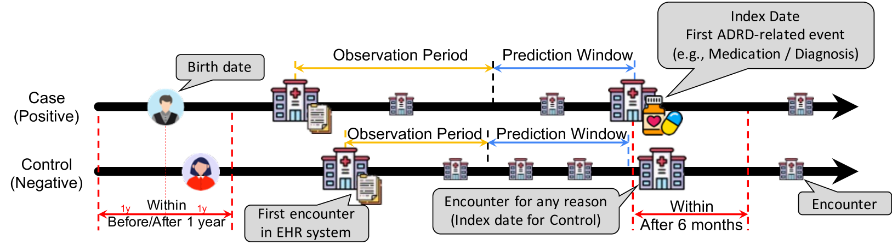
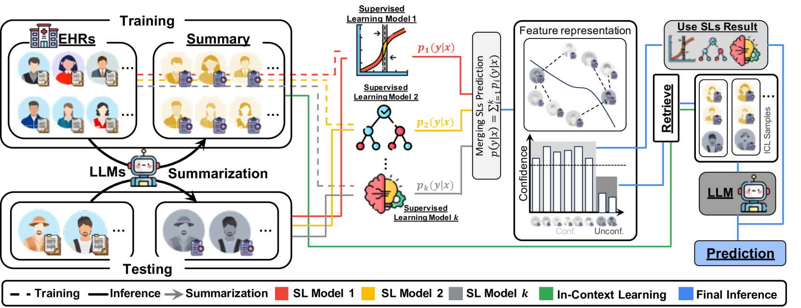
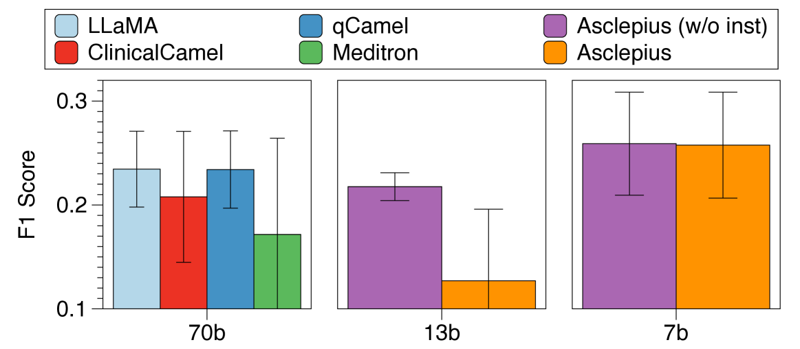
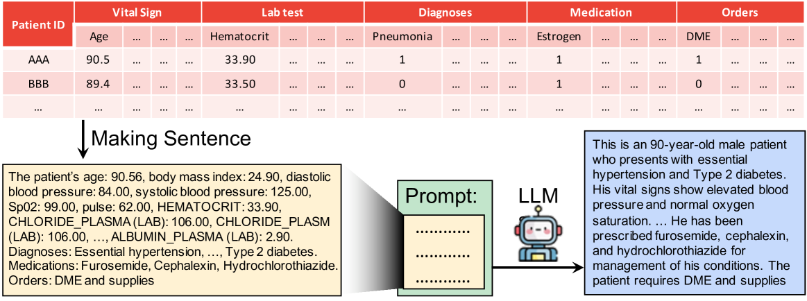

# 利用大型语言模型提升电子健康记录中阿尔茨海默病发病风险的预测能力

发布时间：2024年05月25日

`LLM应用

这篇论文探讨了如何利用大型语言模型（LLMs）在电子健康记录（EHRs）数据上进行阿尔茨海默病及相关痴呆症（ADRD）的风险预测。通过结合传统监督学习方法（SLs）和LLMs的优势，论文提出了一种新的协作机制，旨在提高预测模型的准确性。这种方法特别适用于在样本量有限的情况下进行风险预测，这是传统监督学习方法可能不足的地方。论文通过在OHSU医院的EHR数据上进行实验，验证了其方法的有效性，并展示了LLMs在医疗健康领域的应用潜力。因此，这篇论文属于LLM应用分类。` `机器学习`

> Augmented Risk Prediction for the Onset of Alzheimer's Disease from Electronic Health Records with Large Language Models

# 摘要

> 阿尔茨海默病（AD）是美国65岁以上人群的第五大致死疾病。早期筛查和检测AD及相关痴呆症（ADRD）对于及时干预和临床试验招募至关重要。电子健康记录（EHRs）的普及为开发ADRD筛查工具，如基于机器学习的预测模型，提供了宝贵资源。大型语言模型（LLMs）的最新进展展示了其在知识编码和推理方面的卓越能力，为风险预测提供了新的可能性。本文提出了一种创新流程，通过利用LLMs在少量样本上的推断能力，在传统监督学习方法（SLs）可能不足的案例上进行预测，从而提升风险预测的准确性。我们设计了一种协作机制，通过基于信心的决策流程将SLs和LLMs的优势结合，分别在明确和复杂案例中发挥各自所长。我们利用OHSU医院涵盖超过250万患者和2000万次就诊的EHR数据仓库对该流程进行了评估。结果表明，我们的方法有效融合了SLs和LLMs的优势，显著提升了预测性能。这一创新有望革新ADRD的筛查和早期检测，为改善患者管理和医疗保健策略带来新的希望。

> Alzheimer's disease (AD) is the fifth-leading cause of death among Americans aged 65 and older. Screening and early detection of AD and related dementias (ADRD) are critical for timely intervention and for identifying clinical trial participants. The widespread adoption of electronic health records (EHRs) offers an important resource for developing ADRD screening tools such as machine learning based predictive models. Recent advancements in large language models (LLMs) demonstrate their unprecedented capability of encoding knowledge and performing reasoning, which offers them strong potential for enhancing risk prediction. This paper proposes a novel pipeline that augments risk prediction by leveraging the few-shot inference power of LLMs to make predictions on cases where traditional supervised learning methods (SLs) may not excel. Specifically, we develop a collaborative pipeline that combines SLs and LLMs via a confidence-driven decision-making mechanism, leveraging the strengths of SLs in clear-cut cases and LLMs in more complex scenarios. We evaluate this pipeline using a real-world EHR data warehouse from Oregon Health \& Science University (OHSU) Hospital, encompassing EHRs from over 2.5 million patients and more than 20 million patient encounters. Our results show that our proposed approach effectively combines the power of SLs and LLMs, offering significant improvements in predictive performance. This advancement holds promise for revolutionizing ADRD screening and early detection practices, with potential implications for better strategies of patient management and thus improving healthcare.

[Arxiv](https://arxiv.org/abs/2405.16413)