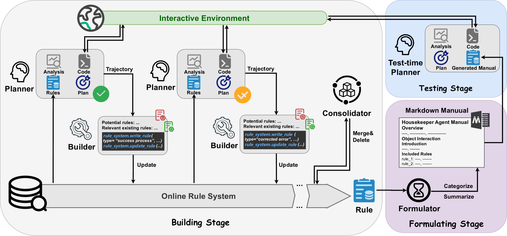
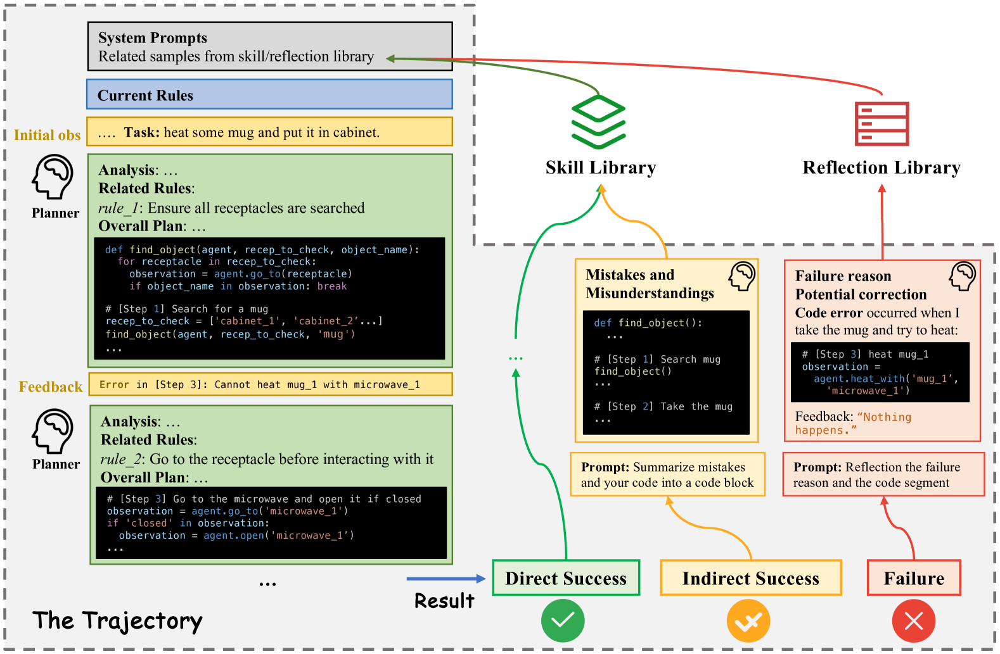
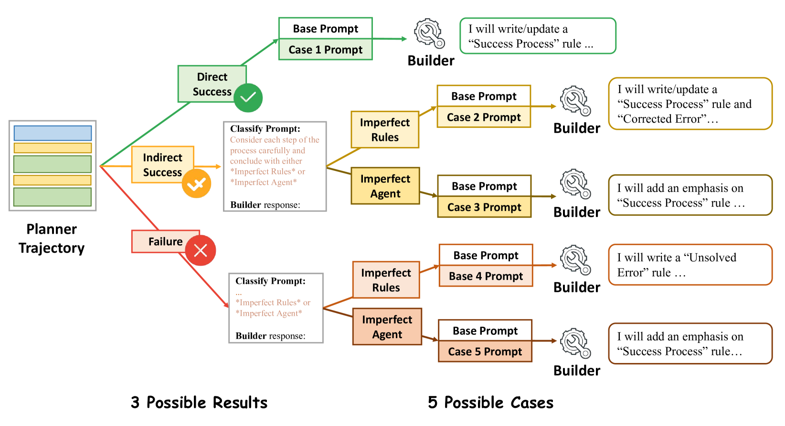
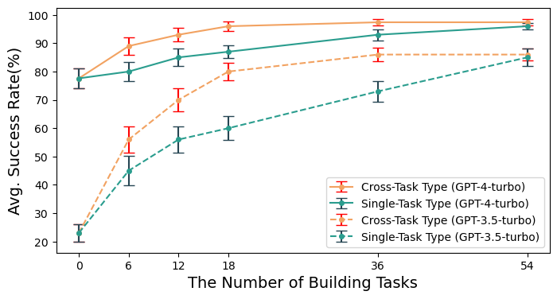
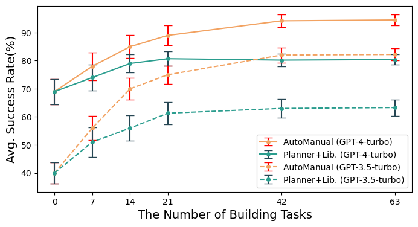
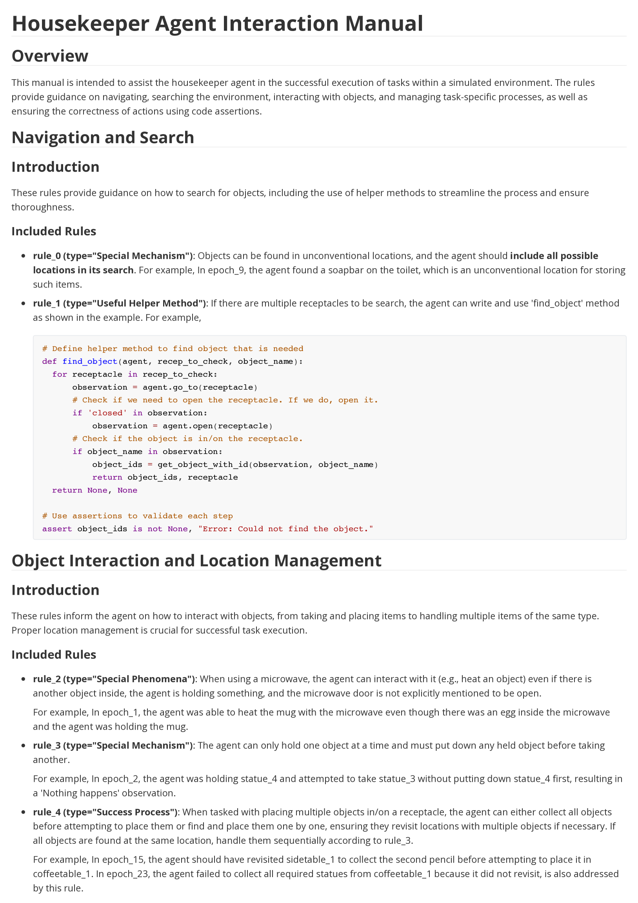
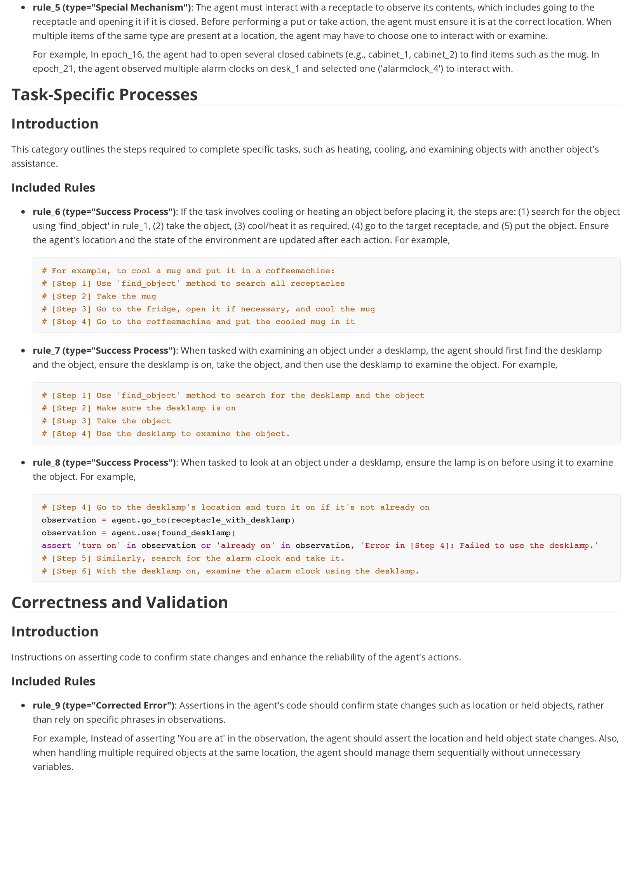

# AutoManual：借助大型语言模型代理的交互式环境学习，智能生成操作手册

发布时间：2024年05月25日

`Agent

这篇论文介绍了一个名为AutoManual的框架，该框架旨在增强基于大型语言模型（LLM）的代理的自主学习和适应新环境的能力。通过引入交互式学习机制和规则细化过程，AutoManual框架提高了LLM代理在跨领域任务中的适应性和效率。这种框架的设计和实现直接关联到Agent的开发和应用，因此将其归类为Agent。` `自动化` `人工智能`

> AutoManual: Generating Instruction Manuals by LLM Agents via Interactive Environmental Learning

# 摘要

> 基于大型语言模型（LLM）的代理在跨领域任务自主完成方面展现出潜力，但它们通常依赖于特定领域的精心设计和专家提示，这限制了其适应性。我们提出的AutoManual框架，使LLM代理能够通过交互自主学习并适应新环境。该框架将环境知识细化为多样化的规则，并通过两个代理在线优化：规划者根据现有规则制定互动计划，而构建者则通过结构化的规则系统更新规则，同时引入“案例条件提示”策略以减少规则管理中的幻觉。最终，制定者将这些规则整合成一份全面的指南，不仅提升了适应性，还为较小LLM的规划提供了人类可读的指导。仅通过一次简单演示，AutoManual在ALFWorld基准任务上的成功率显著提升，GPT-4-turbo达到97.4%，GPT-3.5-turbo达到86.2%。源代码即将公开。

> Large Language Models (LLM) based agents have shown promise in autonomously completing tasks across various domains, e.g., robotics, games, and web navigation. However, these agents typically require elaborate design and expert prompts to solve tasks in specific domains, which limits their adaptability. We introduce AutoManual, a framework enabling LLM agents to autonomously build their understanding through interaction and adapt to new environments. AutoManual categorizes environmental knowledge into diverse rules and optimizes them in an online fashion by two agents: 1) The Planner codes actionable plans based on current rules for interacting with the environment. 2) The Builder updates the rules through a well-structured rule system that facilitates online rule management and essential detail retention. To mitigate hallucinations in managing rules, we introduce \textit{case-conditioned prompting} strategy for the Builder. Finally, the Formulator agent compiles these rules into a comprehensive manual. The self-generated manual can not only improve the adaptability but also guide the planning of smaller LLMs while being human-readable. Given only one simple demonstration, AutoManual significantly improves task success rates, achieving 97.4\% with GPT-4-turbo and 86.2\% with GPT-3.5-turbo on ALFWorld benchmark tasks. The source code will be available soon.

[Arxiv](https://arxiv.org/abs/2405.16247)