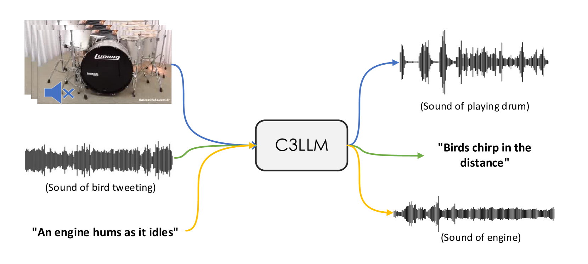
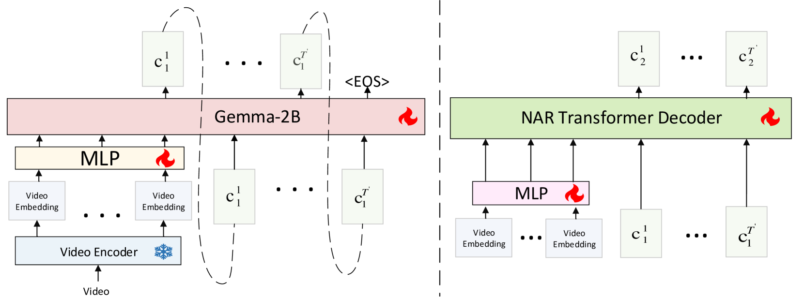
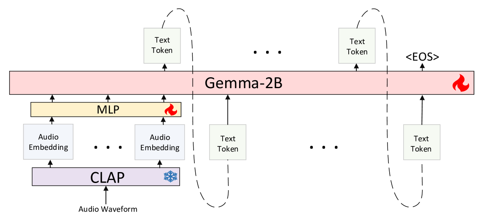

# C3LLM：大型语言模型驱动的条件多模态内容创作

发布时间：2024年05月25日

`LLM应用

这篇论文介绍了一个名为C3LLM的框架，它利用大型语言模型（LLM）来处理视频到音频、音频到文本和文本到音频的多模态任务。该框架通过LLM作为桥梁，实现了不同模态之间的精准对接和条件信息的融合，从而实现多模态内容的离散生成。论文中提到的创新点包括为音频生成任务设计的分层结构、预训练的音频码本的使用、以及将语义信息压缩为声学令牌的方法。此外，C3LLM框架还整合了音频理解、视频到音频生成和文本到音频生成任务，实现了端到端的多功能处理。这些特点表明该论文属于LLM应用类别，因为它展示了LLM在实际应用中的具体使用和改进。` `多媒体` `人工智能`

> C3LLM: Conditional Multimodal Content Generation Using Large Language Models

# 摘要

> 我们创新性地提出了C3LLM框架，它巧妙地将视频到音频、音频到文本和文本到音频三大任务融为一体。C3LLM利用大型语言模型（LLM）作为桥梁，精准对接不同模态，并巧妙地融合条件信息，实现多模态内容的离散生成。我们的研究成果主要体现在三个方面：首先，我们为音频生成任务设计了分层结构，并引入了预训练的音频码本，使LLM能够根据条件生成音频语义令牌，再通过非自回归变换器在多层级上生成声学令牌，显著提升了音频生成的质量。其次，鉴于LLM原本设计用于离散任务，我们采用离散表示进行音频生成，将语义信息压缩为声学令牌，仿佛为LLM增添了“声学词汇”。最后，我们将音频理解、视频到音频生成和文本到音频生成任务整合进一个统一的模型，实现了端到端的多功能处理。C3LLM在多个自动化评估指标上取得了显著进步，相较于以往方法，提供了更精准的语义对齐。

> We introduce C3LLM (Conditioned-on-Three-Modalities Large Language Models), a novel framework combining three tasks of video-to-audio, audio-to-text, and text-to-audio together. C3LLM adapts the Large Language Model (LLM) structure as a bridge for aligning different modalities, synthesizing the given conditional information, and making multimodal generation in a discrete manner. Our contributions are as follows. First, we adapt a hierarchical structure for audio generation tasks with pre-trained audio codebooks. Specifically, we train the LLM to generate audio semantic tokens from the given conditions, and further use a non-autoregressive transformer to generate different levels of acoustic tokens in layers to better enhance the fidelity of the generated audio. Second, based on the intuition that LLMs were originally designed for discrete tasks with the next-word prediction method, we use the discrete representation for audio generation and compress their semantic meanings into acoustic tokens, similar to adding "acoustic vocabulary" to LLM. Third, our method combines the previous tasks of audio understanding, video-to-audio generation, and text-to-audio generation together into one unified model, providing more versatility in an end-to-end fashion. Our C3LLM achieves improved results through various automated evaluation metrics, providing better semantic alignment compared to previous methods.

[Arxiv](https://arxiv.org/abs/2405.16136)