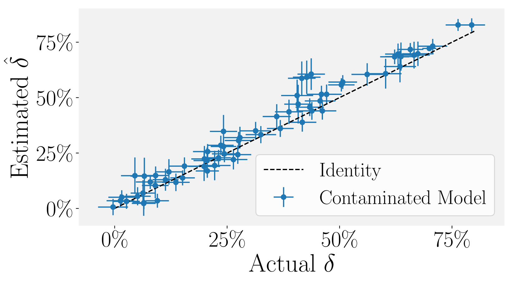
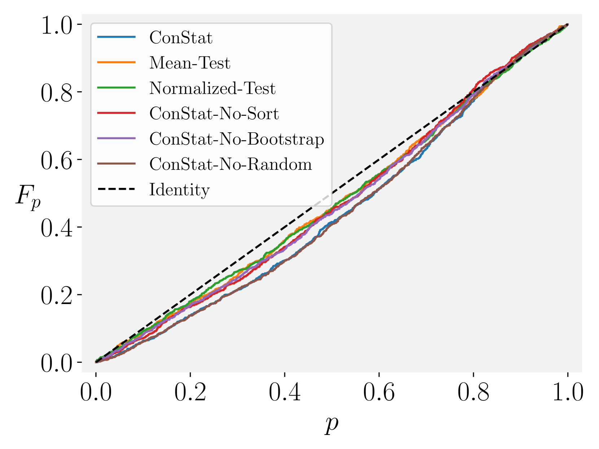

# ConStat：大型语言模型中的性能驱动污染检测

发布时间：2024年05月25日

`LLM理论

理由：这篇论文主要关注的是大型语言模型（LLM）的评估问题，特别是数据污染对模型性能评估的影响。它提出了一种新的污染定义，并开发了一种统计方法（ConStat）来检测和量化这种污染。这些问题属于LLM的理论研究范畴，因为它涉及到如何准确评估和理解LLM的性能，而不是直接应用LLM或探讨其具体应用场景。因此，这篇论文更适合归类于LLM理论。` `模型评估` `数据污染`

> ConStat: Performance-Based Contamination Detection in Large Language Models

# 摘要

> 公共基准对于评估大型语言模型至关重要，但数据污染可能导致性能虚高，使得基准在模型比较中失去可靠性。为此，我们提出了一种新的污染定义，将其视为非泛化的人工膨胀基准性能，而非简单的训练数据包含基准样本。这一创新视角使我们能够识别那些性能虚高的模型，即其性能无法泛化至重新表述的样本或同一任务的不同基准。基于此，我们开发了ConStat，一种统计方法，通过比较主要与参考基准的性能，有效检测并量化污染。我们的广泛评估涵盖了多种模型、基准及污染情况，揭示了包括Mistral、Llama、Yi及Open LLM排行榜前三名在内的多个流行模型存在严重污染。

> Public benchmarks play an essential role in the evaluation of large language models. However, data contamination can lead to inflated performance, rendering them unreliable for model comparison. It is therefore crucial to detect contamination and estimate its impact on measured performance. Unfortunately, existing detection methods can be easily evaded and fail to quantify contamination. To overcome these limitations, we propose a novel definition of contamination as artificially inflated and non-generalizing benchmark performance instead of the inclusion of benchmark samples in the training data. This perspective enables us to detect any model with inflated performance, i.e., performance that does not generalize to rephrased samples, synthetic samples from the same distribution, or different benchmarks for the same task. Based on this insight, we develop ConStat, a statistical method that reliably detects and quantifies contamination by comparing performance between a primary and reference benchmark relative to a set of reference models. We demonstrate the effectiveness of ConStat in an extensive evaluation of diverse model architectures, benchmarks, and contamination scenarios and find high levels of contamination in multiple popular models including Mistral, Llama, Yi, and the top-3 Open LLM Leaderboard models.

[Arxiv](https://arxiv.org/abs/2405.16281)