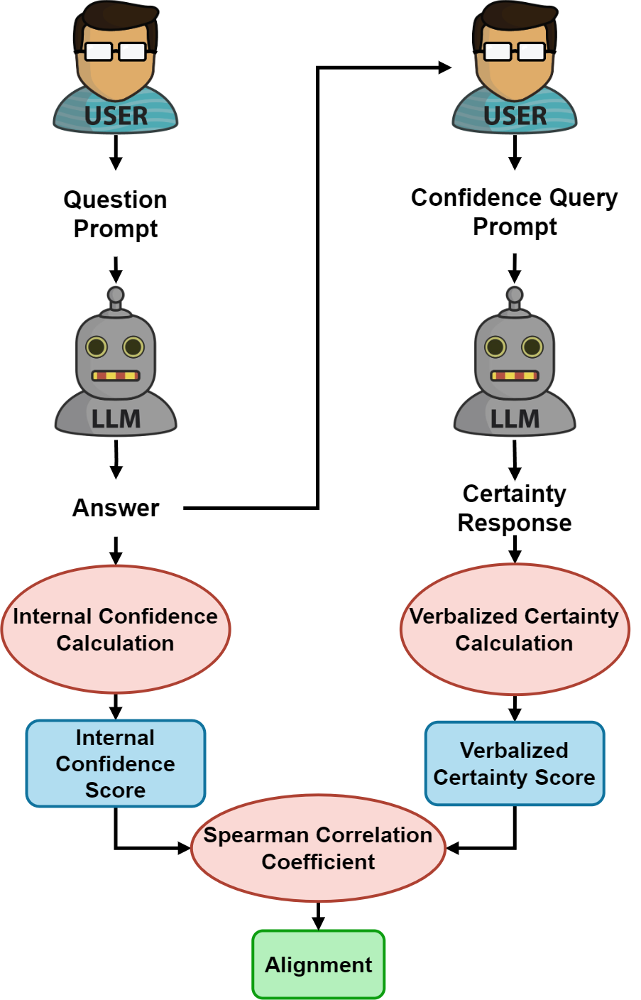
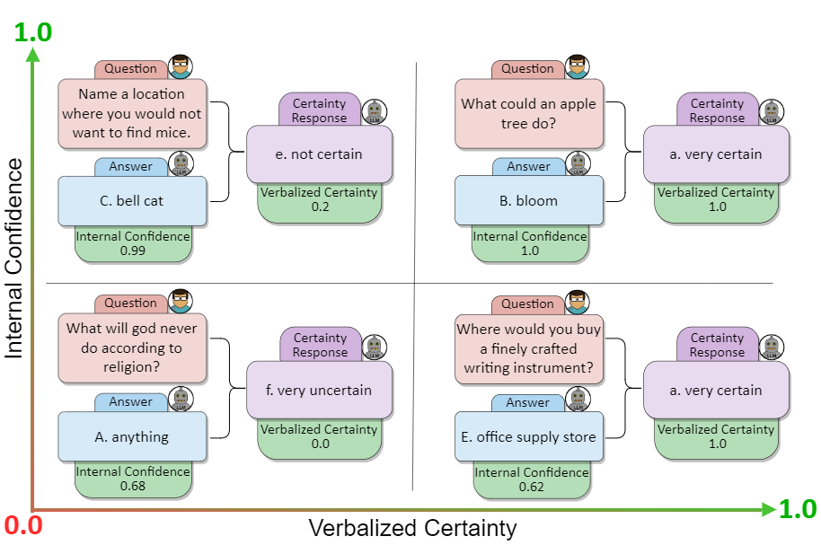
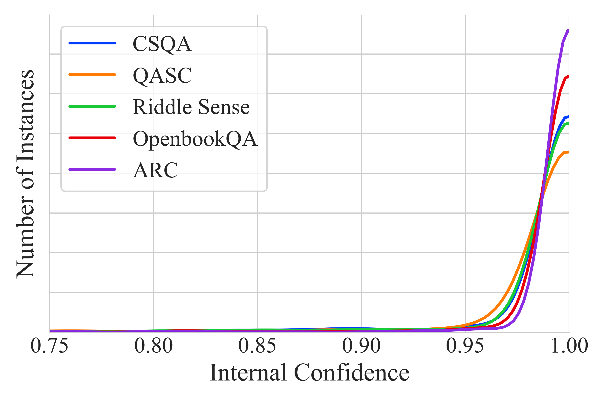
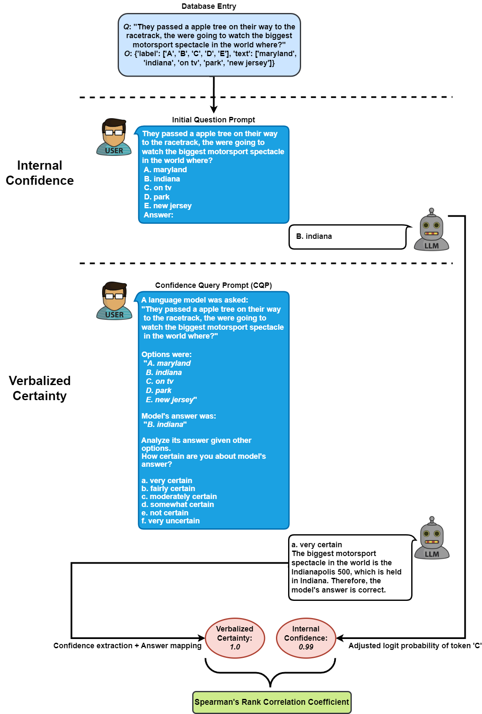
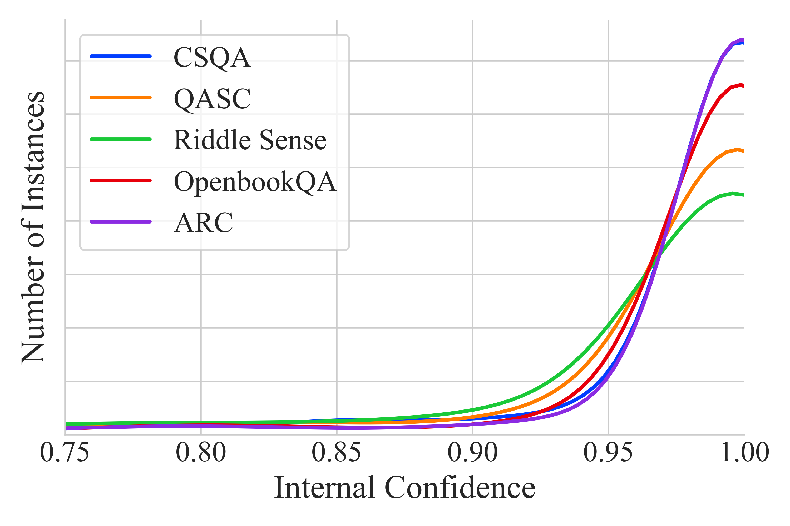

# 《探秘信心之源：大型语言模型中信心与概率匹配度的深度探究》

发布时间：2024年05月25日

`LLM理论

理由：这篇论文探讨了大型语言模型（LLMs）内部自信度的量化及其与模型外在表达自信度的关系，这是一个理论性的研究，旨在理解模型的内部机制和其输出可靠性之间的关系。通过提出“自信度-概率对齐”概念，并使用多种方法和数据集来评估这种对齐情况，论文深入分析了模型的自信度表达，这属于对LLMs理论层面的探讨。因此，将其归类为LLM理论。` `人工智能`

> Confidence Under the Hood: An Investigation into the Confidence-Probability Alignment in Large Language Models

# 摘要

> 随着大型语言模型（LLMs）的普及，理解它们如何自我评估生成答案的自信度变得至关重要，因为这直接关系到模型输出的可靠性。我们提出了“自信度-概率对齐”概念，旨在将LLM内部通过令牌概率量化的自信度与模型在明确询问其确定性时所表达的自信度相联系。通过多样化的数据集和促进模型自我审视的提示方法，我们探索了模型内部自信度与其外在表达之间的对齐情况。这些方法包括采用结构化评估尺度来衡量自信度，提供答案选项以激发模型的自我评估，以及让模型对其不认可的输出表达自信水平。特别值得关注的是，在多个分析模型中，OpenAI的GPT-4展现出最佳的自信度-概率对齐，平均斯皮尔曼相关系数达到0.42，覆盖了多种任务。我们的研究为LLMs应用中的风险评估提供了新视角，并深化了对模型可信度的认识。

> As the use of Large Language Models (LLMs) becomes more widespread, understanding their self-evaluation of confidence in generated responses becomes increasingly important as it is integral to the reliability of the output of these models. We introduce the concept of Confidence-Probability Alignment, that connects an LLM's internal confidence, quantified by token probabilities, to the confidence conveyed in the model's response when explicitly asked about its certainty. Using various datasets and prompting techniques that encourage model introspection, we probe the alignment between models' internal and expressed confidence. These techniques encompass using structured evaluation scales to rate confidence, including answer options when prompting, and eliciting the model's confidence level for outputs it does not recognize as its own. Notably, among the models analyzed, OpenAI's GPT-4 showed the strongest confidence-probability alignment, with an average Spearman's $\hatρ$ of 0.42, across a wide range of tasks. Our work contributes to the ongoing efforts to facilitate risk assessment in the application of LLMs and to further our understanding of model trustworthiness.

[Arxiv](https://arxiv.org/abs/2405.16282)