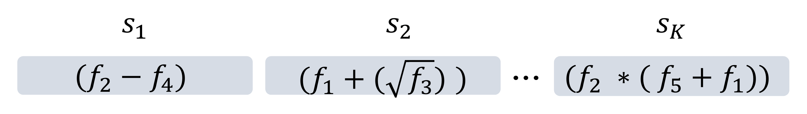
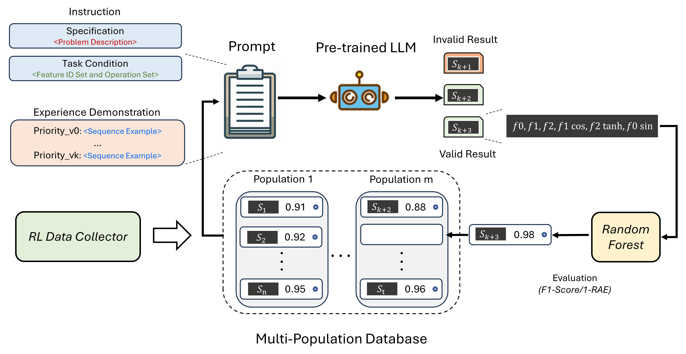
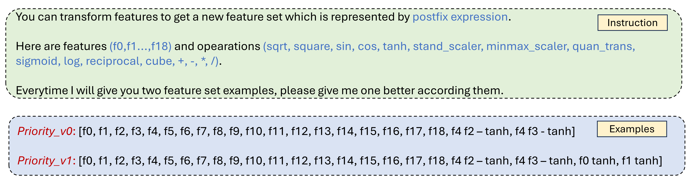
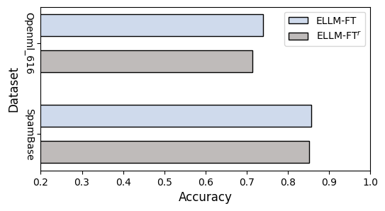

# 进化型大型语言模型：自动化特征转换的新篇章

发布时间：2024年05月25日

`Agent

理由：这篇论文提出了一种结合进化算法的LLM框架，用于自动特征转换。该框架通过强化学习数据收集器构建多群体数据库，并运用进化策略维护数据库，同时利用LLM的序列理解能力生成更优样本。这种方法涉及到了自主决策和行为（通过进化算法和强化学习），以及对环境的适应性（通过特征转换和优化），这些都是Agent行为的特点。因此，这篇论文更适合归类为Agent。` `机器学习` `数据挖掘`

> Evolutionary Large Language Model for Automated Feature Transformation

# 摘要

> 特征转换旨在重塑原始特征空间，以增强下游模型的性能。但特征组合与操作的激增使得现有方法难以高效探索广阔空间，且优化仅关注特定领域模型的准确性，忽略了通用特征知识的获取。为此，我们提出了一种结合进化算法的LLM框架，用于自动特征转换。该框架包含两个关键部分：首先，通过强化学习数据收集器构建多群体数据库，并运用进化策略维护数据库；其次，利用LLM的序列理解能力，通过少量样本提示引导LLM根据特征转换序列的差异生成更优样本。借助多群体数据库，我们拓宽了搜索范围，通过筛选与进化，优质群体得以涌现，进一步优化了最优个体的追求。通过整合LLM与进化算法，我们不仅在广阔空间内实现了高效探索，还利用特征知识推动了优化，形成了一个更具适应性的搜索模式。实证研究证实了我们方法的有效性与通用性。

> Feature transformation aims to reconstruct the feature space of raw features to enhance the performance of downstream models. However, the exponential growth in the combinations of features and operations poses a challenge, making it difficult for existing methods to efficiently explore a wide space. Additionally, their optimization is solely driven by the accuracy of downstream models in specific domains, neglecting the acquisition of general feature knowledge. To fill this research gap, we propose an evolutionary LLM framework for automated feature transformation. This framework consists of two parts: 1) constructing a multi-population database through an RL data collector while utilizing evolutionary algorithm strategies for database maintenance, and 2) utilizing the ability of Large Language Model (LLM) in sequence understanding, we employ few-shot prompts to guide LLM in generating superior samples based on feature transformation sequence distinction. Leveraging the multi-population database initially provides a wide search scope to discover excellent populations. Through culling and evolution, the high-quality populations are afforded greater opportunities, thereby furthering the pursuit of optimal individuals. Through the integration of LLMs with evolutionary algorithms, we achieve efficient exploration within a vast space, while harnessing feature knowledge to propel optimization, thus realizing a more adaptable search paradigm. Finally, we empirically demonstrate the effectiveness and generality of our proposed method.

[Arxiv](https://arxiv.org/abs/2405.16203)