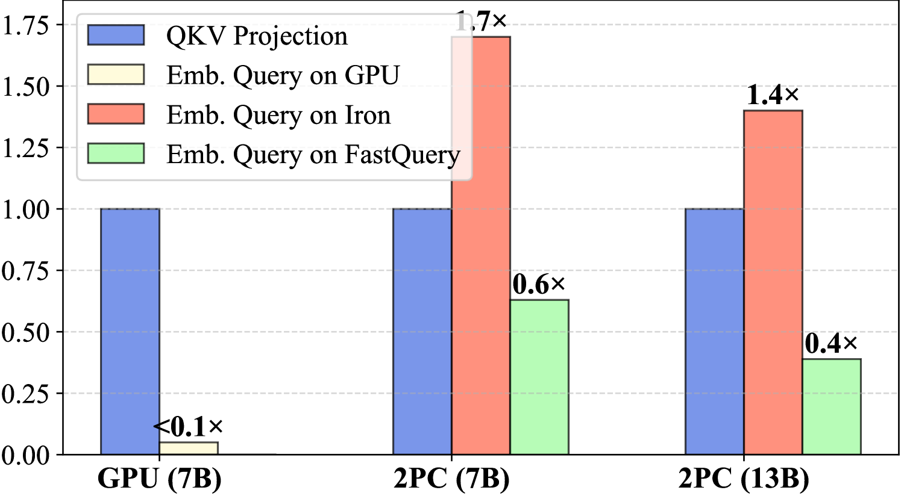
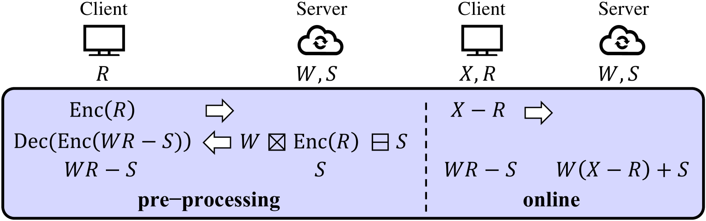
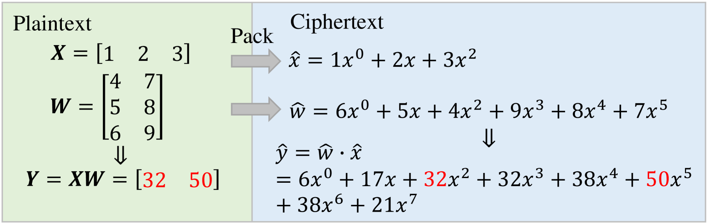
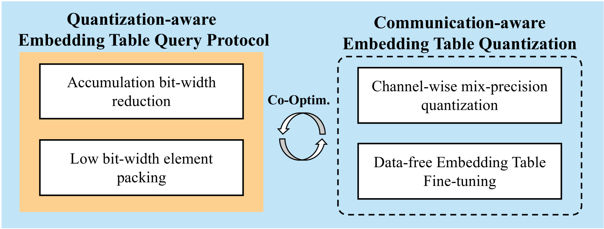
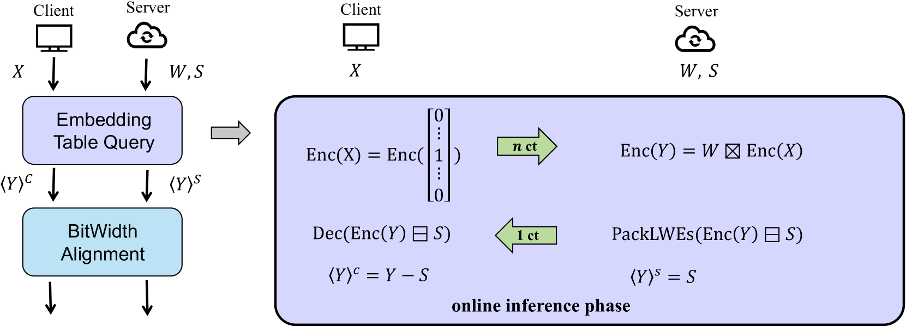
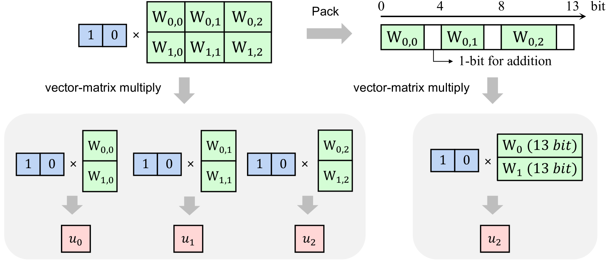
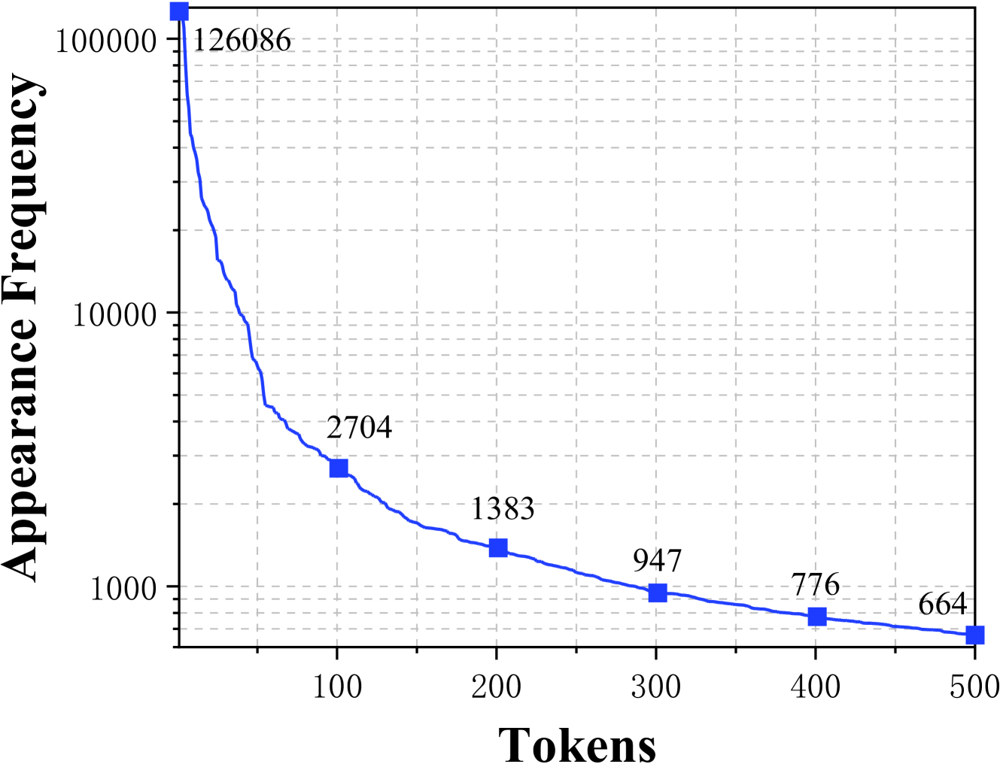
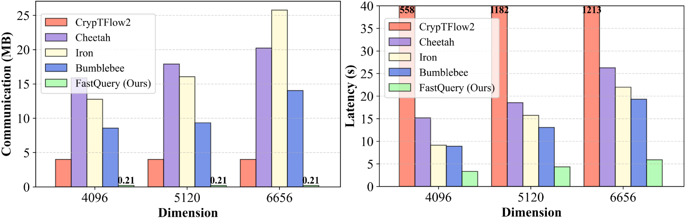
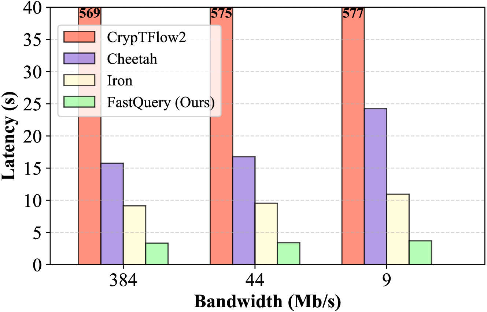

# FastQuery：提升私有LLM推理效率的通信优化嵌入表查询技术

发布时间：2024年05月25日

`LLM应用

这篇论文主要讨论了在大型语言模型（LLMs）中使用同态加密（HE）进行私有推理的问题，并提出了一种名为FastQuery的框架来降低计算和通信成本。这种方法直接应用于LLMs的实际使用场景中，特别是在处理用户查询中的敏感信息时，旨在保护用户隐私。因此，它属于LLM应用类别。` `隐私保护` `机器学习`

> FastQuery: Communication-efficient Embedding Table Query for Private LLM Inference

# 摘要

> 随着大型语言模型（LLMs）的迅猛发展，用户查询中潜在的敏感信息引发了隐私担忧。为此，基于同态加密（HE）的私有推理应运而生，旨在保护用户隐私。但私有嵌入表查询需转化为HE下的矩阵-向量乘法，导致计算与通信成本激增。我们发现，这一负担主要源自对用户查询的独热特性和嵌入表对量化噪声的鲁棒性的忽视。为此，本文推出了FastQuery框架，通过通信感知的量化算法和独热感知的密集打包技术，有效降低了计算与通信开销。与现有HE基框架相比，FastQuery在LLAMA-7B和LLAMA-30B模型上，分别实现了超过4.3倍、2.7倍、1.3倍的延迟降低，以及超过75.7倍、60.2倍、20.2倍的通信量减少。

> With the fast evolution of large language models (LLMs), privacy concerns with user queries arise as they may contain sensitive information. Private inference based on homomorphic encryption (HE) has been proposed to protect user query privacy. However, a private embedding table query has to be formulated as a HE-based matrix-vector multiplication problem and suffers from enormous computation and communication overhead. We observe the overhead mainly comes from the neglect of 1) the one-hot nature of user queries and 2) the robustness of the embedding table to low bit-width quantization noise. Hence, in this paper, we propose a private embedding table query optimization framework, dubbed FastQuery. FastQuery features a communication-aware embedding table quantization algorithm and a one-hot-aware dense packing algorithm to simultaneously reduce both the computation and communication costs. Compared to prior-art HE-based frameworks, e.g., Cheetah, Iron, and Bumblebee, FastQuery achieves more than $4.3\times$, $2.7\times$, $1.3\times$ latency reduction, respectively and more than $75.7\times$, $60.2\times$, $20.2\times$ communication reduction, respectively, on both LLAMA-7B and LLAMA-30B.

[Arxiv](https://arxiv.org/abs/2405.16241)