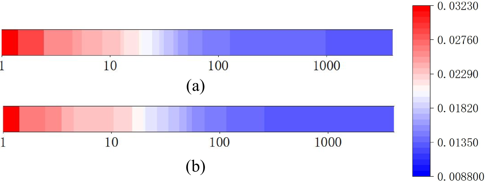

# FastQuery：高效通信的嵌入表查询，专为私有 LLM 推理优化

发布时间：2024年05月25日

`LLM应用

这篇论文主要探讨了大型语言模型（LLMs）在处理用户查询时涉及的隐私问题，并提出了一种基于同态加密（HE）的私有推理技术，即FastQuery框架。该框架通过优化嵌入表查询的实现方式，减少了计算和通信负担，从而提高了处理效率。这一研究直接应用于LLM的实际操作中，特别是在保护用户隐私方面，因此属于LLM应用分类。` `隐私保护` `机器学习`

> FastQuery: Communication-efficient Embedding Table Query for Private LLM Inference

# 摘要

> 随着大型语言模型（LLMs）的迅猛发展，用户查询中可能包含敏感信息的隐私问题日益受到关注。为此，基于同态加密（HE）的私有推理技术应运而生，旨在保护用户查询隐私。然而，私有嵌入表查询的实现方式——基于HE的矩阵-向量乘法，却带来了巨大的计算和通信负担。这一负担主要源于对用户查询的独热特性和嵌入表对低比特量化噪声的鲁棒性的忽视。鉴于此，本文提出了FastQuery框架，该框架通过通信感知的嵌入表量化和独热感知的密集打包算法，有效降低了计算和通信成本。与现有HE基框架相比，FastQuery在LLAMA-7B和LLAMA-30B模型上分别实现了显著的延迟和通信开销减少，分别为4.3倍、2.7倍、1.3倍和75.7倍、60.2倍、20.2倍。

> With the fast evolution of large language models (LLMs), privacy concerns with user queries arise as they may contain sensitive information. Private inference based on homomorphic encryption (HE) has been proposed to protect user query privacy. However, a private embedding table query has to be formulated as a HE-based matrix-vector multiplication problem and suffers from enormous computation and communication overhead. We observe the overhead mainly comes from the neglect of 1) the one-hot nature of user queries and 2) the robustness of the embedding table to low bit-width quantization noise. Hence, in this paper, we propose a private embedding table query optimization framework, dubbed FastQuery. FastQuery features a communication-aware embedding table quantization algorithm and a one-hot-aware dense packing algorithm to simultaneously reduce both the computation and communication costs. Compared to prior-art HE-based frameworks, e.g., Cheetah, Iron, and Bumblebee, FastQuery achieves more than $4.3\times$, $2.7\times$, $1.3\times$ latency reduction, respectively and more than $75.7\times$, $60.2\times$, $20.2\times$ communication reduction, respectively, on both LLAMA-7B and LLAMA-30B.

[Arxiv](https://arxiv.org/abs/2405.16241)