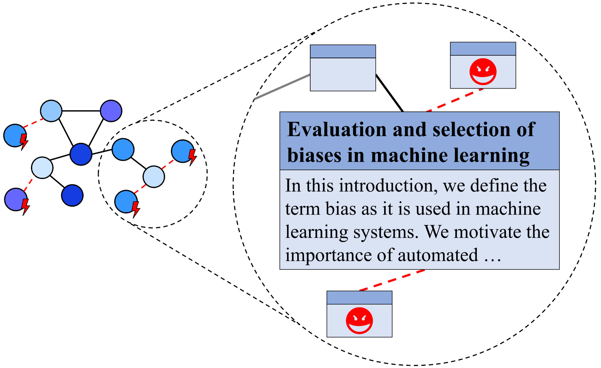
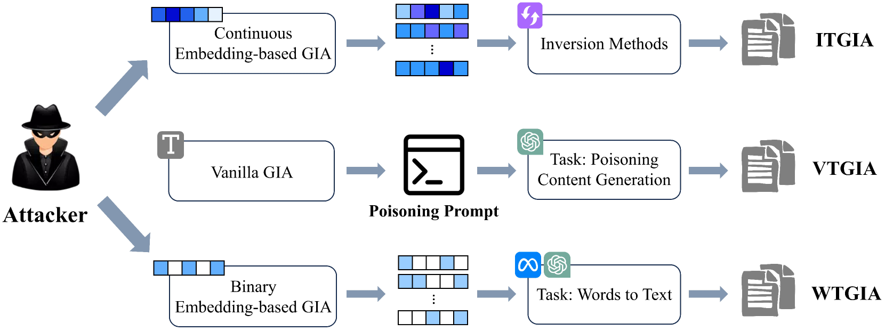
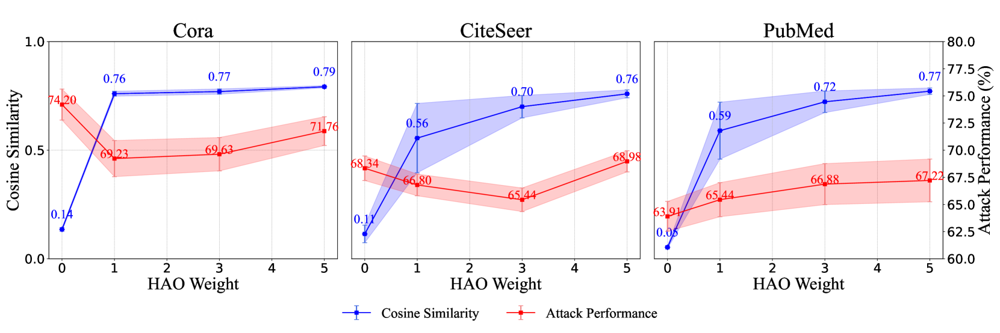
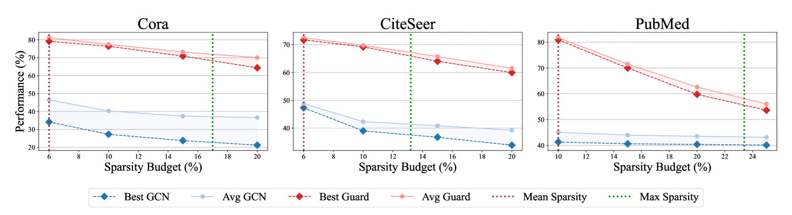
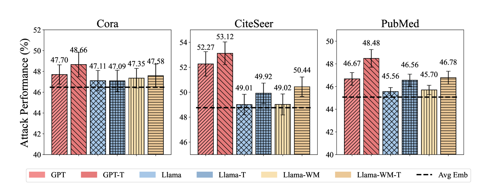
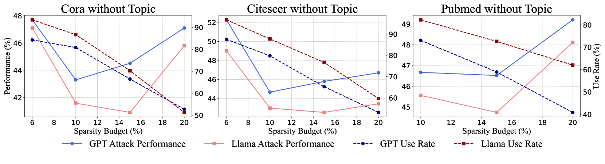
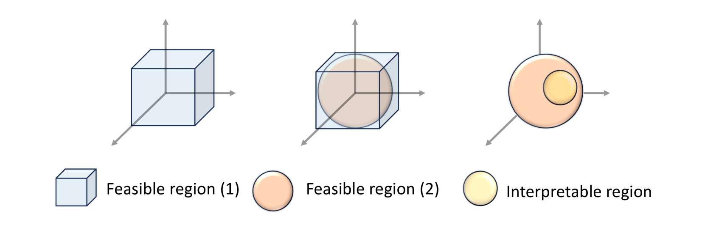
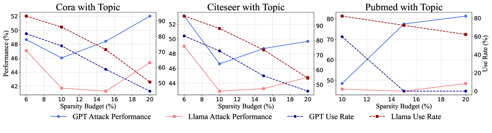

# 文字之侵：探索文本层面的图注入攻击理解之路

发布时间：2024年05月25日

`Agent

理由：这篇论文主要探讨了图神经网络（GNNs）在面对图注入攻击（GIAs）时的脆弱性，特别是针对文本属性图（TAGs）的文本级别攻击。论文提出了新的攻击策略，并分析了这些攻击的有效性及其对防御策略的影响。虽然文中提到了大型语言模型（LLM）在增强防御方面的应用，但主要焦点是攻击策略和防御机制，这与Agent领域的研究更为相关，即如何设计和管理智能体以应对和发起攻击。因此，这篇论文更适合归类于Agent。` `网络安全` `人工智能`

> Intruding with Words: Towards Understanding Graph Injection Attacks at the Text Level

# 摘要

> 图神经网络（GNNs）虽在多领域表现卓越，却易受图注入攻击（GIAs）这类对抗性攻击的威胁，此类攻击通过植入恶意节点对原始图构成真实风险。文本属性图（TAGs）因其广泛应用于现实场景而显得尤为重要，常被用来评估此类漏洞。然而，现有研究仅限于嵌入级别的GIAs，即仅注入节点嵌入而非实际文本内容，这不仅限制了其应用范围，也简化了检测难度。本文首次深入探讨了文本级别的GIAs，并提出了三种创新的攻击策略，直接将文本内容注入图中。我们的理论与实证分析揭示，文本的可解释性——这一在嵌入级别常被忽视的因素——对攻击的有效性至关重要。其中，基于词频的文本级GIA（WTGIA）因其性能与可解释性的良好平衡而备受关注。尽管WTGIA表现出色，我们发现防御者可通过定制文本嵌入技术或利用大型语言模型（LLM）增强预测能力来提升防御。这些发现凸显了深入研究文本级GIAs潜力与实际意义的迫切性。

> Graph Neural Networks (GNNs) excel across various applications but remain vulnerable to adversarial attacks, particularly Graph Injection Attacks (GIAs), which inject malicious nodes into the original graph and pose realistic threats. Text-attributed graphs (TAGs), where nodes are associated with textual features, are crucial due to their prevalence in real-world applications and are commonly used to evaluate these vulnerabilities. However, existing research only focuses on embedding-level GIAs, which inject node embeddings rather than actual textual content, limiting their applicability and simplifying detection. In this paper, we pioneer the exploration of GIAs at the text level, presenting three novel attack designs that inject textual content into the graph. Through theoretical and empirical analysis, we demonstrate that text interpretability, a factor previously overlooked at the embedding level, plays a crucial role in attack strength. Among the designs we investigate, the Word-frequency-based Text-level GIA (WTGIA) is particularly notable for its balance between performance and interpretability. Despite the success of WTGIA, we discover that defenders can easily enhance their defenses with customized text embedding methods or large language model (LLM)--based predictors. These insights underscore the necessity for further research into the potential and practical significance of text-level GIAs.

[Arxiv](https://arxiv.org/abs/2405.16405)