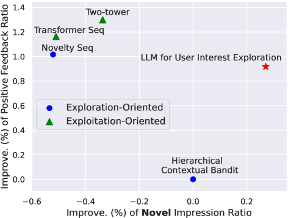
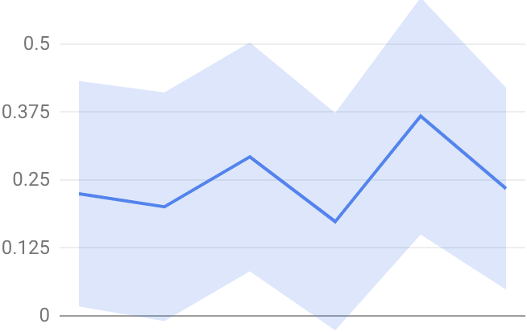

# 探索用户兴趣：大型语言模型的混合策略

发布时间：2024年05月25日

`Agent

理由：这篇论文提出了一种结合大型语言模型（LLMs）与经典推荐模型的混合层次框架，用于探索用户兴趣。该框架通过“兴趣集群”精细调控LLMs与推荐模型间的互动，并由算法设计者设定集群粒度。这种框架可以被视为一个智能代理（Agent），因为它能够自主地探索和发现用户的新兴趣，并通过微调的LLM生成集群内的新兴趣描述，以及通过约束经典推荐模型来确保推荐物品仅来自高层生成的新集群。因此，这篇论文更符合Agent分类，而不是RAG、LLM应用或LLM理论。` `推荐系统` `用户兴趣探索`

> LLMs for User Interest Exploration: A Hybrid Approach

# 摘要

> 传统推荐系统因强化历史用户-物品交互而陷入反馈循环，限制了新兴趣的发现。为此，我们提出了一种结合LLMs与经典推荐模型的混合层次框架，旨在探索用户兴趣。该框架通过“兴趣集群”精细调控LLMs与推荐模型间的互动，由算法设计者设定集群粒度。首先，它以语言形式表达“兴趣集群”，再通过微调的LLM生成集群内的新兴趣描述。在底层，通过约束经典推荐模型（如基于变压器的序列推荐器），确保推荐物品仅来自高层生成的新集群。我们在一个服务数十亿用户的商业平台上验证了此方法，现场实验表明，新兴趣的探索与用户整体满意度均大幅提升。

> Traditional recommendation systems are subject to a strong feedback loop by learning from and reinforcing past user-item interactions, which in turn limits the discovery of novel user interests. To address this, we introduce a hybrid hierarchical framework combining Large Language Models (LLMs) and classic recommendation models for user interest exploration. The framework controls the interfacing between the LLMs and the classic recommendation models through "interest clusters", the granularity of which can be explicitly determined by algorithm designers. It recommends the next novel interests by first representing "interest clusters" using language, and employs a fine-tuned LLM to generate novel interest descriptions that are strictly within these predefined clusters. At the low level, it grounds these generated interests to an item-level policy by restricting classic recommendation models, in this case a transformer-based sequence recommender to return items that fall within the novel clusters generated at the high level. We showcase the efficacy of this approach on an industrial-scale commercial platform serving billions of users. Live experiments show a significant increase in both exploration of novel interests and overall user enjoyment of the platform.

[Arxiv](https://arxiv.org/abs/2405.16363)