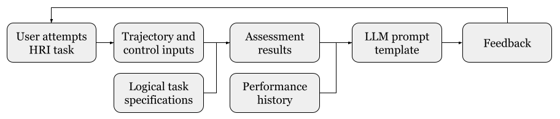
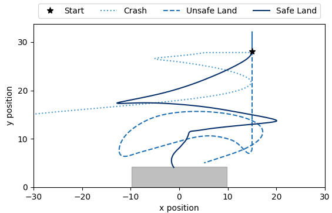

# 大型语言模型为人机交互任务中的自动化形成性反馈开启了新篇章。

发布时间：2024年05月25日

`Agent

理由：这篇论文主要探讨了大型语言模型（LLMs）在人类机器人交互（HRI）任务中的应用，特别是在将复杂的逻辑规范转化为易于理解的反馈方面。这种应用涉及到将LLMs作为智能代理来处理和解释复杂信息，从而提供对用户有帮助的反馈。因此，这篇论文更符合Agent分类，因为它涉及到了LLMs在交互任务中的代理角色和功能。` `人机交互` `教育技术`

> Large Language Models Enable Automated Formative Feedback in Human-Robot Interaction Tasks

# 摘要

> 我们认为，大型语言模型（LLMs）与形式分析方法的结合，能为人类机器人交互（HRI）任务提供既易懂又相关的反馈。逻辑规范虽有助于任务的定义与评估，但其表达对非专家而言并不直观。所幸，LLMs能巧妙地将复杂概念转化为浅显易懂的文字。通过将任务评估结果与上下文信息融入LLM的提示中，我们能高效地提炼出一套实用建议，助力学习者提升其表现。

> We claim that LLMs can be paired with formal analysis methods to provide accessible, relevant feedback for HRI tasks. While logic specifications are useful for defining and assessing a task, these representations are not easily interpreted by non-experts. Luckily, LLMs are adept at generating easy-to-understand text that explains difficult concepts. By integrating task assessment outcomes and other contextual information into an LLM prompt, we can effectively synthesize a useful set of recommendations for the learner to improve their performance.

[Arxiv](https://arxiv.org/abs/2405.16344)