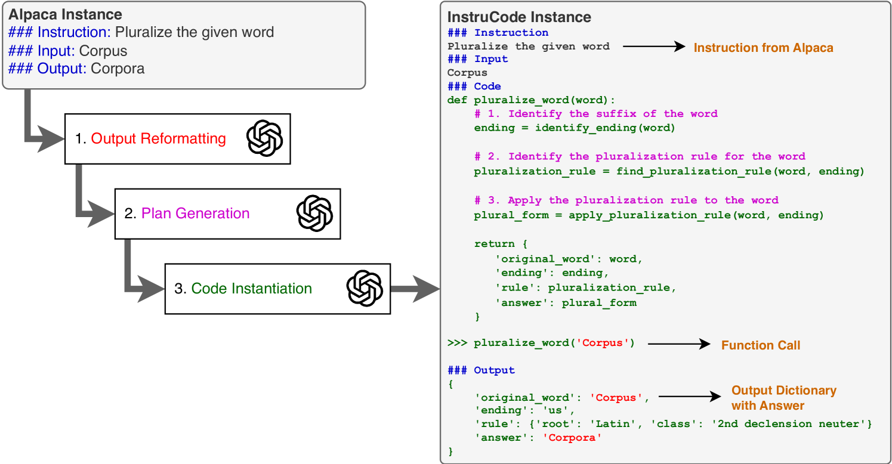
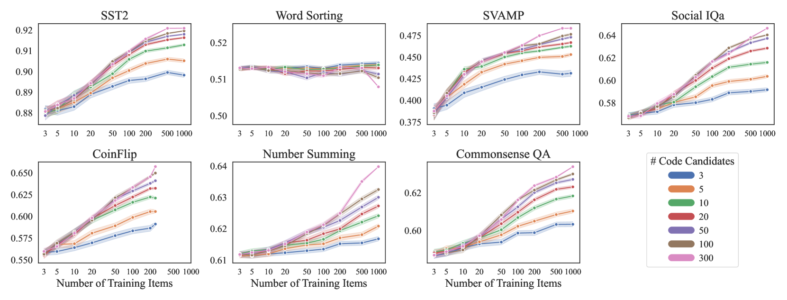
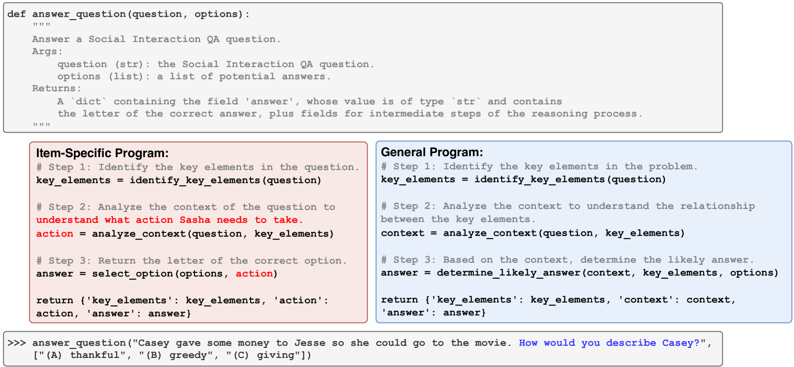
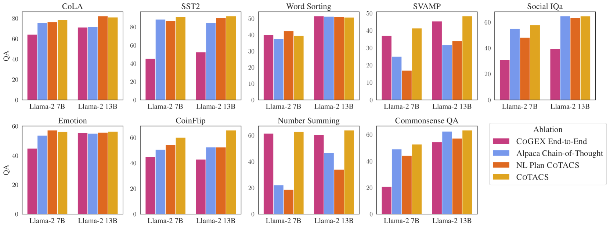
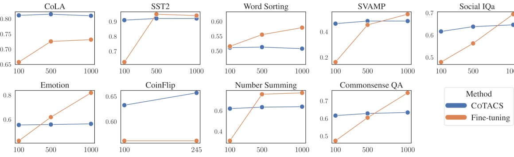

# 学习推理：程序生成、模拟与搜索的结合

发布时间：2024年05月25日

`LLM应用

这篇论文探讨了语言模型（LMs）在程序合成方面的能力，特别是在处理非代码可直接转换的任务（如常识推理、道德决策和讽刺理解）时的应用。通过开发Code Generation and Emulated EXecution（CoGEX）系统，研究者们展示了如何通过训练LMs生成并模拟执行伪程序来扩展其能力，并在多种任务上实现了优于传统上下文学习方法的性能。这一研究强调了代码合成技术在更广泛应用中的潜力，并提供了相关的数据集、微调模型及实现代码。因此，这篇论文属于LLM应用分类。` `人工智能` `编程辅助`

> Learning to Reason via Program Generation, Emulation, and Search

# 摘要

> 语言模型（LMs）的程序合成能力已显著提升推理技巧，尤其是代码调优的LMs在生成解决算法符号操作任务（如单词拼接）的程序方面表现出色。然而，诸如常识推理、道德决策和讽刺理解等任务，并不容易转化为代码。我们的研究旨在扩展LMs的程序合成技能，以应对这些挑战，并通过伪程序——即部分函数未定义的Python程序——来评估其效果。为此，我们开发了Code Generation and Emulated EXecution（CoGEX）系统，它通过训练LMs生成并模拟执行伪程序，填补知识空白，并在众多程序中寻找最优解。我们还提出了一种新方法，用于在给定数据集上搜索并找到一个能通过伪执行达到最优性能的程序。实验证明，CoGEX在多种任务上均优于传统的上下文学习方法，无论是算法推理还是软推理。这表明代码合成技术具有更广泛的应用潜力。我们已将相关数据集、微调模型及实现代码公开于\url{https://github.com/nweir127/CoGEX}。

> Program synthesis with language models (LMs) has unlocked a large set of reasoning abilities; code-tuned LMs have proven adept at generating programs that solve a wide variety of algorithmic symbolic manipulation tasks (e.g. word concatenation). However, not all reasoning tasks are easily expressible as code, e.g. tasks involving commonsense reasoning, moral decision-making, and sarcasm understanding. Our goal is to extend an LM's program synthesis skills to such tasks and evaluate the results via pseudo-programs, namely Python programs where some leaf function calls are left undefined. To that end, we propose, Code Generation and Emulated EXecution (CoGEX). CoGEX works by (1) training LMs to generate their own pseudo-programs, (2) teaching them to emulate their generated program's execution, including those leaf functions, allowing the LM's knowledge to fill in the execution gaps; and (3) using them to search over many programs to find an optimal one. To adapt the CoGEX model to a new task, we introduce a method for performing program search to find a single program whose pseudo-execution yields optimal performance when applied to all the instances of a given dataset. We show that our approach yields large improvements compared to standard in-context learning approaches on a battery of tasks, both algorithmic and soft reasoning. This result thus demonstrates that code synthesis can be applied to a much broader class of problems than previously considered. Our released dataset, fine-tuned models, and implementation can be found at \url{https://github.com/nweir127/CoGEX}.

[Arxiv](https://arxiv.org/abs/2405.16337)